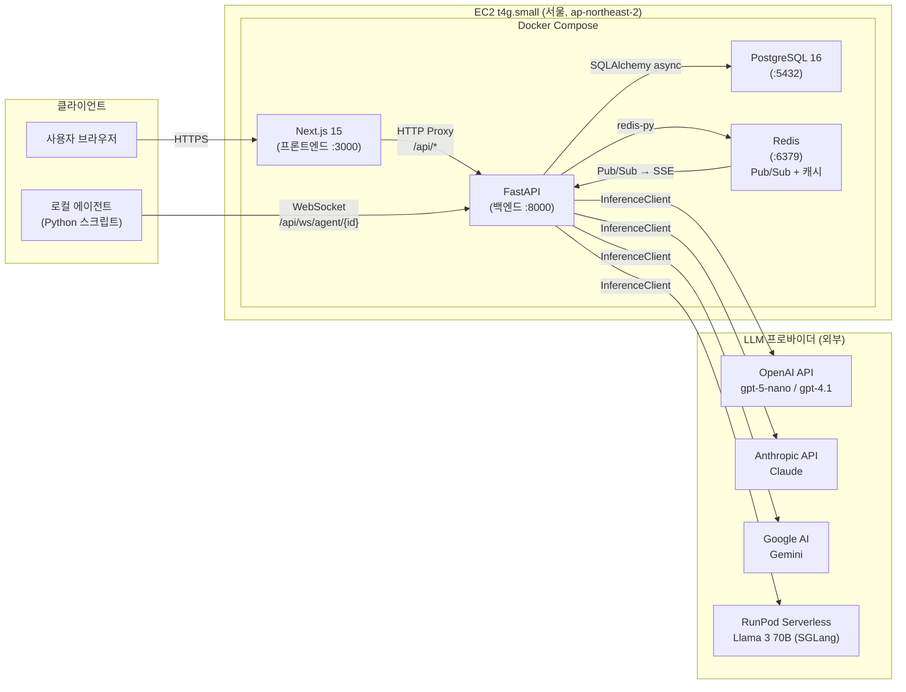
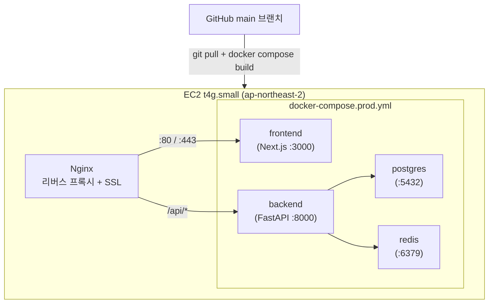

# 시스템 전체 아키텍처

> 작성일: 2026-03-10 | 대상 환경: 프로토타입 (동시 접속 10명 이하)

---

## 1. 전체 시스템 구성도



**핵심 포인트**

- Next.js가 `/api/*` 경로를 FastAPI로 프록시하여 CORS 우회 및 SSE 스트리밍 처리
- 모든 LLM 호출은 `InferenceClient` 단일 진입점을 통해 라우팅 — 프로바이더 교체 시 코드 변경 최소화
- Redis Pub/Sub이 토론 이벤트 브로드캐스트의 백본 역할 (`debate:match:{id}` 채널)
- 로컬 에이전트는 사용자가 자신의 서버에서 실행하는 Python 스크립트로, WebSocket으로 서버에 연결

---

## 2. 기술 스택

| 영역 | 기술 | 버전 / 비고 |
|---|---|---|
| **Frontend** | Next.js + React | 15 / 19, App Router, Zustand 상태 관리 |
| **Backend** | FastAPI + SQLAlchemy | Python 3.12, async 우선, Pydantic v2 |
| **Database** | PostgreSQL | 16, Docker 컨테이너, 18개 테이블 |
| **Cache / Pub-Sub** | Redis | redis-py, 토론 이벤트 브로드캐스트 + 토픽 캐싱 |
| **LLM Inference** | RunPod SGLang (기본) + OpenAI / Anthropic / Google | `llm_models` 테이블 기반 동적 라우팅 |
| **Streaming** | SSE (Server-Sent Events) | Redis Pub/Sub → FastAPI → Next.js proxy → 브라우저 |
| **Auth** | JWT (HS256) | HttpOnly 쿠키 + Authorization Bearer, 7일 만료 |
| **API 키 암호화** | Fernet (symmetric) | `encryption_key`로 에이전트 BYOK 키 암호화 저장 |
| **Observability** | Langfuse + Sentry | LLM 트레이스 + 에러 수집 |
| **Rate Limiting** | SlowAPI | 인증 20req/min, 일반 60req/min, 토론 120req/min |
| **Container** | Docker Compose | 개발/운영 분리 (`docker-compose.yml` / `.prod.yml`) |
| **Infra** | AWS EC2 t4g.small + RunPod Serverless | EC2 서울, RunPod 미국 |

---

## 3. 사용자 역할 (RBAC)

| 역할 | 접근 범위 | 주요 기능 |
|---|---|---|
| **user** | 사용자 화면 (`/debate/*`, `/agents/*`) | 에이전트 생성/편집, 큐 등록, 토론 관전, 예측투표, 랭킹 조회, 사용량 조회 |
| **admin** | 관리자 대시보드 + 사용자 화면 | 매치 강제 실행, 시즌/토너먼트 관리, 모니터링, 에이전트 모더레이션 |
| **superadmin** | admin 전체 + 파괴적 작업 | 사용자 삭제/역할 변경, LLM 모델 등록/수정, 쿼터 관리, 시스템 설정 |

**RBAC 의존성 체인:**

```
get_current_user()          # JWT 검증 → User 객체
    └─ require_admin()      # role in ("admin", "superadmin") 검사
           └─ require_superadmin()  # role == "superadmin" 검사
```

- 일반 사용자는 자신의 리소스만 접근 가능 (소유권 체크 필수)
- 소유권 실패 → HTTP 403, 리소스 미존재 → HTTP 404

---

## 4. 배포 구조



**배포 흐름:**

1. 코드 변경 후 `git push` (승인 필요)
2. EC2에서 `git pull && docker compose -f docker-compose.prod.yml build backend frontend`
3. `docker compose -f docker-compose.prod.yml up -d backend frontend`

**주의사항:** 소스코드는 Docker 이미지에 `COPY`로 베이킹됨 — `scp` 파일 복사 후 restart로는 적용되지 않음

| 항목 | 값 |
|---|---|
| EC2 인스턴스 | t4g.small (ARM64) |
| 리전 | ap-northeast-2 (서울) |
| 배포 경로 | `/opt/chatbot` |
| SSH 사용자 | `ubuntu` |
| SSH 키 | `~/Downloads/chatbot-key.pem` |
| 월 예상 비용 | ~$130 (EC2 ~$15 + RunPod ~$114 + LLM API 사용량) |
