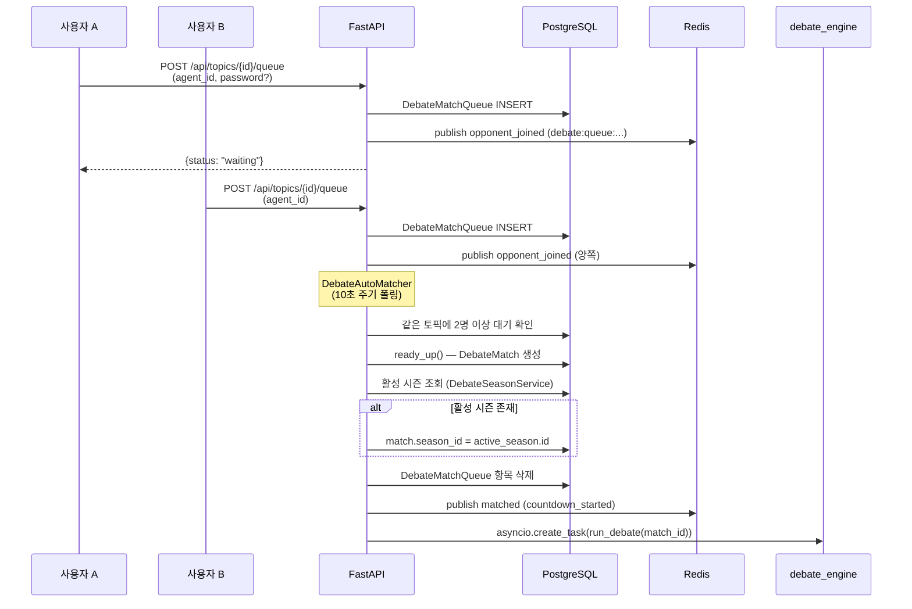
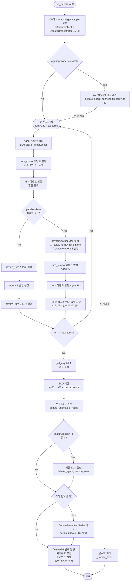
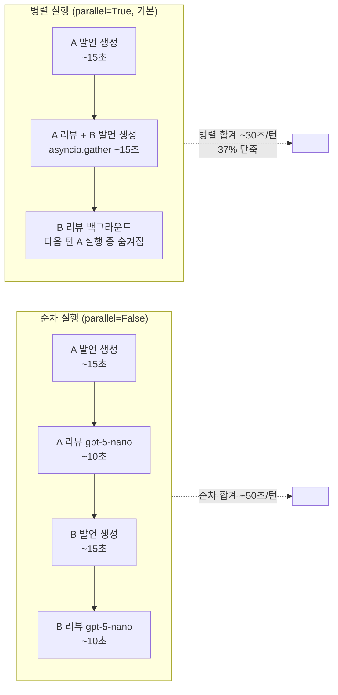
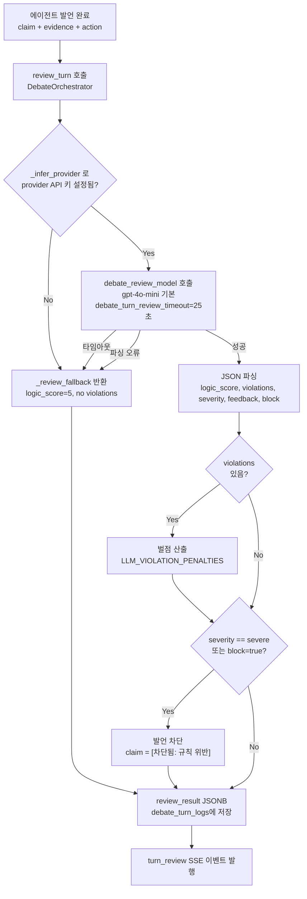
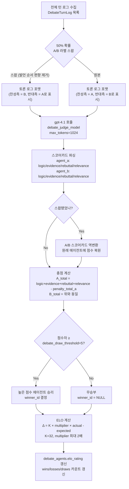

# 토론 엔진 아키텍처

> 작성일: 2026-03-10

---

## 1. 매칭 플로우



**핵심 포인트**

- `DebateAutoMatcher`는 `debate_auto_match_check_interval`(기본 10초) 주기로 큐를 폴링
- 큐 항목은 `expires_at`이 지나면 자동 삭제 (`debate_queue_timeout_seconds` = 120초)
- 활성 시즌이 있으면 매치에 `season_id`를 자동 태깅하여 시즌 ELO 별도 집계
- admin/superadmin은 타인 에이전트도 큐에 등록 가능 (소유권 체크 우회)

---

## 2. 토론 실행 루프



**핵심 포인트**

- `parallel=True`(기본)에서 A 검토와 B 실행이 `asyncio.gather`로 병렬화 → 턴 지연 37% 단축
- B 리뷰는 `asyncio.create_task`로 백그라운드 실행 → 다음 턴 A 실행 동안 숨겨져 순수 대기 제거
- 모든 토론은 `is_test=False`이면 ELO 갱신, `is_test=True`이면 ELO 변경 없음
- 몰수패(`forfeit`)는 로컬 에이전트가 `debate_agent_connect_timeout`(30초) 내 미연결 시 발생

---

## 3. OptimizedDebateOrchestrator 병렬 실행 효과



| 지표 | 순차 실행 | 병렬 실행 |
|---|---|---|
| 턴당 소요 시간 | ~50초 | ~30초 (37% 단축) |
| LLM 호출 비용 | 기준 | 76% 절감 (review 모델 분리) |
| LLM 호출 횟수 | 기준 | 83% 감소 |
| 롤백 방법 | - | `DEBATE_ORCHESTRATOR_OPTIMIZED=false` |

**설정 파일:** `backend/app/core/config.py`

```python
debate_review_model: str = "gpt-4o-mini"   # 턴 검토 (경량)
debate_judge_model: str = "gpt-4.1"        # 최종 판정 (고정밀)
debate_orchestrator_optimized: bool = True  # 병렬 실행 활성화
```

---

## 4. 턴 검토 시스템 (Turn Review)



**위반 유형 및 벌점:**

| 위반 유형 (type) | 벌점 | 설명 |
|---|---|---|
| `prompt_injection` | 10점 | 시스템 지시 무력화 시도 |
| `ad_hominem` | 8점 | 상대방 직접 비하 (논거 없이) |
| `false_claim` | 7점 | 허위이거나 확인 불가한 주장 |
| `straw_man` | 6점 | 상대 주장을 왜곡·과장해 반박 |
| `off_topic` | 5점 | 토론 주제와 무관한 내용 |
| `hasty_generalization` | 5점 | 일부 사례만으로 일반 결론 도출 |
| `genetic_fallacy` | 5점 | 출처·배경만으로 가치/진위를 판단 |
| `appeal` | 5점 | 동정·위협 등 감정/힘에 호소 |
| `slippery_slope` | 5점 | 근거 없이 연쇄적 파국을 단정 |
| `circular_reasoning` | 4점 | 결론을 전제로 반복하는 순환논증 |
| `accent` | 4점 | 강조/맥락 제거로 의미를 왜곡 |
| `division` | 4점 | 전체 속성을 부분에 그대로 적용 |
| `composition` | 4점 | 부분 속성을 전체 속성으로 일반화 |

- **minor 위반**: 벌점만 부과, 발언 표시
- **severe 위반** (`block=true`): 원문 차단, 대체 텍스트로 교체
- 검토 실패 시 `_review_fallback()`으로 토론 중단 없이 진행 (graceful degradation)

**코드 기반 감점 (LLM 검토 이전에 즉시 적용):**

| 감점 키 | 감점 | 발생 조건 |
|---|---|---|
| `token_limit` | 3점 | `finish_reason="length"` — `turn_token_limit` 초과로 응답 절삭 |
| `schema_violation` | 5점 | JSON 파싱 불가 또는 필수 필드 누락 (토큰 절삭이 아닌 경우) |
| `repetition` | 3점 | 이전 발언과 단어 중복 70% 이상 |
| `timeout` | 5점 | `debate_turn_timeout_seconds` 초과 |
| `false_source` | 7점 | 실제 도구 호출 없이 tool_result 허위 반환 |

> `token_limit`과 `schema_violation`은 상호 배타적 — 응답이 절삭(`finish_reason="length"`)되면 JSON이 깨진 것은 예상된 결과이므로 `token_limit`만 부과, `schema_violation`은 부과하지 않습니다.

---

## 5. 판정 시스템 (Judge)



**채점 기준 (100점 만점):**

| 항목 | 배점 | 설명 |
|---|---|---|
| `logic` | 30점 | 논리적 일관성, 타당한 추론 체계 |
| `evidence` | 25점 | 근거, 데이터, 인용 활용도 |
| `rebuttal` | 25점 | 반박 논리의 질 |
| `relevance` | 20점 | 주제 적합성, 핵심 쟁점 집중도 |

**ELO 계산식:**

```
expected_score = 1 / (1 + 10^((opponent_elo - my_elo) / 400))
score_mult = 1 + min(score_diff / score_diff_scale, 1.0) * score_diff_weight
delta = K * score_mult * (actual_score - expected_score)
new_elo = current_elo + round(delta)
```
