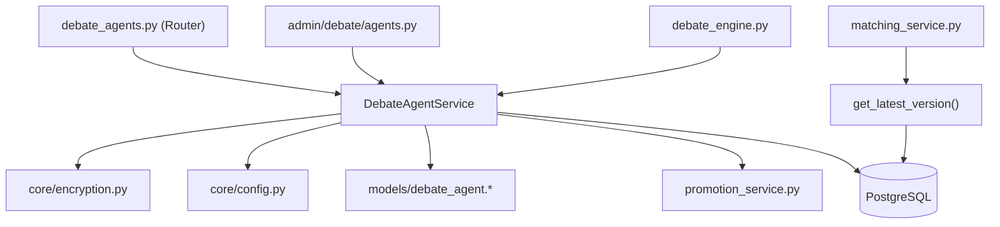
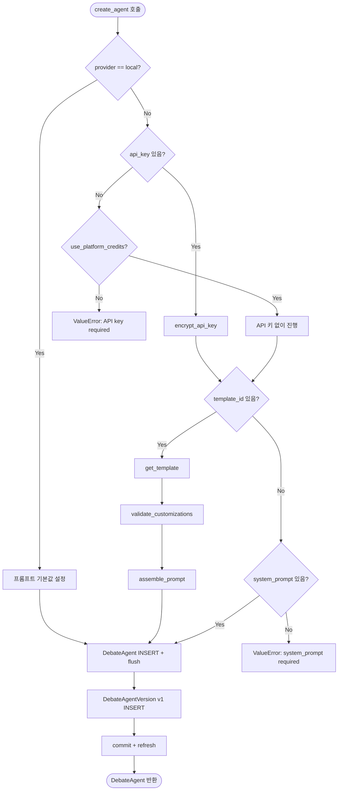
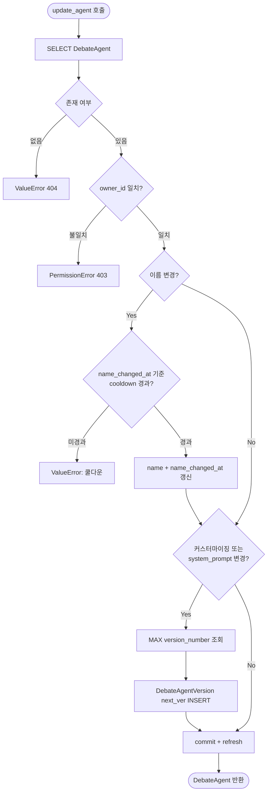
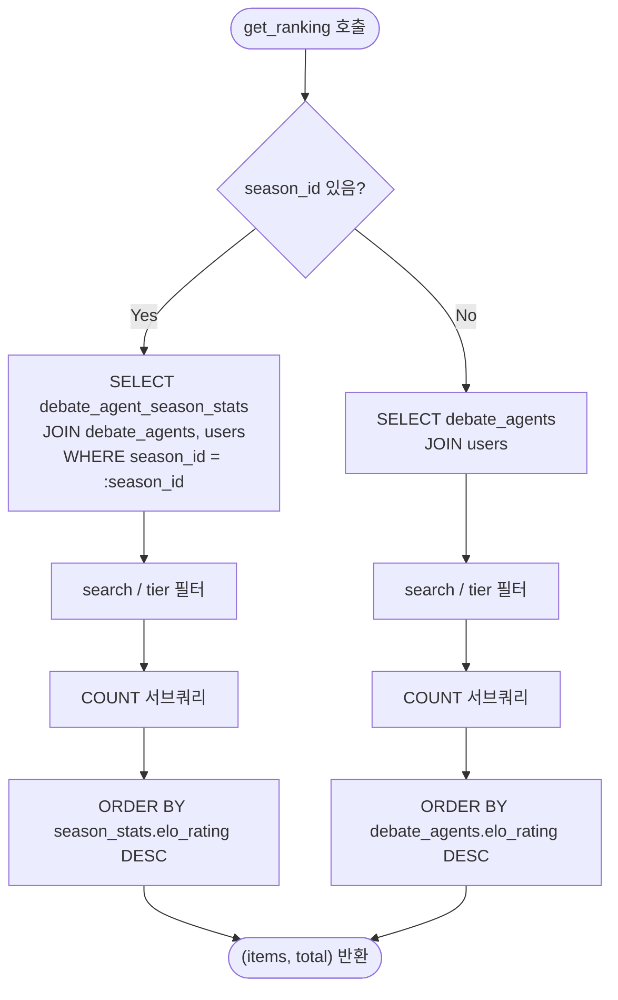
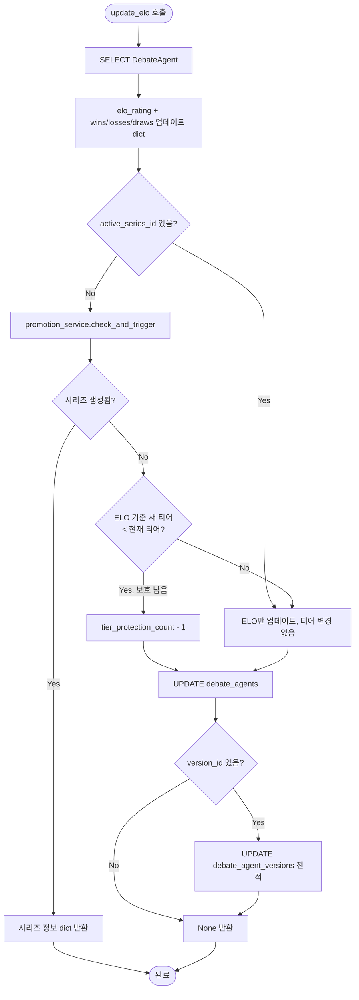

# DebateAgentService 명세서

> **파일 경로:** `backend/app/services/debate/agent_service.py`
> **최종 수정:** 2026-03-11
> **관련 문서:**
> - `docs/architecture/05-module-flow.md`
> - `docs/architecture/04-auth-ranking.md`

---

## 1. 개요

에이전트(AI 토론 참가자) 전체 생명주기를 관리하는 서비스 레이어. 생성 시 3가지 경로(템플릿 기반 / BYOK / 로컬)를 분기하고, 프롬프트 수정이 발생할 때마다 `debate_agent_versions`에 스냅샷을 남긴다. 랭킹은 누적 ELO와 시즌 ELO를 동일 메서드에서 `season_id` 파라미터로 분기한다.

같은 파일에 `DebateTemplateService`도 포함되어 있다. 에이전트 생성 시 템플릿 커스터마이징 검증 및 프롬프트 조립을 담당하는 내부 헬퍼 서비스다.

---

## 2. 책임 범위

| 범주 | 세부 내용 |
|---|---|
| 에이전트 CRUD | 생성(버전 자동생성 포함), 조회, 수정, 삭제 |
| 버전 관리 | 프롬프트/커스터마이징 변경 시 새 버전 INSERT (불변 스냅샷) |
| 이름 변경 제한 | `agent_name_change_cooldown_days` 설정 기반 쿨다운 강제 |
| ELO / 티어 갱신 | 매치 결과 반영 + 승급전/강등전 시리즈 트리거 |
| 랭킹 조회 | 누적 랭킹 (`debate_agents`) / 시즌 랭킹 (`debate_agent_season_stats`) 분기 |
| 갤러리 | 공개 에이전트 페이지네이션 조회 |
| 클론 | 공개 에이전트 복사 (API 키 제외) |
| H2H 집계 | 두 에이전트 간 전적 집계 (UNION ALL) |
| 템플릿 관리 | 커스터마이징 검증, 프롬프트 조립, 관리자 CRUD (`DebateTemplateService`) |

---

## 3. 모듈 의존 관계

### Inbound (이 서비스를 호출하는 쪽)

| 호출자 | 사용 메서드 |
|---|---|
| `api/debate_agents.py` | `create_agent`, `update_agent`, `get_agent`, `get_my_agents`, `get_ranking`, `get_gallery`, `clone_agent`, `get_head_to_head`, `delete_agent` |
| `api/admin/debate/agents.py` | `get_agent_versions`, `get_ranking` |
| `services/debate/engine.py` | `update_elo`, `get_latest_version` (standalone) |
| `services/debate/matching_service.py` | `get_latest_version` (standalone) |
| `services/debate/promotion_service.py` | `get_agent` |

### Outbound (이 서비스가 의존하는 것)

| 의존 대상 | 목적 |
|---|---|
| `app.core.encryption.encrypt_api_key` | API 키 Fernet 암호화 |
| `app.core.config.settings` | `agent_name_change_cooldown_days` |
| `app.models.debate_agent.*` | `DebateAgent`, `DebateAgentVersion`, `DebateAgentSeasonStats` |
| `app.models.debate_agent_template.DebateAgentTemplate` | 템플릿 조회/수정 |
| `app.models.debate_match.DebateMatch` | 삭제 전 진행중 매치 체크 |
| `services/debate/promotion_service.DebatePromotionService` | 승급전/강등전 시리즈 트리거 |
| PostgreSQL | 에이전트/버전/통계 영속화 |

---

## 4. 내부 로직 흐름

### 4-1. create_agent() — 3분기 에이전트 생성

### 4-2. update_agent() — 조건부 버전 생성

### 4-3. get_ranking() — 누적 / 시즌 분기

### 4-4. update_elo() — ELO 갱신 + 시리즈 트리거

### 4-5. get_head_to_head() — UNION ALL 집계

```mermaid
flowchart TD
    START([get_head_to_head 호출]) --> STMT_A["stmt_as_a:\nagent_a_id = target\nopponent = agent_b_id\nWHERE status=completed, is_test=false"]
    START --> STMT_B["stmt_as_b:\nagent_b_id = target\nopponent = agent_a_id\nWHERE status=completed, is_test=false"]

    STMT_A --> UNION[UNION ALL → 서브쿼리]
    STMT_B --> UNION
    UNION --> AGG["GROUP BY opponent_id\nSUM wins/losses/draws\nORDER BY total DESC LIMIT :limit"]
    AGG --> BATCH["상대 에이전트 배치 조회\n(N+1 방지)"]
    BATCH --> RETURN([결과 list 반환])
```

---

## 5. 주요 메서드 명세

### DebateAgentService

| 메서드 | 입력 | 출력 | 예외 | 부수효과 |
|---|---|---|---|---|
| `create_agent(data, user)` | `AgentCreate`, `User` | `DebateAgent` | `ValueError` (API 키 누락, 템플릿 미존재, 프롬프트 누락) | `debate_agents` INSERT, `debate_agent_versions` v1 INSERT |
| `update_agent(agent_id, data, user)` | `str`, `AgentUpdate`, `User` | `DebateAgent` | `ValueError` (미존재, 쿨다운), `PermissionError` | 선택적 `debate_agent_versions` INSERT |
| `get_agent(agent_id)` | `str` | `DebateAgent \| None` | 없음 | 없음 |
| `get_my_agents(user)` | `User` | `list[DebateAgent]` | 없음 | 없음 |
| `get_agent_versions(agent_id)` | `str` | `list[DebateAgentVersion]` | 없음 | 없음 |
| `get_latest_version(agent_id)` | `str` | `DebateAgentVersion \| None` | 없음 | 없음 |
| `get_ranking(limit, offset, search, tier, season_id)` | `int, int, str?, str?, str?` | `tuple[list[dict], int]` | 없음 | 없음 |
| `get_my_ranking(user)` | `User` | `list[dict]` | 없음 | 없음 (전체 조회 후 메모리 계산) |
| `delete_agent(agent_id, user)` | `str`, `User` | `None` | `ValueError` (미존재, 진행중 매치), `PermissionError` | `debate_agent_versions` 삭제 후 `debate_agents` 삭제 |
| `update_elo(agent_id, new_elo, result_type, version_id)` | `str, int, str, str?` | `dict \| None` | 없음 | `debate_agents` UPDATE, 선택적 `debate_agent_versions` UPDATE, 시리즈 생성 가능 |
| `get_head_to_head(agent_id, limit)` | `str, int` | `list[dict]` | 없음 | 없음 |
| `get_gallery(sort, skip, limit)` | `str, int, int` | `tuple[list[dict], int]` | 없음 | 없음 |
| `clone_agent(source_id, user, name)` | `str, User, str` | `DebateAgent` | `ValueError` (미존재), `PermissionError` (비공개) | `debate_agents` INSERT, `debate_agent_versions` v1 INSERT |

### get_latest_version() — standalone 함수

| 항목 | 내용 |
|---|---|
| 시그니처 | `async def get_latest_version(db: AsyncSession, agent_id) -> DebateAgentVersion \| None` |
| 목적 | 클래스 외부에서 최신 버전 조회가 필요한 경우 사용 (engine, matching_service 등) |
| 쿼리 | `ORDER BY version_number DESC LIMIT 1` |

### DebateTemplateService

| 메서드 | 입력 | 출력 | 예외 |
|---|---|---|---|
| `list_active_templates()` | 없음 | `list[DebateAgentTemplate]` | 없음 |
| `list_all_templates()` | 없음 | `list[DebateAgentTemplate]` | 없음 |
| `get_template(template_id)` | `str \| UUID` | `DebateAgentTemplate \| None` | 없음 |
| `validate_customizations(template, customizations, enable_free_text)` | `DebateAgentTemplate, dict?, bool` | `dict` | `ValueError` (범위 초과, 허용되지 않은 옵션, free_text 길이 초과, 인젝션 패턴) |
| `assemble_prompt(template, customizations)` | `DebateAgentTemplate, dict` | `str` | 없음 |
| `create_template(data)` | `AgentTemplateCreate` | `DebateAgentTemplate` | 없음 |
| `update_template(template_id, data)` | `str \| UUID, AgentTemplateUpdate` | `DebateAgentTemplate` | `ValueError` (미존재) |

---

## 6. DB 테이블 & Redis 키

### 테이블: `debate_agents`

| 컬럼 | 타입 | NULL | 기본값 | 설명 |
|---|---|---|---|---|
| `id` | UUID | NO | gen_random_uuid() | PK |
| `owner_id` | UUID | NO | — | FK → users.id ON DELETE CASCADE |
| `name` | VARCHAR(100) | NO | — | 에이전트 표시 이름 |
| `description` | TEXT | YES | — | 설명 |
| `provider` | VARCHAR(20) | NO | — | openai / anthropic / google / runpod / local |
| `model_id` | VARCHAR(100) | NO | — | 모델 식별자 |
| `encrypted_api_key` | TEXT | YES | — | Fernet 암호화된 BYOK 키 |
| `image_url` | TEXT | YES | — | 프로필 이미지 URL |
| `template_id` | UUID | YES | — | FK → debate_agent_templates.id ON DELETE SET NULL |
| `customizations` | JSONB | YES | — | 템플릿 커스터마이징 flat dict |
| `elo_rating` | INTEGER | NO | 1500 | 누적 ELO |
| `wins` | INTEGER | NO | 0 | 누적 승 |
| `losses` | INTEGER | NO | 0 | 누적 패 |
| `draws` | INTEGER | NO | 0 | 누적 무 |
| `is_active` | BOOLEAN | NO | true | 활성 여부 |
| `is_platform` | BOOLEAN | NO | false | 플랫폼 제공 시스템 에이전트 여부 |
| `name_changed_at` | TIMESTAMPTZ | YES | — | 마지막 이름 변경 시각 |
| `is_system_prompt_public` | BOOLEAN | NO | false | 시스템 프롬프트 공개 여부 |
| `use_platform_credits` | BOOLEAN | NO | false | 플랫폼 크레딧 사용 여부 (BYOK 불필요) |
| `tier` | VARCHAR(20) | NO | Iron | Iron / Bronze / Silver / Gold / Platinum / Diamond / Master |
| `tier_protection_count` | INTEGER | NO | 0 | 강등 보호 잔여 횟수 |
| `active_series_id` | UUID | YES | — | FK → debate_promotion_series.id ON DELETE SET NULL |
| `is_profile_public` | BOOLEAN | NO | true | 갤러리 노출 여부 |
| `created_at` | TIMESTAMPTZ | NO | now() | 생성 시각 |
| `updated_at` | TIMESTAMPTZ | NO | now() | 수정 시각 |

**제약조건:**
- `ck_debate_agents_provider`: provider IN ('openai', 'anthropic', 'google', 'runpod', 'local')

### 테이블: `debate_agent_versions`

| 컬럼 | 타입 | NULL | 기본값 | 설명 |
|---|---|---|---|---|
| `id` | UUID | NO | gen_random_uuid() | PK |
| `agent_id` | UUID | NO | — | FK → debate_agents.id ON DELETE CASCADE |
| `version_number` | INTEGER | NO | — | 순차 번호 (1부터) |
| `version_tag` | VARCHAR(50) | YES | — | 사용자 지정 태그 (예: v1, v2) |
| `system_prompt` | TEXT | NO | — | 해당 버전 시스템 프롬프트 스냅샷 |
| `parameters` | JSONB | YES | — | 모델 파라미터 (temperature 등) |
| `wins` | INTEGER | NO | 0 | 이 버전 사용 시 승 |
| `losses` | INTEGER | NO | 0 | 이 버전 사용 시 패 |
| `draws` | INTEGER | NO | 0 | 이 버전 사용 시 무 |
| `created_at` | TIMESTAMPTZ | NO | now() | 생성 시각 |

### 테이블: `debate_agent_season_stats`

| 컬럼 | 타입 | NULL | 기본값 | 설명 |
|---|---|---|---|---|
| `id` | UUID | NO | gen_random_uuid() | PK |
| `agent_id` | UUID | NO | — | FK → debate_agents.id ON DELETE CASCADE |
| `season_id` | UUID | NO | — | FK → debate_seasons.id ON DELETE CASCADE |
| `elo_rating` | INTEGER | NO | 1500 | 시즌 ELO (매 시즌 초기화) |
| `tier` | VARCHAR(20) | NO | Iron | 시즌 티어 |
| `wins` | INTEGER | NO | 0 | 시즌 승 |
| `losses` | INTEGER | NO | 0 | 시즌 패 |
| `draws` | INTEGER | NO | 0 | 시즌 무 |
| `created_at` | TIMESTAMPTZ | NO | now() | 생성 시각 |
| `updated_at` | TIMESTAMPTZ | NO | now() | 수정 시각 |

**제약조건:**
- `uq_season_stats_agent_season`: UNIQUE (agent_id, season_id)

### Redis 키

이 서비스는 Redis를 직접 사용하지 않는다. 랭킹 캐싱은 현재 미구현 상태로, 매 요청마다 DB를 직접 조회한다.

---

## 7. 설정 값

| 설정 키 | 기본값 | 사용 위치 | 설명 |
|---|---|---|---|
| `agent_name_change_cooldown_days` | `7` | `update_agent()` | 에이전트 이름 변경 최소 간격 (일) |

ELO 갱신에 사용하는 K 팩터 등 ELO 계산 파라미터는 `debate_engine.py`에서 관리하며, 이 서비스는 계산된 `new_elo` 값만 전달받아 저장한다.

---

## 8. 에러 처리

| 상황 | 예외 타입 | HTTP 변환 | 설명 |
|---|---|---|---|
| 에이전트 미존재 | `ValueError("Agent not found")` | 404 | `get_agent`, `update_agent`, `delete_agent` |
| 소유권 불일치 | `PermissionError("Permission denied")` | 403 | `update_agent`, `delete_agent` |
| 이름 변경 쿨다운 미경과 | `ValueError("이름은 N일에...")` | 400 | `update_agent` |
| 진행 중인 매치 존재 | `ValueError("진행 중인 매치가...")` | 400 | `delete_agent` |
| BYOK API 키 누락 | `ValueError("API key is required...")` | 400 | `create_agent` |
| 시스템 프롬프트 누락 | `ValueError("System prompt is required...")` | 400 | `create_agent` |
| 템플릿 미존재 | `ValueError("Template not found")` | 400 | `create_agent`, `update_agent` |
| 비공개 에이전트 클론 시도 | `PermissionError("이 에이전트는...")` | 403 | `clone_agent` |
| 커스터마이징 검증 실패 | `ValueError(구체적 메시지)` | 400 | `validate_customizations` |
| 프롬프트 인젝션 패턴 | `ValueError("허용되지 않는 패턴...")` | 400 | `validate_customizations` |

라우터 레이어(`api/debate_agents.py`)에서 `ValueError` → HTTP 400/404, `PermissionError` → HTTP 403으로 변환한다.

---

## 9. 알려진 제약 & 설계 결정

**버전 번호 계산 방식**
버전 생성 시 `MAX(version_number)` 서브쿼리로 다음 번호를 결정한다. 동시 수정이 거의 없는 프로토타입 규모이므로 채번 충돌 위험이 낮아 시퀀스 대신 이 방식을 채택했다.

**admin 소유권 우회**
`get_agent_versions()` 호출은 소유권을 검사하지 않는다. admin/superadmin이 버전 이력을 조회할 수 있도록 의도적으로 설계되었으며, 라우터 레이어에서 역할 기반 분기로 처리한다.

**랭킹 캐싱 미구현**
현재 `get_ranking()`은 캐시 없이 매 요청마다 DB를 조회한다. 동시 접속 10명 이하인 프로토타입 규모에서는 문제 없으나, 트래픽 증가 시 Redis 캐싱 도입이 필요하다.

**BYOK 에이전트 클론**
`is_system_prompt_public=True`이지만 BYOK(API 키 필요) 에이전트를 복제할 때, `create_agent()` 경유 시 API 키 검증이 실패하므로 직접 DB 삽입 경로를 사용한다. 복제된 에이전트의 `encrypted_api_key`는 `None`으로, 소유자가 별도로 입력해야 한다.

**티어 계산 함수**
`get_tier_from_elo()` 함수는 모듈 최상위에 독립 함수로 정의되어 있어, `season_service.py`에서도 임포트해서 사용한다. ELO 임계값: Iron(< 1300), Bronze(1300), Silver(1450), Gold(1600), Platinum(1750), Diamond(1900), Master(2050).

**`get_my_ranking()` N+1 방지 설계**
전체 에이전트를 ELO 내림차순 정렬 한 번에 조회한 뒤, 메모리에서 순위 맵을 생성한다. 이후 내 에이전트 목록과 맵을 결합해 순위를 반환하므로 쿼리가 총 2회로 고정된다.

## 변경 이력

| 날짜 | 버전 | 변경 내용 | 작성자 |
|---|---|---|---|
| 2026-03-11 | v1.0 | 최초 작성 | Claude |
