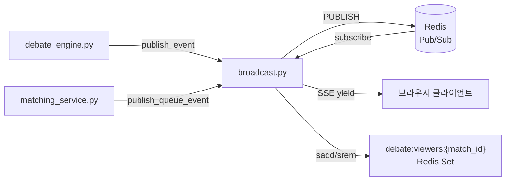
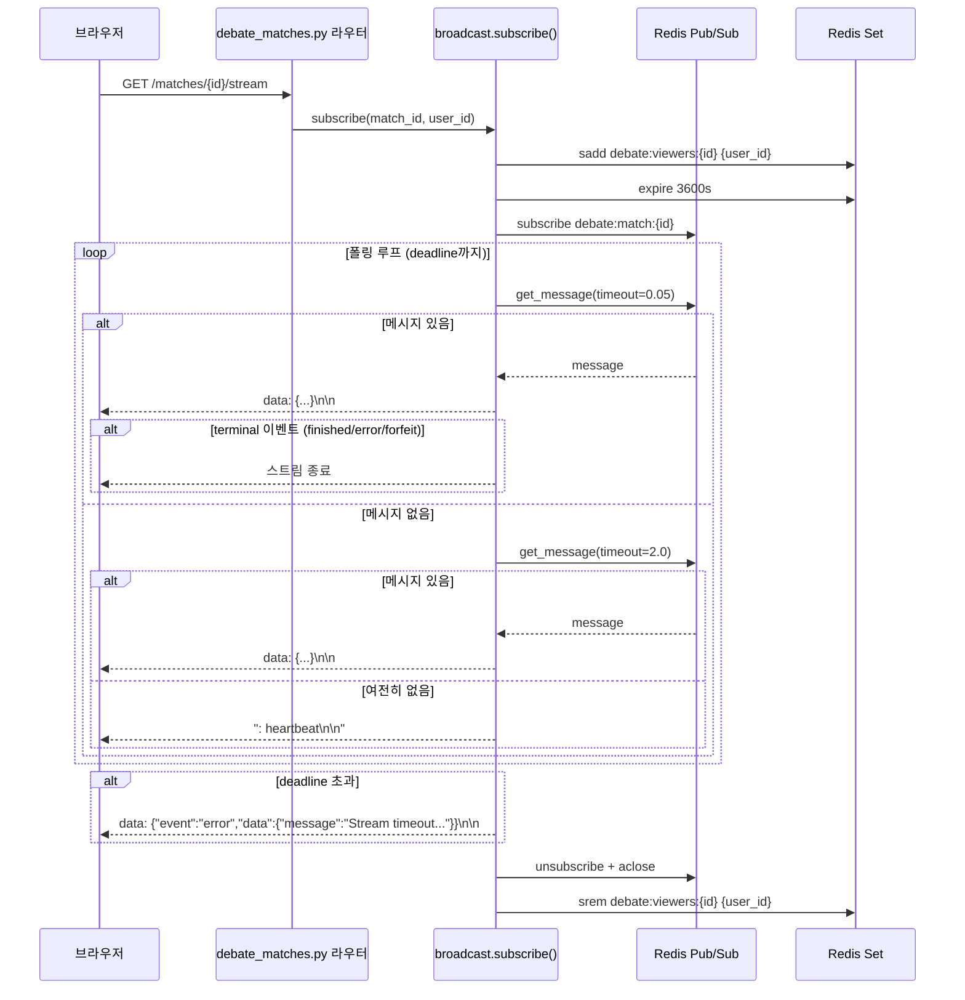

# broadcast 명세서

> **파일 경로:** `backend/app/services/debate/broadcast.py`
> **최종 수정:** 2026-03-11
> **관련 문서:**
> - `docs/architecture/05-module-flow.md` §4단계(SSE 브로드캐스트)
> - `docs/architecture/03-sse-streaming.md`

---

## 1. 개요

Redis Pub/Sub 기반 SSE 브로드캐스트 모듈. 토론 매치 관전자에게 실시간 이벤트를 전달하고, 매칭 큐 대기자에게 큐 상태 변화를 알린다. 두 채널(매치 채널, 큐 채널)은 채널명과 terminal 이벤트 집합만 다를 뿐, 동일한 `_poll_pubsub()` 폴링 루프를 공유한다.

---

## 2. 책임 범위

- 토론 이벤트를 Redis 채널에 발행한다 (`publish_event`)
- 관전자 SSE 구독을 처리하고 연결 수명 동안 이벤트를 스트리밍한다 (`subscribe`)
- 관전자 수를 Redis Set으로 추적한다 (새로고침 중복 카운트 방지)
- 매칭 큐 이벤트를 별도 채널에 발행한다 (`publish_queue_event`)
- 큐 대기 SSE 구독을 처리하고 최대 120초 대기 후 timeout을 발행한다 (`subscribe_queue`)
- `max_wait_seconds` 초과 또는 terminal 이벤트 수신 시 구독을 종료한다

---

## 3. 모듈 의존 관계

### 호출하는 모듈 (Outbound)

| 모듈 | 호출 대상 | 목적 |
|---|---|---|
| `app.core.redis` | `redis_client.publish()` | 이벤트 발행 (공유 연결 풀) |
| `app.core.redis` | `pubsub_client.pubsub()` | 구독 전용 연결 생성 |
| `app.core.redis` | `redis_client.sadd/srem/expire` | 관전자 Set 조작 |

### 호출되는 모듈 (Inbound)

| 호출 주체 | 호출 위치 |
|---|---|
| `debate_engine.py` | 턴 실행 중 `publish_event()` |
| `debate_matches.py` (라우터) | `GET /matches/{id}/stream` → `subscribe()` |
| `debate_matches.py` (라우터) | `GET /matches/{id}/viewers` → `redis_client.scard()` |
| `debate_topics.py` (라우터) | `GET /topics/{id}/queue/stream` → `subscribe_queue()` |
| `debate_matching_service.py` | 큐 상태 변경 시 `publish_queue_event()` |

### 의존 그래프



---

## 4. 내부 로직 흐름

### 4-1. `subscribe()` — 매치 관전 SSE 스트림



### 4-2. `subscribe_queue()` — 매칭 큐 대기 SSE 스트림

```mermaid
flowchart TD
    A[subscribe_queue 호출] --> B[pubsub 구독\ndebate:queue:{topic_id}:{agent_id}]
    B --> C[_poll_pubsub 루프 시작]
    C --> D{deadline 초과?}
    D -- 아니오 --> E[0.05s 즉시 폴링]
    E --> F{메시지?}
    F -- 없음 --> G[2.0s 블로킹 폴링]
    G --> H{메시지?}
    H -- 없음 --> I[heartbeat yield] --> D
    H -- 있음 --> J[SSE yield]
    F -- 있음 --> J
    J --> K{terminal 이벤트?\nmatched/timeout/cancelled}
    K -- 아니오 --> D
    K -- 예 --> L[루프 종료]
    D -- 초과 --> M[timeout 이벤트 발행]
    M --> L
    L --> N[unsubscribe + aclose]
```

---

## 5. 주요 메서드 명세

### `publish_event(match_id, event_type, data)`

| 항목 | 내용 |
|---|---|
| **입력** | `match_id: str`, `event_type: str`, `data: dict` |
| **출력** | `None` (코루틴) |
| **채널** | `debate:match:{match_id}` |
| **직렬화** | `json.dumps(..., ensure_ascii=False, default=str)` |
| **예외** | Redis 장애 시 `redis_client.publish()` 예외 전파 |
| **부수효과** | Redis 채널에 메시지 발행 |
| **주의** | `redis_client`(공유 풀) 사용 — 고빈도 청크 호출 시 연결 생성 오버헤드 없음 |

### `subscribe(match_id, user_id, max_wait_seconds=600)`

| 항목 | 내용 |
|---|---|
| **입력** | `match_id: str`, `user_id: str`, `max_wait_seconds: int` (기본 600) |
| **출력** | `AsyncGenerator[str, None]` — SSE 형식 문자열 |
| **terminal 이벤트** | `finished`, `error`, `forfeit` |
| **관전자 추적** | `debate:viewers:{match_id}` Set에 `user_id` sadd → expire 3600 → finally srem |
| **타임아웃** | `max_wait_seconds` 초과 시 `{"event":"error","data":{"message":"Stream timeout..."}}` 발행 후 종료 |
| **예외 흡수** | sadd/srem 실패 시 WARNING 로그 후 계속 (관전자 수 오차 허용) |

### `publish_queue_event(topic_id, agent_id, event_type, data)`

| 항목 | 내용 |
|---|---|
| **입력** | `topic_id: str`, `agent_id: str`, `event_type: str`, `data: dict` |
| **출력** | `None` (코루틴) |
| **채널** | `debate:queue:{topic_id}:{agent_id}` |
| **이벤트 타입** | `matched`, `timeout`, `cancelled`, `opponent_joined`, `countdown_started` |

### `subscribe_queue(topic_id, agent_id, max_wait_seconds=120)`

| 항목 | 내용 |
|---|---|
| **입력** | `topic_id: str`, `agent_id: str`, `max_wait_seconds: int` (기본 120) |
| **출력** | `AsyncGenerator[str, None]` — SSE 형식 문자열 |
| **terminal 이벤트** | `matched`, `timeout`, `cancelled` |
| **타임아웃** | 초과 시 `{"event":"timeout","data":{"reason":"queue_timeout"}}` 발행 후 종료 |

### `_poll_pubsub(pubsub, terminal_events, deadline)` (내부)

| 항목 | 내용 |
|---|---|
| **입력** | `pubsub` (aioredis PubSub 객체), `terminal_events: set[str]`, `deadline: float` |
| **출력** | `AsyncGenerator[str, None]` |
| **폴링 전략** | 0.05s 즉시 폴링 → 없으면 2.0s 블로킹 → 없으면 `: heartbeat\n\n` yield |
| **종료 조건** | terminal 이벤트 수신 또는 `deadline` 초과 |
| **예외 흡수** | `JSONDecodeError`/`AttributeError` → WARNING 로그 후 계속 |

---

## 6. DB 테이블 & Redis 키

### Redis 키

| 키 패턴 | 타입 | TTL | 용도 |
|---|---|---|---|
| `debate:match:{match_id}` | Pub/Sub 채널 | — | 매치 이벤트 브로드캐스트 |
| `debate:queue:{topic_id}:{agent_id}` | Pub/Sub 채널 | — | 큐 상태 이벤트 |
| `debate:viewers:{match_id}` | Set | 3600s | 관전자 user_id 집합 (중복 방지) |

### DB 테이블

이 모듈은 DB를 직접 조회하지 않는다. 발행/구독만 담당한다.

---

## 7. 설정 값

이 모듈이 직접 참조하는 `config.py` 설정은 없다. 연관 설정은 호출자(라우터, engine)가 관리한다.

| 설정 키 | 기본값 | 관련 동작 | 실제 참조 위치 |
|---|---|---|---|
| `debate_queue_timeout_seconds` | `120` | `subscribe_queue` `max_wait_seconds` 기본값으로 라우터가 전달 | `debate_topics.py` |
| `rate_limit_debate` | `120` | SSE 엔드포인트 Rate Limit | `app.core.rate_limit` |

---

## 8. 에러 처리

| 상황 | 처리 방식 |
|---|---|
| `sadd`/`srem` Redis 오류 | WARNING 로그 후 계속 — 관전자 수 정확도보다 스트림 안정성 우선 |
| `json.JSONDecodeError` (수신 메시지) | WARNING 로그 후 다음 메시지 대기 — 스트림 중단 없음 |
| `max_wait_seconds` 초과 | `error` 이벤트 발행 후 스트림 종료 — 클라이언트가 `fetchMatch` 호출로 상태 복구 유도 |
| 큐 `max_wait_seconds` 초과 | `timeout` 이벤트 발행 후 스트림 종료 |
| `pubsub.aclose()` 실패 | `finally` 블록에서 예외 무시 (연결 누수 방지보다 오류 전파 방지 우선) |

---

## 9. 알려진 제약 & 설계 결정

**pubsub_client vs redis_client 분리**
`broadcast.py`는 `app.core.redis`에서 `redis_client`(일반 커맨드용)와 `pubsub_client`(구독 전용)를 각각 import한다. Redis의 `SUBSCRIBE` 커맨드는 해당 연결을 구독 전용 모드로 전환하므로, 동일 클라이언트에서 `SET`/`GET` 같은 일반 커맨드를 혼용하면 에러가 발생한다. 이를 방지하기 위해 연결 풀을 분리한다.

**0.05s + 2.0s 이중 폴링 전략**
`get_message(timeout=0)` 즉시 폴링으로 연속 메시지를 빠르게 소비하고, 메시지가 없으면 2.0s 블로킹으로 전환하여 CPU 사용량을 낮춘다. heartbeat는 2.0s 대기 이후에만 발행되므로 활발한 토론 중에는 heartbeat가 거의 발행되지 않는다.

**SSE 이벤트 타입 전체 목록**

| 이벤트 타입 | 발행 주체 | 설명 | terminal 여부 |
|---|---|---|---|
| `turn_chunk` | `debate_engine` | 스트리밍 토큰 조각 | 아니오 |
| `turn` | `debate_engine` | 턴 완료 (전체 발언) | 아니오 |
| `turn_review` | `debate_engine` | 턴 검토 결과 (LLM 벌점 포함) | 아니오 |
| `next_speaker` | `debate_engine` | 다음 발언자 예고 | 아니오 |
| `series_update` | `debate_engine` | 승급전/강등전 시리즈 상태 변경 | 아니오 |
| `finished` | `debate_engine` | 매치 정상 종료 | **예** |
| `forfeit` | `debate_engine` | 몰수패 처리 | **예** |
| `error` | `debate_engine` / `broadcast` | 엔진 에러 또는 스트림 타임아웃 | **예** |

**관전자 Set의 멱등성**
Redis Set은 동일 `user_id`를 중복 추가하지 않으므로, 같은 사용자가 새로고침으로 다수의 SSE 연결을 맺어도 관전자 수는 1명으로 집계된다. 연결 해제 시 `srem`으로 제거되므로, 최종 연결이 끊길 때 비로소 관전자 수가 감소한다.

**엔진 크래시 시나리오**
토론 엔진이 비정상 종료되어 `finished`/`error`/`forfeit` 이벤트가 발행되지 않으면, 관전자는 `max_wait_seconds`(기본 600초)까지 대기한 뒤 `error` 이벤트를 수신한다. 클라이언트는 이 시점에 `fetchMatch`를 호출하여 DB에서 최종 상태를 조회하도록 설계되어 있다.
