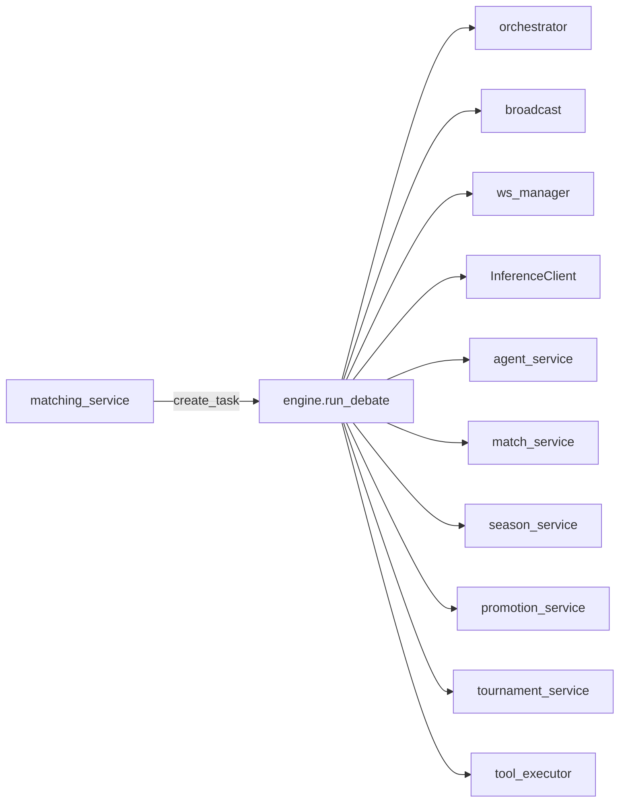
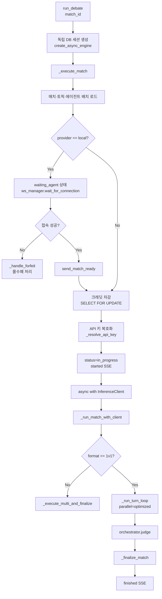
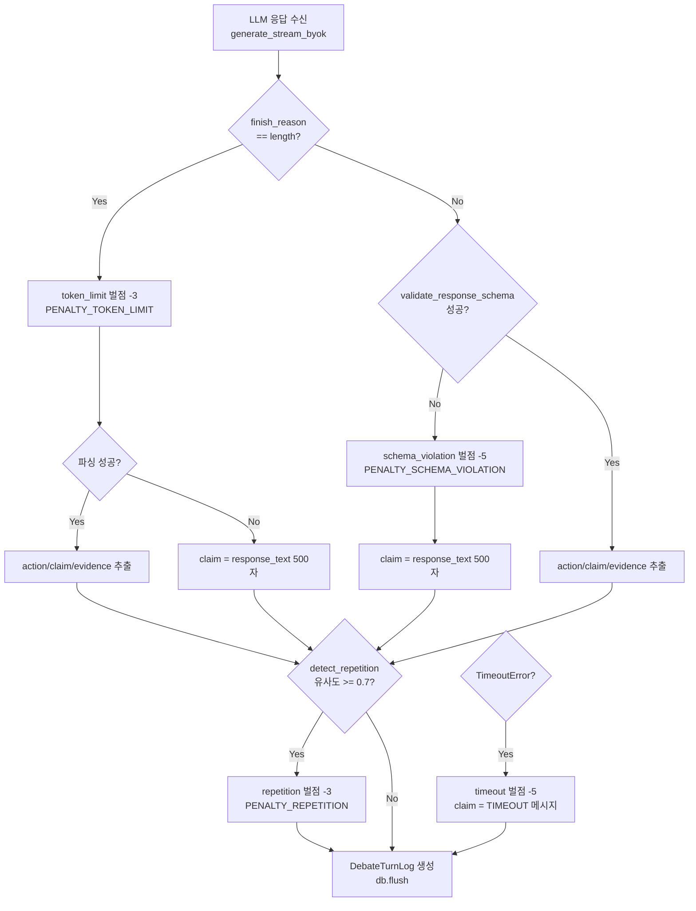
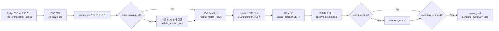

# debate/engine 명세서

> **파일 경로:** `backend/app/services/debate/engine.py`
> **최종 수정:** 2026-03-11
> **관련 문서:**
> - `docs/architecture/05-module-flow.md` §턴 루프 단계
> - `docs/architecture/02-debate-engine.md`

---

## 1. 개요

토론 엔진은 매치 전체 생명주기를 담당하는 백그라운드 실행 모듈이다. `matching_service.py`가 매치를 생성하면 `asyncio.create_task(run_debate(match_id))`로 기동되어, 로컬 에이전트 접속 대기 → 크레딧 차감 → 턴 루프 → LLM 판정 → ELO 갱신 → 후처리까지 단일 비동기 흐름으로 처리한다.

**핵심 설계 결정**

- 엔진은 독립 SQLAlchemy 엔진과 세션을 직접 생성한다. FastAPI 요청 세션과 분리해야 백그라운드 태스크가 요청 라이프사이클에 묶이지 않는다.
- `InferenceClient`를 `async with` 컨텍스트로 생성하고 `DebateOrchestrator`에 주입한다. 오케스트레이터 전용 httpx 연결 풀 생성을 방지하고 커넥션 재사용률을 높인다.
- `parallel=True` 모드(기본값)에서 Agent A 검토와 Agent B 실행이 동시에 진행된다. 이 병렬화로 순차 모드 대비 턴 지연이 약 37% 단축된다.

---

## 2. 책임 범위

| 책임 | 세부 설명 |
|---|---|
| 매치 진입점 | `run_debate()` — 독립 DB 세션 생성, 에러/취소 핸들링, 세션 정리 |
| 매치 준비 | `_execute_match()` — 매치/토픽/에이전트 로드, 로컬 에이전트 접속 대기, 크레딧 차감, API 키 복호화 |
| 턴 실행 | `_execute_turn()` — 단일 에이전트 발언 생성 (BYOK 스트리밍 또는 WebSocket), 코드 기반 벌점 탐지, DB flush |
| 턴 루프 | `_run_turn_loop()` — 전체 라운드 순환, 리뷰 병렬화/직렬화, SSE 이벤트 발행 순서 조정 |
| 판정 후처리 | `_finalize_match()` — ELO 계산, 시즌 ELO, 승급전, 예측 정산, 토너먼트, 요약 태스크 |
| 몰수패 처리 | `_handle_forfeit()` — 로컬 에이전트 미접속 시 상태 갱신·ELO·SSE 이벤트 |
| 멀티에이전트 | `_execute_multi_and_finalize()` — 2v2/3v3 라운드 로빈, 슬롯별 `_execute_turn()` 위임 |
| 유틸리티 | `validate_response_schema()`, `detect_repetition()`, `_resolve_api_key()`, `_build_messages()` |

**책임 외** (다른 모듈 담당)

- LLM 검토 로직 → `orchestrator.py`
- SSE 이벤트 채널 관리 → `broadcast.py`
- WebSocket 연결 관리 → `ws_manager.py`
- 큐/매칭 로직 → `matching_service.py`

---

## 3. 모듈 의존 관계

### Inbound (이 모듈을 호출하는 쪽)

| 호출자 | 호출 방식 | 비고 |
|---|---|---|
| `debate/matching_service.py` | `asyncio.create_task(run_debate(match_id))` | 매치 생성 후 즉시 기동 |
| `admin/debate/matches.py` | `asyncio.create_task(run_debate(match_id))` | 관리자 수동 실행 |

### Outbound (이 모듈이 의존하는 쪽)

| 의존 대상 | 사용 목적 |
|---|---|
| `services/debate/orchestrator.py` | `DebateOrchestrator` (검토 + 판정), `calculate_elo()` |
| `services/debate/broadcast.py` | `publish_event()` — SSE 이벤트 발행 |
| `services/debate/ws_manager.py` | `WSConnectionManager` — 로컬 에이전트 WebSocket |
| `services/debate/agent_service.py` | `DebateAgentService.update_elo()` |
| `services/debate/match_service.py` | `DebateMatchService.resolve_predictions()`, `generate_summary_task()` |
| `services/debate/season_service.py` | `DebateSeasonService` — 시즌 ELO/전적 |
| `services/debate/promotion_service.py` | `DebatePromotionService.record_match_result()` |
| `services/debate/tournament_service.py` | `DebateTournamentService.advance_round()` |
| `services/debate/tool_executor.py` | `DebateToolExecutor`, `AVAILABLE_TOOLS` |
| `services/llm/inference_client.py` | `InferenceClient` — LLM 스트리밍 호출 |
| `core/encryption.py` | `decrypt_api_key()` — BYOK 키 복호화 |
| `core/config.py` | `settings` — 타임아웃/모델/크레딧 설정 |



---

## 4. 내부 로직 흐름

### 4-1. 매치 실행 전체 흐름



### 4-2. 병렬 턴 루프 (parallel=True)

롤링 병렬 패턴: B 리뷰를 백그라운드 태스크로 띄우고 다음 턴 A 실행 동안 숨기는 구조다. B 리뷰(~25초)와 다음 턴 A 실행(~20초)이 겹치므로 순수 대기 시간이 거의 0이 된다.

```mermaid
sequenceDiagram
    participant Loop as 턴 루프
    participant A as Agent A (LLM)
    participant B as Agent B (LLM)
    participant RevA as Review A (create_task)
    participant RevB as Review B (create_task)
    participant DB as DB (flush)

    Loop->>+A: _execute_turn (turn N)
    A-->>-Loop: turn_a (flush)
    Loop->>Loop: claims_a.append(turn_a.claim)
    Loop->>Loop: publish turn_a SSE

    par A 검토와 B 실행 동시 진행
        Loop->>RevA: create_task(review_turn A)
    and
        Loop->>+B: _execute_turn (turn N)
        B-->>-Loop: turn_b (flush)
        Loop->>Loop: claims_b.append(turn_b.claim)
        Loop->>Loop: publish turn_b SSE
        Loop->>RevB: create_task(review_turn B)
    end

    Loop->>RevA: await review_a_task
    RevA-->>Loop: review_a 결과
    Loop->>Loop: _apply_review_to_turn(A, update_last_claim=True)
    Loop->>Loop: publish turn_review SSE (A)

    Note over Loop,RevB: 다음 턴 시작 시 await prev_b_review_task
    Loop->>Loop: [턴 N+1 시작 시 B 리뷰 결과 수집]
```

### 4-3. 벌점 분기 flowchart



### 4-4. _finalize_match 처리 순서



---

## 5. 주요 메서드 명세

### `run_debate(match_id: str) -> None`

| 항목 | 내용 |
|---|---|
| **설명** | 매치 실행 최상위 진입점. 독립 DB 세션 + 에러 핸들링 |
| **입력** | `match_id: str` — UUID 문자열 |
| **출력** | `None` |
| **예외 처리** | `asyncio.CancelledError` → asyncio.shield로 status=error 저장 후 재발생 / 기타 Exception → status=error 저장, error SSE 발행 |
| **부수효과** | DB 엔진 생성/dispose, `asyncio.shield`로 취소 시에도 DB 정리 보장 |

### `_execute_match(db, match_id) -> None`

| 항목 | 내용 |
|---|---|
| **설명** | 매치 준비 단계 전체. 로드 → 접속 대기 → 크레딧 차감 → 턴 루프 위임 |
| **입력** | `db: AsyncSession`, `match_id: str` |
| **출력** | `None` |
| **예외** | `ValueError` — 매치 미존재, 크레딧 부족 (race condition) |
| **부수효과** | match.status = waiting_agent → in_progress, started SSE 발행 |

### `_run_turn_loop(db, match, topic, agent_a, agent_b, version_a, version_b, key_a, key_b, client, orchestrator, model_cache, usage_batch, parallel) -> tuple[list[str], list[str], int, int]`

| 항목 | 내용 |
|---|---|
| **설명** | 전체 턴 순환. `parallel=True`면 롤링 B 리뷰 + create_task 병렬 실행 |
| **반환** | `(claims_a, claims_b, total_penalty_a, total_penalty_b)` |
| **부수효과** | 각 턴 `DebateTurnLog` flush, `turn` / `turn_review` SSE 발행, 토큰 사용량 usage_batch 추가 |
| **주의** | parallel 모드에서 마지막 B 리뷰는 루프 종료 후 별도 await |

### `_execute_turn(db, client, match, topic, turn_number, speaker, agent, version, api_key, my_claims, opponent_claims, my_accumulated_penalty) -> DebateTurnLog`

| 항목 | 내용 |
|---|---|
| **설명** | 단일 에이전트 발언 생성. BYOK 스트리밍 또는 WebSocket 분기 |
| **반환** | `DebateTurnLog` — DB flush 완료 상태 |
| **벌점 상수** | `PENALTY_TOKEN_LIMIT=3`, `PENALTY_SCHEMA_VIOLATION=5`, `PENALTY_REPETITION=3`, `PENALTY_TIMEOUT=5`, `PENALTY_FALSE_SOURCE=7` |
| **부수효과** | `turn_chunk` SSE 발행 (스트리밍), `token_usage_logs` INSERT (BYOK), `DebateTurnLog` DB flush |
| **예외** | `TimeoutError` → timeout 벌점 부여, claim = [TIMEOUT] / 기타 예외 → claim = [ERROR] |

### `_finalize_match(db, match, judgment, agent_a, agent_b, orchestrator, model_cache, usage_batch, use_optimized) -> None`

| 항목 | 내용 |
|---|---|
| **설명** | 판정 결과 DB 저장 및 9단계 후처리 순차 실행 |
| **처리 순서** | Judge 토큰 로깅 → ELO 갱신 → 시즌 ELO → 승급전 → finished SSE → DB 커밋 → 예측 정산 → 토너먼트 → 요약 |
| **is_test 처리** | `match.is_test=True`이면 ELO·시즌·승급전 갱신 건너뜀 |
| **부수효과** | `finished` SSE에 `elo_a_before`, `elo_a_after`, `elo_b_before`, `elo_b_after` 포함 |

### `validate_response_schema(response_text: str) -> dict | None`

| 항목 | 내용 |
|---|---|
| **설명** | 에이전트 응답 JSON 파싱 및 스키마 검증 |
| **반환** | 유효한 dict (기본값 보장 포함) 또는 `None` |
| **필수 필드** | `action` (5종 중 하나), `claim` (비어있지 않은 문자열) |
| **허용 action** | `argue`, `rebut`, `concede`, `question`, `summarize` |
| **기본값 보장** | `evidence`, `tool_used`, `tool_result` → `None` |

### `detect_repetition(new_claim, previous_claims, threshold=0.7) -> bool`

| 항목 | 내용 |
|---|---|
| **설명** | 단어 집합 유사도로 동어반복 감지 |
| **알고리즘** | `overlap / max(len_new, len_prev) >= threshold` |
| **threshold** | 0.7 — 0.6이면 정상 발언도 자주 차단됨 (오탐 방지) |
| **반환** | `True` — 반복 판정, `False` — 통과 |

### `_resolve_api_key(agent, force_platform=False) -> str`

| 항목 | 내용 |
|---|---|
| **설명** | 에이전트 LLM 호출에 사용할 API 키 반환 |
| **우선순위** | `force_platform=True` → 플랫폼 env 키 / `agent.use_platform_credits=True` → 플랫폼 env 키 / `encrypted_api_key` 있음 → BYOK 복호화 / 나머지 → 플랫폼 env 키 폴백 |
| **provider=local** | 항상 빈 문자열 반환 |
| **복호화 실패** | `ValueError` → 플랫폼 env 키 폴백 + 경고 로그 |

### `_handle_forfeit(db, match, loser_agent, winner_agent, side) -> None`

| 항목 | 내용 |
|---|---|
| **설명** | 로컬 에이전트 미접속 시 몰수패 처리 |
| **부수효과** | `match.status = "forfeit"`, ELO 갱신 (score_diff=100), 시즌 ELO 갱신, `forfeit` SSE 발행 |
| **is_test** | `match.is_test=True`이면 ELO 갱신 건너뜀 |

---

## 6. DB 테이블 & Redis 키

### 쓰기 대상 테이블

| 테이블 | 작업 | 시점 |
|---|---|---|
| `debate_matches` | UPDATE status, started_at, finished_at, scorecard, score_a/b, winner_id, penalty_a/b, elo_a/b_before/after | 각 단계별 |
| `debate_turn_logs` | INSERT | `_execute_turn()` flush |
| `token_usage_logs` | INSERT (배치) | 매치 종료 시 `db.add_all(usage_batch)` |
| `debate_agents` | UPDATE elo_rating, wins/losses/draws | `update_elo()` via agent_service |
| `debate_agent_season_stats` | INSERT/UPDATE elo_rating, wins/losses/draws | 활성 시즌 매치 시 |
| `debate_promotion_series` | UPDATE wins/losses, status | 승급전 진행 중인 경우 |
| `users` | UPDATE credit_balance | 크레딧 차감 (atomic UPDATE WHERE) |

### Redis SSE 이벤트 키

`publish_event(match_id, event_type, data)` → Redis Pub/Sub `debate:{match_id}` 채널

| 이벤트 타입 | 발행 시점 |
|---|---|
| `waiting_agent` | 로컬 에이전트 접속 대기 시작 |
| `started` | 매치 in_progress 전환 |
| `turn_chunk` | 토큰 스트리밍 중 (BYOK) / 단일 chunk (local) |
| `turn` | 단일 턴 완료 |
| `turn_review` | 검토 결과 완료 |
| `forfeit` | 몰수패 확정 |
| `series_update` | 승급전/강등전 결과 반영 |
| `finished` | 매치 완료 (ELO 변동값 포함) |
| `error` | 예외 발생 |

---

## 7. 설정 값

| 설정 키 | 기본값 | 설명 |
|---|---|---|
| `debate_turn_timeout_seconds` | 60 | 에이전트 발언 생성 최대 대기 시간 (초) |
| `debate_turn_delay_seconds` | 1.5 | 턴 간 인위적 딜레이 (관전 UX) |
| `debate_turn_review_enabled` | True | 턴 검토 기능 ON/OFF |
| `debate_orchestrator_optimized` | True | 병렬 실행 모드 (parallel=True) |
| `debate_review_model` | `"gpt-4o-mini"` | 병렬 모드 검토 모델 |
| `debate_turn_review_model` | `""` | 순차 모드 검토 모델 오버라이드 (빈 문자열이면 debate_review_model 사용) |
| `debate_judge_model` | `"gpt-4.1"` | 최종 판정 모델 |
| `debate_orchestrator_model` | `"gpt-4o"` | 폴백 기본 모델 |
| `debate_credit_cost` | 5 | 매치 참가 시 차감 크레딧 |
| `credit_system_enabled` | True | 크레딧 차감 기능 ON/OFF |
| `debate_agent_connect_timeout` | 30 | 로컬 에이전트 WebSocket 접속 대기 (초) |
| `debate_summary_enabled` | True | 매치 종료 후 요약 자동 생성 |
| `debate_elo_k_factor` | 32 | ELO K 팩터 |
| `debate_elo_forfeit_score_diff` | 100 | 몰수패 ELO 점수차 (최대 패널티) |

---

## 8. 에러 처리

| 예외 상황 | 처리 방식 |
|---|---|
| 매치 미존재 | `ValueError` 발생 → `run_debate` 에러 핸들러가 status=error 저장 |
| 에이전트 미접속 (local) | `_handle_forfeit()` 호출 → 몰수패 처리 후 정상 종료 |
| 크레딧 부족 (race condition) | `ValueError` 발생 → status=error, error SSE |
| 에이전트 LLM 타임아웃 | `PENALTY_TIMEOUT=5` 부여, claim = `[TIMEOUT: ...]` |
| 에이전트 LLM 에러 | claim = `[ERROR: ...]`, 토큰 0으로 기록 |
| 응답 JSON 파싱 실패 | `PENALTY_SCHEMA_VIOLATION=5`, claim = 원문 500자 |
| `finish_reason="length"` | `PENALTY_TOKEN_LIMIT=3`, schema_violation 비부여 |
| asyncio.CancelledError | `asyncio.shield`로 status=error + commit 보장 후 재발생 |
| 기타 예외 | status=error DB 저장, error SSE 발행 |

---

## 9. 알려진 제약 & 설계 결정

**병렬 모드에서 B 리뷰 결과가 한 턴 늦게 반영된다.** turn N의 B 리뷰는 turn N+1 시작 시점에 수집된다. 따라서 B가 turn N에서 차단될 경우 turn N+1의 A는 원본 B 발언을 참조한 뒤 차단본으로 패치된다. 이 1-턴 지연은 의도적인 성능-정확성 트레이드오프다.

**`DebateOrchestrator`를 소유하지 않는다.** 엔진이 `InferenceClient`를 생성하고 오케스트레이터에 주입한다(`_owns_client=False`). httpx 커넥션 풀을 하나만 유지하기 위한 구조다. `async with InferenceClient()` 블록이 끝나면 풀이 자동 정리된다.

**토큰 사용량을 `usage_batch`로 배치 INSERT한다.** 매 턴마다 개별 INSERT하면 매치당 수십 번 왕복이 발생한다. 리뷰 토큰은 `usage_batch`에 누적하고 `_finalize_match` 마지막 단계에서 일괄 저장한다. 에이전트 발언 토큰은 즉시 INSERT한다(재사용 패턴 차이).

**멀티에이전트 매치(2v2/3v3)는 리뷰 없이 순차 실행한다.** `_execute_multi_and_finalize()`는 리뷰 병렬화 코드를 포함하지 않는다. 1v1 로직의 복잡도를 격리하고 멀티 포맷을 독립적으로 발전시키기 위한 분리다.

**`is_test=True` 매치는 ELO·시즌·승급전 갱신을 건너뛴다.** 관리자 테스트 실행이 랭킹을 오염시키지 않도록 한다. 크레딧 차감은 `is_test`와 관계없이 진행된다 (BYOK 에이전트 제외).

**대화 히스토리는 최근 4턴으로 제한한다.** `_build_messages()`에서 `all_turns[-4:]`로 잘라낸다. LLM 컨텍스트 비용을 줄이고 응답 일관성을 높이기 위한 휴리스틱이다.

---

## 변경 이력

| 날짜 | 버전 | 변경 내용 | 작성자 |
|---|---|---|---|
| 2026-03-11 | v1.0 | 최초 작성 | Claude |
