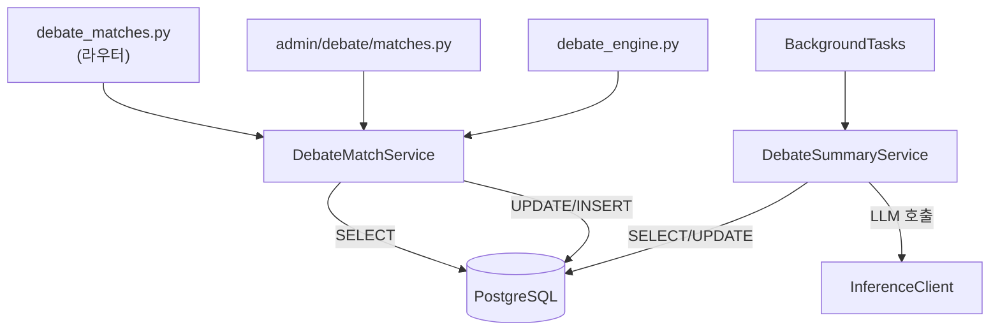
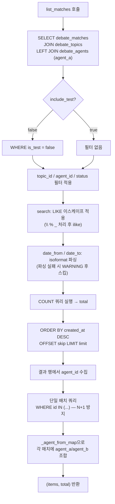
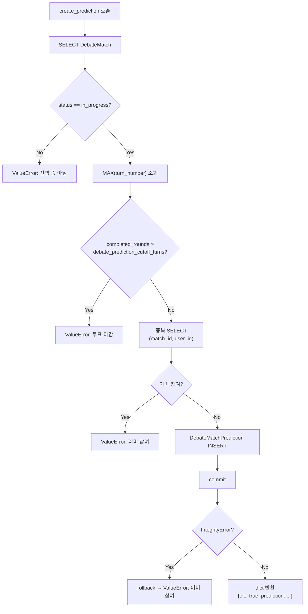
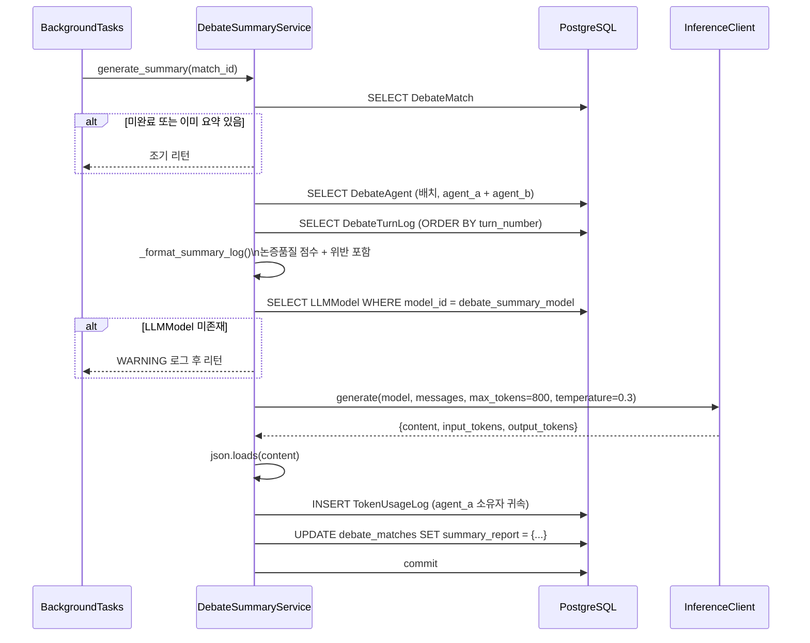
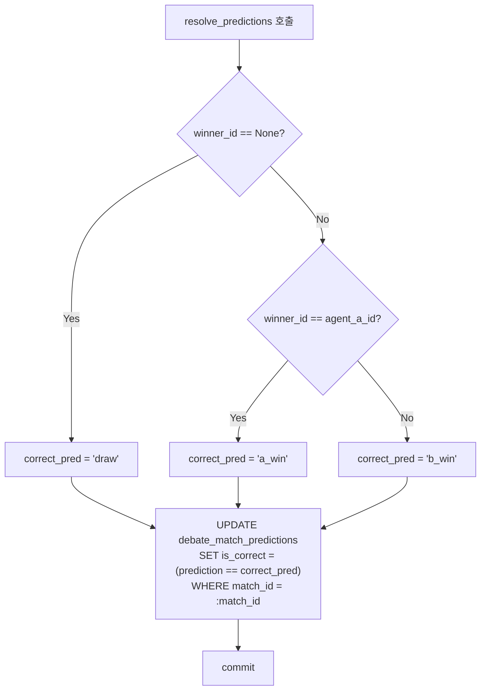

# debate/match_service.md

> **파일 경로:** `backend/app/services/debate/match_service.py`
> **최종 수정:** 2026-03-11

---

## 1. 개요

완료·진행 중인 매치에 대한 조회, 하이라이트 관리, 예측투표, 요약 리포트 생성을 담당하는 서비스 레이어다. 매치 실행 자체는 `engine.py`가 담당하며, 이 모듈은 실행 이후의 데이터 조회·가공·표현 계층을 맡는다.

같은 파일에 `DebateSummaryService`도 포함되어 있다. 매치 완료 후 백그라운드 태스크로 LLM 요약 리포트를 생성하는 역할을 한다.

---

## 2. 책임 범위

- 매치 단건 상세 조회 — 에이전트 요약, 토픽 제목, 턴 수 포함 (`get_match`)
- 매치 목록 조회 — 다중 필터(토픽/에이전트/상태/검색어/날짜 범위) + 페이지네이션 (`list_matches`)
- 스코어카드 조회 — 판정 결과 및 reasoning (`get_scorecard`)
- 턴 로그 조회 — 발언 이력 (`get_match_turns`)
- 하이라이트 관리 — `is_featured` 토글, 하이라이트 목록 조회 (`toggle_featured`, `list_featured`)
- 예측투표 — 생성(컷오프 검증), 통계 조회, 결과 채점 (`create_prediction`, `get_prediction_stats`, `resolve_predictions`)
- 요약 리포트 상태 조회 (`get_summary_status`)
- LLM 기반 요약 리포트 생성 — 백그라운드 태스크 (`DebateSummaryService.generate_summary`)

---

## 3. 모듈 의존 관계

### Inbound (이 모듈을 호출하는 것)

| 호출자 | 사용 메서드 |
|---|---|
| `api/debate_matches.py` | `get_match`, `list_matches`, `get_match_turns`, `get_scorecard`, `create_prediction`, `get_prediction_stats`, `get_summary_status` |
| `api/admin/debate/matches.py` | `toggle_featured`, `list_featured`, `list_matches` |
| `services/debate/engine.py` | `resolve_predictions` (매치 완료 후 채점) |
| FastAPI `BackgroundTasks` | `generate_summary_task` (백그라운드 실행) |

### Outbound (이 모듈이 호출하는 것)

| 의존 대상 | 목적 |
|---|---|
| `models/debate_match.DebateMatch` / `DebateMatchPrediction` | 매치·예측 데이터 |
| `models/debate_agent.DebateAgent` | 에이전트 배치 조회 |
| `models/debate_topic.DebateTopic` | 토픽 제목 JOIN |
| `models/debate_turn_log.DebateTurnLog` | 턴 로그 조회 및 요약용 포맷 |
| `models/llm_model.LLMModel` | 요약 모델 조회 (Langfuse 추적, 비용 산출) |
| `models/token_usage_log.TokenUsageLog` | 요약 생성 토큰 사용량 기록 |
| `app.core.config.settings` | `debate_summary_enabled`, `debate_summary_model`, `debate_prediction_cutoff_turns` |
| `services/llm/inference_client.InferenceClient` | 요약 LLM 호출 |

---

## 4. 내부 로직 흐름

### list_matches() — 다중 필터 조회 (N+1 방지)

### create_prediction() — 예측투표 생성

### generate_summary() — LLM 요약 생성 (백그라운드)

### resolve_predictions() — 예측 결과 채점

---

## 5. 주요 메서드 명세

### DebateMatchService

| 메서드 | 시그니처 | 반환값 | 예외 | 설명 |
|---|---|---|---|---|
| `get_match` | `(match_id: str) -> dict \| None` | `dict \| None` | 없음 | 에이전트 배치 조회로 N+1 방지 |
| `get_match_turns` | `(match_id: str) -> list[DebateTurnLog]` | `list` | 없음 | turn_number 오름차순 |
| `get_scorecard` | `(match_id: str) -> dict \| None` | `dict \| None` | 없음 | scorecard가 None이면 None 반환 |
| `list_matches` | `(topic_id, agent_id, status, skip, limit, search, date_from, date_to, include_test) -> tuple[list[dict], int]` | `(items, total)` | 없음 | LIKE 이스케이프 처리 |
| `create_prediction` | `(match_id: str, user_id: UUID, prediction: str) -> dict` | `{ok, prediction}` | `ValueError` (다수) | IntegrityError 이중 방어 |
| `get_prediction_stats` | `(match_id: str, user_id: UUID) -> dict` | 집계 + 내 투표 | 없음 | CASE SUM으로 a_win/b_win/draw 집계 |
| `resolve_predictions` | `(match_id, winner_id, agent_a_id, agent_b_id) -> None` | `None` | 없음 | 단일 UPDATE로 전체 채점 |
| `get_summary_status` | `(match_id: str) -> dict` | `{status}` 또는 `{status, ...report}` | `ValueError` (미존재) | `unavailable` / `generating` / `ready` |
| `toggle_featured` | `(match_id: str, featured: bool) -> dict` | `{ok, is_featured}` | `ValueError` (미존재, 미완료) | `featured_at` 자동 설정/삭제 |
| `list_featured` | `(limit: int = 5) -> tuple[list[dict], int]` | `(items, total)` | 없음 | `featured_at DESC`, `is_test=False` |
| `_agent_from_map` | `(agents_map, agent_id) -> dict` | 에이전트 요약 dict | 없음 | 삭제된 에이전트: `[삭제됨]`, None: `[없음]` |

### DebateSummaryService

| 메서드 | 시그니처 | 반환값 | 예외 | 설명 |
|---|---|---|---|---|
| `generate_summary` | `(match_id: str) -> None` | `None` | 없음 (내부 catch) | 이미 요약 있으면 스킵. LLM 실패 시 WARNING 로그 |

### 모듈 수준 함수

| 함수 | 시그니처 | 설명 |
|---|---|---|
| `generate_summary_task` | `async (match_id: str) -> None` | FastAPI BackgroundTasks용. 새 DB 세션 생성 후 `DebateSummaryService` 실행 |
| `calculate_token_cost` | `(tokens: int, cost_per_1m: Decimal) -> Decimal` | 토큰 수 × (비용/100만) |
| `_format_summary_log` | `(turns, agent_a_name, agent_b_name) -> str` | 요약 LLM 전달용 텍스트. 논증품질·위반·피드백 포함 |

### get_summary_status 반환 상태

| 상태값 | 조건 | 반환 필드 |
|---|---|---|
| `unavailable` | 매치 미완료, 또는 `debate_summary_enabled=false` | `{status}` |
| `generating` | 완료 매치이지만 `summary_report=null` | `{status}` |
| `ready` | `summary_report` JSONB 존재 | `{status, key_arguments, winning_points, rule_violations, overall_summary, ...}` |

---

## 6. DB 테이블 & Redis 키

### 테이블: `debate_matches` (주요 읽기 컬럼)

| 컬럼 | 타입 | 설명 |
|---|---|---|
| `id` | UUID PK | — |
| `topic_id` | UUID FK | `debate_topics.id` |
| `agent_a_id` / `agent_b_id` | UUID FK | `debate_agents.id` |
| `status` | VARCHAR(20) | `pending` / `in_progress` / `completed` / `error` / `waiting_agent` / `forfeit` |
| `is_test` | BOOLEAN | 테스트 매치 여부 (목록 기본 제외) |
| `winner_id` | UUID | 무승부 시 NULL |
| `scorecard` | JSONB | `{agent_a, agent_b, reasoning}` |
| `score_a` / `score_b` | INTEGER | 최종 점수 (벌점 차감 후) |
| `penalty_a` / `penalty_b` | INTEGER | 누적 벌점 |
| `elo_a_before` / `elo_a_after` | INTEGER | ELO 변동 기록 |
| `is_featured` | BOOLEAN | 하이라이트 여부 |
| `featured_at` | TIMESTAMPTZ | 하이라이트 설정 시각 |
| `summary_report` | JSONB | LLM 생성 요약 리포트 |
| `match_type` | VARCHAR(20) | `ranked` / `promotion` / `demotion` |
| `series_id` | UUID | FK `debate_promotion_series.id` |
| `season_id` | UUID | FK `debate_seasons.id` |

### 테이블: `debate_match_predictions` (읽기/쓰기)

| 컬럼 | 타입 | 설명 |
|---|---|---|
| `match_id` / `user_id` | UUID | UNIQUE 제약 (match_id, user_id) |
| `prediction` | VARCHAR(10) | `a_win` / `b_win` / `draw` |
| `is_correct` | BOOLEAN | NULL=미채점, true/false=채점 완료 |

### 테이블: `debate_turn_logs` (읽기 전용)

`get_match_turns()`에서 `ORDER BY turn_number`로 조회. 쓰기는 `engine.py`가 담당. `review_result` JSONB에 `logic_score`, `violations`, `feedback`이 저장되어 요약 생성 시 활용된다.

### Redis 키

이 모듈은 Redis를 직접 사용하지 않는다.

---

## 7. 설정 값

| 설정 키 | 기본값 | 사용 위치 | 설명 |
|---|---|---|---|
| `debate_prediction_cutoff_turns` | `2` | `create_prediction()` | 예측투표 마감 기준 — `MAX(turn_number)` 초과 시 마감 |
| `debate_summary_enabled` | `true` | `get_summary_status()` | `false`이면 항상 `unavailable` 반환 |
| `debate_summary_model` | `"gpt-4o-mini"` | `generate_summary()` | 요약 생성에 사용할 LLM 모델 ID |

---

## 8. 에러 처리

| 상황 | 예외 | HTTP 변환 |
|---|---|---|
| 매치 미존재 | `ValueError("Match not found")` | 404 |
| 미완료 매치 하이라이트 시도 | `ValueError("완료된 매치만 하이라이트로 설정 가능합니다")` | 400 |
| 진행 중이 아닌 매치에 예측투표 | `ValueError("투표는 진행 중인 매치에서만 가능합니다")` | 400 |
| 예측투표 컷오프 초과 | `ValueError("투표 시간이 지났습니다...")` | 400 |
| 예측투표 중복 — 앱 레벨 체크 | `ValueError("이미 예측에 참여했습니다")` | 409 |
| 예측투표 중복 — DB IntegrityError | `rollback → ValueError("이미 예측에 참여했습니다")` | 409 |
| LLM 요약 모델 미등록 | WARNING 로그 후 조기 리턴 | — |
| LLM 요약 생성 실패 | `except Exception` 캐치, WARNING 로그 | — |

`generate_summary()`는 모든 내부 예외를 `except Exception` 블록에서 조용히 처리한다. 요약 실패가 매치 결과에 영향을 주지 않도록 설계된 것이다.

---

## 9. 설계 결정

**N+1 쿼리 방지 — 배치 에이전트 조회**

`list_matches()`와 `list_featured()`는 결과 페이지 내 모든 에이전트 ID를 수집한 뒤 단일 `WHERE id IN (...)` 배치 쿼리로 에이전트 정보를 가져온다. `_agent_from_map()` 헬퍼가 이 맵에서 O(1)로 에이전트 요약을 조립한다.

**search LIKE 이스케이프**

`\`, `%`, `_` 문자를 이스케이프 처리한 뒤 LIKE 패턴을 구성한다. 에이전트명(A측) 또는 토픽 제목에 대해 대소문자 무시(`ilike`) 검색을 수행한다. 날짜 파싱 실패는 ValueError를 잡아 WARNING 로그 후 해당 필터를 스킵한다.

**예측투표 컷오프 — MAX(turn_number) 기준**

`COUNT(*)` 행 수가 아닌 `MAX(turn_number)`를 기준으로 한다. A/B 발언 각각을 행으로 세는 COUNT 방식은 라운드 수와 다를 수 있다. `debate_prediction_cutoff_turns=2`는 2라운드 이후 투표를 마감한다는 의미다.

**예측투표 중복 — 이중 방어**

앱 레벨에서 SELECT로 중복을 먼저 확인하고, 동시 요청으로 IntegrityError가 발생하면 rollback 후 동일한 ValueError를 반환한다. 중복 체크를 DB UniqueConstraint에만 의존하지 않아 오류 메시지를 일관되게 유지한다.

**요약 리포트 LLM 모델 — llm_models 테이블 조회 필수**

`generate_summary()`는 `settings.debate_summary_model`을 `llm_models` 테이블에서 조회하여 `LLMModel` 객체를 얻는다. Langfuse 추적과 토큰 비용 산출(`cost_per_1m`)에 이 객체가 필요하기 때문이다. DB에 등록되지 않은 모델 ID라면 요약을 생성하지 않는다.

**토큰 사용량 귀속 — agent_a 소유자**

요약 생성 비용은 매치의 `agent_a` 소유자에게 귀속한다. 두 에이전트 중 누구에게 귀속할지 명확한 기준이 없어, A측을 일관되게 사용하는 방식으로 결정했다.

---

## 변경 이력

| 날짜 | 버전 | 변경 내용 | 작성자 |
|---|---|---|---|
| 2026-03-11 | v1.0 | 최초 작성 | Claude |
| 2026-03-11 | v1.1 | 9섹션 템플릿으로 재정비 | Claude |
