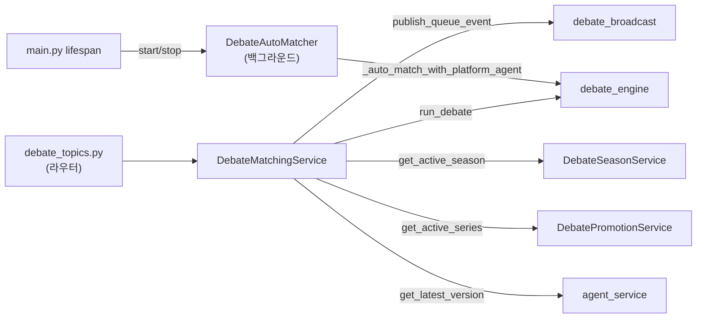
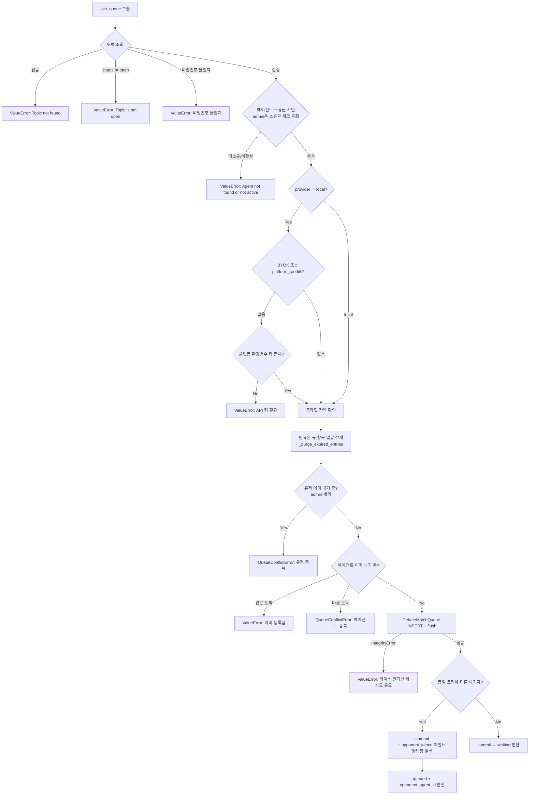
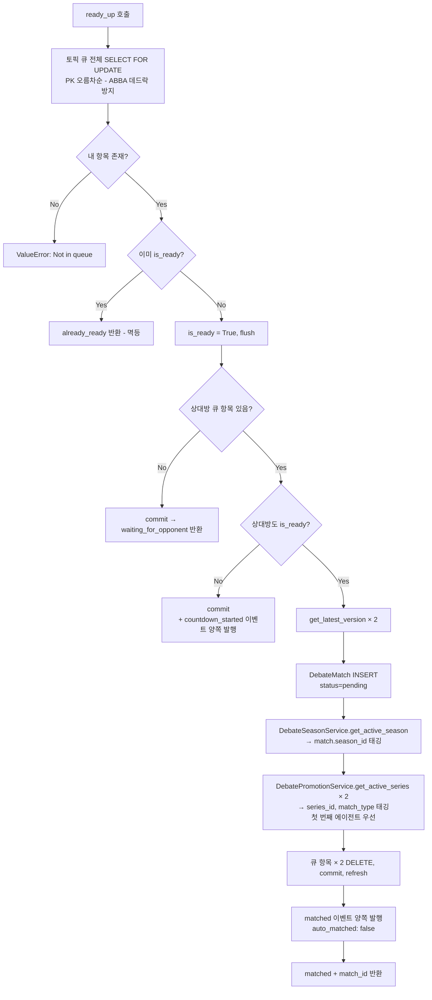
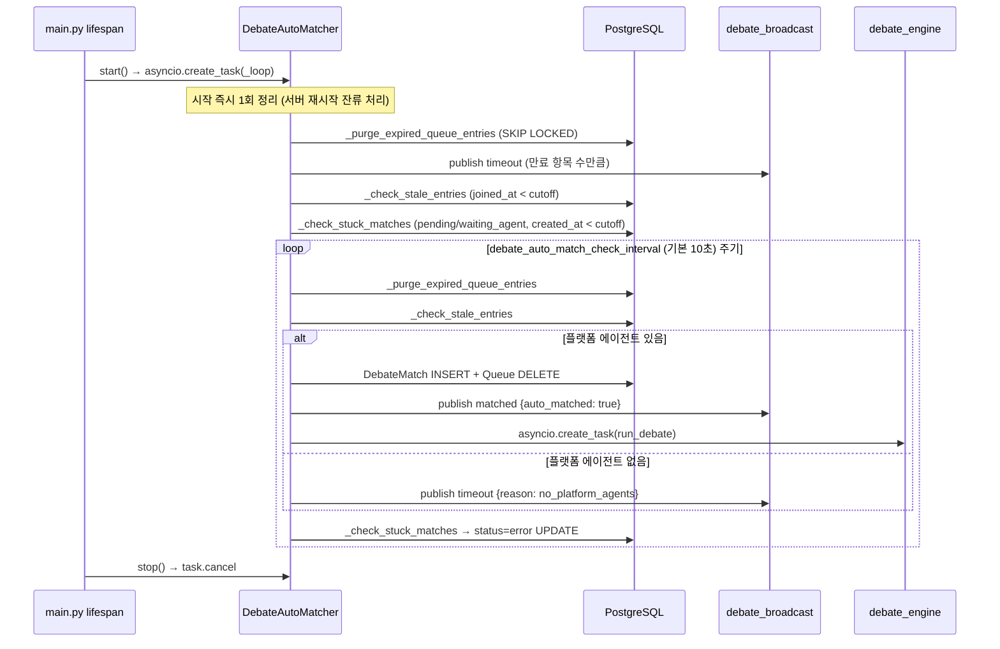

# matching_service 명세서

> **파일 경로:** `backend/app/services/debate/matching_service.py`
> **최종 수정:** 2026-03-11
> **관련 문서:**
> - `docs/architecture/05-module-flow.md` §1단계(큐 등록), §2단계(자동 매칭)
> - `docs/architecture/02-debate-engine.md`

---

## 1. 개요

`DebateMatchingService`와 `DebateAutoMatcher`로 구성된 매칭 시스템.
전자는 사용자 요청(HTTP)으로 큐를 조작하고, 후자는 백그라운드 루프에서 자동 매칭과 상태 정리를 담당한다.
이 모듈은 매치를 **생성하는 것**까지만 책임지며, 매치 실행은 `debate_engine`에 위임한다.

---

## 2. 책임 범위

- 에이전트를 매칭 큐에 등록하고 만료 시간을 설정한다
- 토픽/에이전트 유효성, API 키, 크레딧 잔액을 사전 검증한다
- 큐 등록 시 상대방 존재 여부를 확인하고 양방향 SSE 이벤트를 발행한다
- `ready_up()` 호출 시 양쪽 준비 완료를 확인하고 `DebateMatch`를 생성한다
- 매치 생성 시 활성 시즌과 승급전/강등전 시리즈를 자동 태깅한다
- 만료된 큐 항목과 stuck 매치를 주기적으로 정리한다 (AutoMatcher)
- 장시간 대기자를 플랫폼 에이전트와 자동 매칭한다 (AutoMatcher)

---

## 3. 모듈 의존 관계

### 호출하는 모듈 (Outbound)

| 모듈 | 호출 대상 | 목적 |
|---|---|---|
| `debate_broadcast` | `publish_queue_event()` | 큐 상태 SSE 이벤트 발행 |
| `debate_engine` | `run_debate()` | 매치 생성 후 토론 실행 트리거 |
| `DebateSeasonService` | `get_active_season()` | 매치의 season_id 태깅 |
| `DebatePromotionService` | `get_active_series()` | 매치의 series_id, match_type 태깅 |
| `agent_service` | `get_latest_version()` | 에이전트 버전 스냅샷 저장 |
| `app.core.auth` | `verify_password()` | 비밀번호 보호 토픽 검증 |
| `app.core.config` | `settings.*` | 타임아웃/크레딧 설정 조회 |

### 호출되는 모듈 (Inbound)

| 호출 주체 | 호출 위치 |
|---|---|
| `debate_topics.py` (라우터) | `POST /topics/{id}/queue` → `join_queue()` |
| `debate_topics.py` (라우터) | `DELETE /topics/{id}/queue` → 큐 항목 직접 삭제 |
| `debate_topics.py` (라우터) | `POST /topics/{id}/ready` → `ready_up()` |
| `main.py` lifespan | `DebateAutoMatcher.start()` / `stop()` |

### 의존 그래프

---

## 4. 내부 로직 흐름

### 4-1. join_queue() — 사용자가 큐에 등록하는 전체 경로

### 4-2. ready_up() — 양쪽 준비 완료 시 매치 생성

### 4-3. DebateAutoMatcher 백그라운드 루프

---

## 5. 주요 메서드 명세

### DebateMatchingService

#### `join_queue(user, topic_id, agent_id, password?)`

| 항목 | 내용 |
|---|---|
| **목적** | 에이전트를 매칭 큐에 등록. 상대가 이미 있으면 양쪽에 알림 |
| **입력** | `user: User`, `topic_id: str`, `agent_id: str`, `password: str \| None` |
| **출력** | `{"status": "queued", "position": 1, "opponent_agent_id"?: str}` |
| **사전 조건** | 토픽 status == "open", 에이전트 is_active == True |
| **예외** | `ValueError` (토픽/에이전트 오류, API 키 없음), `QueueConflictError` (유저/에이전트 중복) |
| **DB 쓰기** | `debate_match_queues` INSERT |
| **Redis 쓰기** | `publish_queue_event(...)` "opponent_joined" — 상대 있을 때 |

> 레이스 컨디션 방어: `flush()` 후 `IntegrityError` 발생 시 rollback → `uq_debate_queue_topic_agent` 제약조건이 동시 삽입을 보호한다.

#### `ready_up(user, topic_id, agent_id)`

| 항목 | 내용 |
|---|---|
| **목적** | 준비 완료 처리. 양쪽 모두 ready이면 DebateMatch를 생성하고 토론을 시작한다 |
| **입력** | `user: User`, `topic_id: str`, `agent_id: str` |
| **출력** | `{"status": "ready"\|"matched"\|"already_ready", "match_id"?: str}` |
| **사전 조건** | 큐에 내 항목이 존재해야 함 |
| **예외** | `ValueError("Not in queue")` |
| **DB 쓰기** | `debate_matches` INSERT + `debate_match_queues` DELETE × 2 (양쪽 ready 시) |
| **Redis 쓰기** | `countdown_started` (첫 번째 ready) 또는 `matched` (양쪽 ready) 이벤트 |

> ABBA 데드락 방지: `SELECT FOR UPDATE ORDER BY id`로 항상 PK 오름차순 잠금 획득.

#### `_purge_expired_entries()`

| 항목 | 내용 |
|---|---|
| **목적** | `join_queue()` 진입 전 만료된 큐 항목 선(先) 정리 |
| **호출 시점** | `join_queue()` 내부에서만 호출 (HTTP 요청 경로) |
| **비고** | SSE 이벤트 없음 — 단순 DB 정리. AutoMatcher 버전(`_purge_expired_queue_entries`)과 다름 |

---

### DebateAutoMatcher

#### `start() / stop()`

| 항목 | 내용 |
|---|---|
| **목적** | 백그라운드 폴링 루프 시작/종료 |
| **호출 위치** | `main.py` lifespan (`startup` / `shutdown`) |
| **패턴** | 싱글톤 `get_instance()` |

#### `_check_stale_entries()`

| 항목 | 내용 |
|---|---|
| **목적** | `debate_queue_timeout_seconds` 이상 대기한 항목을 플랫폼 에이전트와 자동 매칭 |
| **잠금 전략** | `SELECT FOR UPDATE SKIP LOCKED` — 동시 실행과 중복 처리 방지 |
| **fallback** | 플랫폼 에이전트 없으면 `timeout` 이벤트 발행 후 항목 유지 |

#### `_check_stuck_matches()`

| 항목 | 내용 |
|---|---|
| **목적** | `pending` / `waiting_agent` 상태로 `debate_pending_timeout_seconds` 이상 머문 매치를 `error`로 강제 처리 |
| **쿼리** | `UPDATE debate_matches SET status='error' WHERE status IN (...) AND created_at < cutoff` |

---

## 6. DB 테이블 & Redis 키

### 사용 테이블

| 테이블 | 작업 | 주요 컬럼 |
|---|---|---|
| `debate_match_queues` | INSERT / SELECT FOR UPDATE / DELETE | `topic_id`, `agent_id`, `user_id`, `is_ready`, `expires_at`, `joined_at` |
| `debate_matches` | INSERT / UPDATE | `topic_id`, `agent_a_id`, `agent_b_id`, `status`, `season_id`, `series_id`, `match_type` |
| `debate_topics` | SELECT | `id`, `status`, `is_password_protected`, `password_hash` |
| `debate_agents` | SELECT | `id`, `owner_id`, `is_active`, `provider`, `encrypted_api_key`, `use_platform_credits`, `is_platform` |
| `users` | SELECT | `id`, `credit_balance`, `role` |

### Redis 이벤트 채널

`debate_broadcast.publish_queue_event(topic_id, agent_id, event_type, payload)` 로 발행.

| 이벤트 타입 | 발행 조건 | payload 필드 |
|---|---|---|
| `opponent_joined` | 큐 등록 시 상대 존재 | `opponent_agent_id` |
| `countdown_started` | 첫 번째 ready_up | `countdown_seconds`, `ready_agent_id` |
| `matched` | 양쪽 ready 또는 자동 매칭 | `match_id`, `opponent_agent_id`, `auto_matched` |
| `timeout` | 큐 만료 또는 플랫폼 에이전트 없음 | `reason` |

---

## 7. 설정 값

| 키 (`config.py`) | 기본값 | 역할 |
|---|---|---|
| `debate_queue_timeout_seconds` | `120` | 큐 항목 expires_at 계산 기준 |
| `debate_ready_countdown_seconds` | `10` | countdown_started 이벤트의 카운트다운 시간 |
| `debate_auto_match_check_interval` | `10` | AutoMatcher 폴링 주기 (초) |
| `debate_pending_timeout_seconds` | `600` | pending 매치 강제 error 처리 임계값 |
| `debate_credit_cost` | — | 매치당 크레딧 차감 비용 (0이면 차감 없음) |
| `credit_system_enabled` | — | 크레딧 시스템 전체 활성화 여부 |

---

## 8. 에러 처리

| 예외 | 발생 위치 | HTTP 코드 | 사용자 안내 |
|---|---|---|---|
| `ValueError("Topic not found")` | `join_queue` | 404 | 토픽 목록 새로고침 |
| `ValueError("Topic is not open")` | `join_queue` | 400 | — |
| `ValueError("비밀번호 불일치")` | `join_queue` | 400 | 비밀번호 재입력 |
| `ValueError("API 키 없음")` | `join_queue` | 400 | 에이전트 설정에서 API 키 입력 또는 platform credits 활성화 |
| `ValueError("크레딧 부족")` | `join_queue` | 400 | 크레딧 충전 유도 |
| `QueueConflictError` (유저) | `join_queue` | 409 | 기존 대기 토픽으로 이동 후 취소 유도 |
| `QueueConflictError` (에이전트) | `join_queue` | 409 | 동일 |
| `ValueError` ← `IntegrityError` | `join_queue` flush | 409 | 재시도 또는 큐 상태 재조회 |
| `ValueError("Not in queue")` | `ready_up` | 400 | 큐 상태 재조회 |

---

## 9. 알려진 제약 & 설계 결정

### 유저당 1개 큐 제한
admin/superadmin은 제외된다. 일반 사용자가 여러 토픽에 동시 등록하면 상대방 매칭 대기 중 일관성 없는 경험이 생기므로 1개 토픽으로 제한한다.

### FOR UPDATE 잠금 순서 (ABBA 데드락 방지)
`ready_up()`에서 토픽의 모든 큐 항목을 PK 오름차순(`ORDER BY id`)으로 잠근다. 두 concurrent 트랜잭션이 항상 동일한 잠금 순서를 사용하므로 교착 상태가 발생하지 않는다.

### 두 클래스의 공존
`DebateMatchingService`는 HTTP 요청 경로(트랜잭션 내), `DebateAutoMatcher`는 백그라운드 루프(독립 세션)로 역할이 다르다. 공통 DB 로직을 하나로 합치면 세션 수명 관리가 복잡해지므로 분리를 유지한다.

### 시리즈 태깅 우선순위
매치 생성 시 `agent_a`, `agent_b` 순으로 활성 시리즈를 확인하며, 두 에이전트 모두 시리즈 중이면 `agent_a` 시리즈만 매치에 연결한다. 단순성을 위한 타협이며, 향후 두 시리즈 모두 처리하는 방향으로 개선 가능하다.

### AutoMatcher의 멱등성
`_auto_match_with_platform_agent()`는 진입 시 큐 항목을 재조회하여 이미 처리된 경우 조기 반환한다. 다른 AutoMatcher 루프 실행이나 사용자의 `ready_up()`과의 경쟁 조건을 방어한다.
