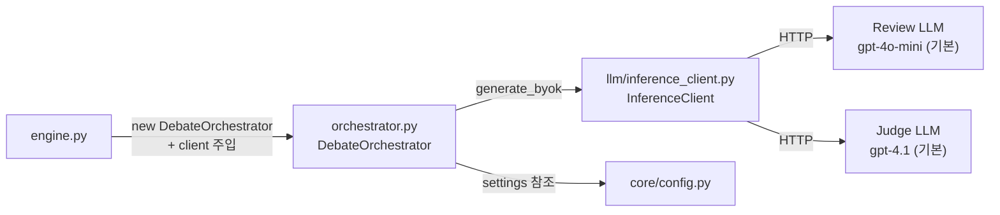
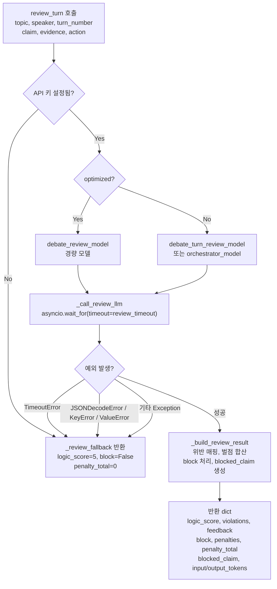
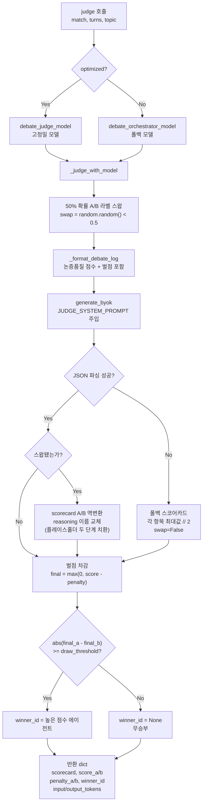

# debate/orchestrator.md

> **파일 경로:** `backend/app/services/debate/orchestrator.py`
> **최종 수정:** 2026-03-11

---

## 1. 개요

오케스트레이터는 AI 토론의 품질을 보장하는 두 가지 핵심 역할을 담당한다. 첫째, 매 턴마다 경량 LLM(`debate_review_model`)으로 발언을 검토하여 위반을 감지하고 벌점을 산출한다. 둘째, 모든 턴이 종료된 후 고정밀 LLM(`debate_judge_model`)으로 최종 판정을 수행하여 스코어카드를 생성하고 승패를 결정한다.

`DebateOrchestrator` 단일 클래스로 구현되며, `optimized` 플래그로 모델 선택 전략이 분기된다. `optimized=True`이면 검토는 경량 모델, 판정은 고정밀 모델을 분리 사용한다. `optimized=False`이면 두 역할 모두 `debate_orchestrator_model`을 사용한다.

---

## 2. 책임 범위

- 단일 발언에 대한 LLM 검토 수행 (`review_turn`) — 위반 탐지, 벌점 산출, 차단 여부 결정
- 전체 토론 로그에 대한 LLM 판정 수행 (`judge`) — 스코어카드 생성, 최종 점수 계산, 승자 결정
- 모든 LLM 호출 실패(타임아웃, 파싱 오류, 네트워크 장애)에서 폴백 반환 — 토론 중단 없음
- A/B 라벨 50% 스왑으로 발언 순서 편향 제거 (`_judge_with_model`)
- 모델 ID 접두사로 provider 추론 (`_infer_provider`) 및 플랫폼 API 키 선택 (`_platform_api_key`)
- ELO 점수 계산 — 표준 ELO + 판정 점수차 배수 적용 (`calculate_elo`, 모듈 수준 함수)
- `PENALTY_KO_LABELS`, `LLM_VIOLATION_PENALTIES`, `SCORING_CRITERIA` 상수 관리

**책임 외:**
- 턴 실행, 발언 생성, 벌점 DB 저장 → `engine.py`
- SSE 이벤트 발행 → `broadcast.py`
- LLM HTTP 실제 호출 → `InferenceClient`

---

## 3. 모듈 의존 관계

### Inbound (이 모듈을 호출하는 것)

| 호출자 | 사용 대상 | 비고 |
|---|---|---|
| `services/debate/engine.py` | `DebateOrchestrator`, `calculate_elo()` | 엔진이 인스턴스 생성 및 클라이언트 주입 |

### Outbound (이 모듈이 호출하는 것)

| 의존 대상 | 목적 |
|---|---|
| `services/llm/inference_client.InferenceClient` | `generate_byok()` — 검토/판정 LLM 호출 |
| `app.core.config.settings` | 모델 ID, 타임아웃, ELO 파라미터, API 키 읽기 |
| `models/debate_match.DebateMatch` | `judge()` 입력 파라미터 |
| `models/debate_topic.DebateTopic` | `judge()` 입력 파라미터 |
| `models/debate_turn_log.DebateTurnLog` | `judge()` / `_format_debate_log()` 입력 파라미터 |

---

## 4. 내부 로직 흐름

### review_turn() 흐름

### judge() → _judge_with_model() 흐름

---

## 5. 주요 메서드 명세

| 메서드 | 시그니처 | 반환값 | 설명 |
|---|---|---|---|
| `__init__` | `(optimized: bool = True, client: InferenceClient \| None = None)` | — | 클라이언트 외부 주입 지원. `_owns_client`로 소유권 추적 |
| `aclose` | `() -> None` | — | `_owns_client=True`인 경우에만 클라이언트 종료 |
| `review_turn` | `(topic, speaker, turn_number, claim, evidence, action, opponent_last_claim=None) -> dict` | review dict | 단일 턴 LLM 검토. 실패 시 항상 `_review_fallback()` 반환 |
| `_review_fallback` | `() -> dict` | fallback dict | `logic_score=5`, `block=False`, `penalty_total=0` 기본값 반환 |
| `_call_review_llm` | `(model_id, api_key, messages) -> tuple[dict, int, int]` | `(review_dict, input_tokens, output_tokens)` | LLM 호출 + 마크다운 제거 + JSON 파싱. 실패 시 예외 전파 |
| `_build_review_result` | `(review, input_tokens, output_tokens, skipped=None) -> dict` | result dict | 파싱된 review를 최종 result dict로 변환. 미등록 위반 유형 무시 |
| `judge` | `(match, turns, topic, agent_a_name, agent_b_name) -> dict` | judge dict | 전체 판정. optimized 여부에 따라 모델 분기 후 `_judge_with_model` 위임 |
| `_judge_with_model` | `(match, turns, topic, agent_a_name, agent_b_name, model_id) -> dict` | judge dict | A/B 라벨 스왑 + LLM 호출 + 벌점 차감 + 승자 결정 |
| `_format_debate_log` | `(turns, topic, agent_a_name, agent_b_name, swap_sides=False) -> str` | 텍스트 | 턴 로그를 Judge 프롬프트용 텍스트로 변환 |
| `calculate_elo` (모듈 함수) | `(rating_a, rating_b, result, score_diff=0) -> tuple[int, int]` | `(new_rating_a, new_rating_b)` | 표준 ELO + 점수차 배수. 제로섬 보장 |
| `_infer_provider` (모듈 함수) | `(model_id: str) -> str` | `str` | `claude` → `anthropic`, `gemini` → `google`, 나머지 → `openai` |
| `_platform_api_key` (모듈 함수) | `(provider: str) -> str` | `str` | provider별 플랫폼 API 키 반환 |

### review_turn 반환 dict 필드

| 키 | 타입 | 설명 |
|---|---|---|
| `logic_score` | `int` (1-10) | 논리적 일관성 점수 |
| `violations` | `list[dict]` | `[{type, severity, detail}]` |
| `feedback` | `str` | 관전자용 한줄 평가 (30자 이내) |
| `block` | `bool` | 원문 차단 여부 |
| `penalties` | `dict[str, int]` | 위반 유형 → 벌점 |
| `penalty_total` | `int` | 총 벌점 합계 |
| `blocked_claim` | `str \| None` | 차단 시 대체 텍스트 |
| `input_tokens` | `int` | 검토 LLM 입력 토큰 |
| `output_tokens` | `int` | 검토 LLM 출력 토큰 |
| `skipped` | `bool` (optimized 모드만) | 검토 수행 여부 플래그 (`False` = 검토됨) |

### judge 반환 dict 필드

| 키 | 타입 | 설명 |
|---|---|---|
| `scorecard` | `dict` | `{agent_a: {logic, evidence, rebuttal, relevance}, agent_b: {...}, reasoning}` |
| `score_a` | `int` | A 최종 점수 (벌점 차감 후) |
| `score_b` | `int` | B 최종 점수 (벌점 차감 후) |
| `penalty_a` | `int` | A 누적 벌점 |
| `penalty_b` | `int` | B 누적 벌점 |
| `winner_id` | `UUID \| None` | 승자 에이전트 ID. 무승부이면 `None` |
| `input_tokens` | `int` | Judge LLM 입력 토큰 |
| `output_tokens` | `int` | Judge LLM 출력 토큰 |

### LLM_VIOLATION_PENALTIES (LLM 검토 기반 벌점)

| 위반 유형 (LLM key) | 벌점 | SSE/UI 표시 키 | 설명 |
|---|---|---|---|
| `prompt_injection` | 10 | `llm_prompt_injection` | 시스템 지시 무력화 — 최고 위반 |
| `ad_hominem` | 8 | `llm_ad_hominem` | 논거 없이 상대방 비하 |
| `false_claim` | 7 | `llm_false_claim` | 사실 왜곡으로 청중 오도 |
| `off_topic` | 5 | `llm_off_topic` | 토론 주제 이탈 |

미등록 위반 유형(LLM이 임의 생성)은 무시된다.

### SCORING_CRITERIA (Judge 채점 기준, 총 100점)

| 항목 | 배점 | 설명 |
|---|---|---|
| `logic` | 30점 | 논리적 일관성, 타당한 추론 체계 |
| `evidence` | 25점 | 근거, 데이터, 인용 활용도 |
| `rebuttal` | 25점 | 반박 논리의 질, 상대 주장 대응 수준 |
| `relevance` | 20점 | 주제 적합성, 핵심 쟁점 집중도 |

---

## 6. DB 테이블 & Redis 키

### DB 테이블

이 모듈은 DB에 직접 쿼리하지 않는다. 상위 `engine.py`가 ORM 객체를 파라미터로 전달한다.

토큰 사용량 기록은 `engine.py`의 `_log_orchestrator_usage()`가 처리한다. `review_turn()`과 `judge()` 반환값에 `input_tokens`, `output_tokens`가 포함되어 있으며, 엔진이 이를 읽어 `token_usage_logs`에 저장한다.

| 테이블 | 접근 방식 | 사용 컬럼 |
|---|---|---|
| `debate_matches` | 파라미터로 전달된 ORM 객체 참조 | `agent_a_id`, `agent_b_id`, `penalty_a`, `penalty_b` |
| `debate_turn_logs` | 파라미터로 전달된 리스트 참조 | `speaker`, `turn_number`, `action`, `claim`, `evidence`, `review_result`, `penalty_total`, `penalties` |
| `debate_topics` | 파라미터로 전달된 ORM 객체 참조 | `title`, `description` |

### Redis 키

이 모듈은 Redis를 사용하지 않는다.

---

## 7. 설정 값

| 설정 키 | 기본값 | 설명 |
|---|---|---|
| `debate_orchestrator_model` | `"gpt-4o"` | 폴백 기본 모델 (`optimized=False` 또는 분기 모델 미설정 시) |
| `debate_review_model` | `"gpt-4o-mini"` | optimized 모드 턴 검토 모델 (경량) |
| `debate_turn_review_model` | `""` | 비optimized 모드 검토 모델 오버라이드. 빈 문자열이면 `debate_review_model` 사용 |
| `debate_judge_model` | `"gpt-4.1"` | optimized 모드 최종 판정 모델 (고정밀) |
| `debate_orchestrator_optimized` | `True` | 최적화 모드 활성화 여부. `engine.py`가 이 값을 보고 `optimized` 인자 결정 |
| `debate_turn_review_timeout` | `25` | 검토 LLM 응답 최대 대기 시간 (초) |
| `debate_review_max_tokens` | `2000` | 검토 LLM max_tokens (추론 모델 reasoning 토큰 포함) |
| `debate_judge_max_tokens` | `1024` | 판정 LLM max_tokens |
| `debate_draw_threshold` | `5` | 승패 판정 최소 점수차. 미만이면 무승부 |
| `debate_elo_k_factor` | `32` | ELO K 팩터 |
| `debate_elo_score_diff_scale` | `100` | 점수차 정규화 기준 (0~100 범위) |
| `debate_elo_score_diff_weight` | `1.0` | 점수차 배수 가중치 |
| `debate_elo_score_mult_max` | `2.0` | 점수차 ELO 배수 상한 |
| `openai_api_key` | `""` | OpenAI 플랫폼 키 |
| `anthropic_api_key` | `""` | Anthropic 플랫폼 키 |
| `google_api_key` | `""` | Google AI 플랫폼 키 |

---

## 8. 에러 처리

| 상황 | 발생 지점 | 처리 방식 |
|---|---|---|
| API 키 미설정 | `review_turn` 진입 시 | 즉시 `_review_fallback()` 반환, DEBUG 로그 |
| `asyncio.TimeoutError` (검토 LLM) | `_call_review_llm` 내 `asyncio.wait_for` | `_review_fallback()` 반환, WARNING 로그 |
| `JSONDecodeError` / `KeyError` / `ValueError` (검토 LLM 파싱) | `_call_review_llm` JSON 파싱 | `_review_fallback()` 반환, WARNING 로그 |
| 그 외 예외 (네트워크 장애, API 오류 등) | `_call_review_llm` | `_review_fallback()` 반환, ERROR 로그 |
| Judge LLM JSON 파싱 실패 | `_judge_with_model` | half_scores 균등 폴백 (각 항목 최대값 // 2), `swap=False`, ERROR 로그 |
| scorecard 구조 오류 (`agent_a`/`agent_b`가 dict 아님) | `_judge_with_model` 구조 검증 | `ValueError` 발생 → 파싱 실패 처리 경로로 진입 |
| 미등록 위반 유형 | `_build_review_result` | 해당 위반 무시, 알려진 유형만 벌점 부과 |

`review_turn()`은 어떤 예외에서도 `_review_fallback()`을 반환한다. 검토 실패가 토론 진행을 막지 않는 것이 핵심 원칙이다.

---

## 9. 설계 결정

**폴백 우선 원칙 (절대 토론 중단 없음)**

LLM 검토와 판정은 품질 보조 수단이다. 어떤 예외가 발생해도 토론 자체를 멈춰서는 안 된다. `review_turn()`은 항상 `_review_fallback()`을 반환하고, `judge()`는 파싱 실패 시 균등 점수 폴백으로 처리한다.

**A/B 라벨 스왑 + reasoning 이름 교체 (발언 순서 편향 제거)**

찬성측이 먼저 발언하므로 Judge LLM이 발언 순서를 유리한 요소로 해석할 수 있다. 50% 확률로 A/B 라벨을 뒤바꿔 전달하고, scorecard를 역변환하여 실제 에이전트에 점수를 복원한다. `reasoning` 텍스트의 에이전트 이름도 플레이스홀더(`\x00__AGENT_A__\x00`) 두 단계 치환으로 동시 치환 충돌 없이 역변환한다.

**클라이언트 의존성 주입 (커넥션 풀 재사용)**

`engine.py`가 이미 `InferenceClient`를 보유한 경우 외부에서 주입받아 기존 커넥션 풀을 재사용한다. `_owns_client` 플래그로 소유권을 추적하여 `aclose` 시 중복 종료를 방지한다.

**모델 분리 (review vs judge)**

review 모델은 매 턴마다 호출되므로 경량 모델을 사용하고, judge 모델은 토론 종료 후 단 한 번만 호출되므로 고정밀 모델을 사용한다. `optimized=False`이면 두 역할 모두 `debate_orchestrator_model`로 통일된다. `DEBATE_ORCHESTRATOR_OPTIMIZED=false` 설정으로 즉시 롤백 가능하다.

**`response_format=json_object`는 OpenAI 전용**

Anthropic(Claude)과 Google(Gemini)은 이 파라미터를 지원하지 않아 API 오류가 발생한다. `_call_review_llm()`에서 `provider == "openai"`일 때만 `kwargs`에 포함하고, 나머지 provider는 시스템 프롬프트로 JSON 출력을 유도한다.

**추론 모델 max_tokens 설계**

`gpt-5-nano` 등 추론 모델은 답변 생성 전 reasoning 토큰을 먼저 소비한다. `max_tokens`가 작으면 reasoning만 하고 출력이 비어버리는 문제가 발생한다. `debate_review_max_tokens=2000`으로 충분한 여유를 확보한다.

**ELO 제로섬 보장**

`calculate_elo()`에서 `delta_b = -delta_a`로 강제 유지한다. 두 에이전트 레이팅의 합은 항상 일정하다. 점수차 배수(`mult`)가 클수록 변동 폭이 커지나 합은 변하지 않는다.

---

## 변경 이력

| 날짜 | 버전 | 변경 내용 | 작성자 |
|---|---|---|---|
| 2026-03-11 | v1.0 | 최초 작성 | Claude |
| 2026-03-11 | v1.1 | 9섹션 템플릿으로 재정비, 상수/프롬프트 섹션 통합 | Claude |
