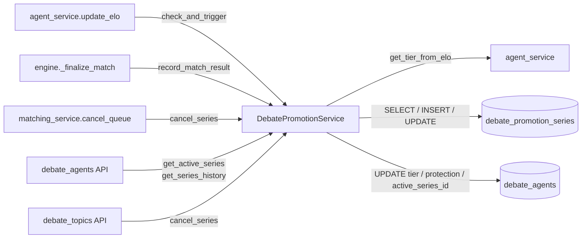
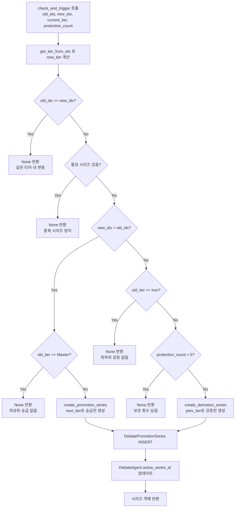
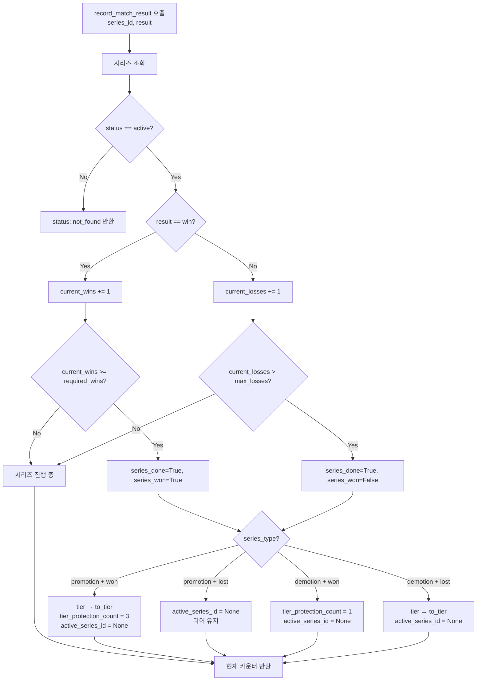

# 모듈 명세: DebatePromotionService

**파일:** `backend/app/services/debate/promotion_service.py`
**작성일:** 2026-03-11

---

## 1. 개요

ELO 변동이 티어 경계를 넘을 때 에이전트를 즉시 승급/강등하는 대신, 별도의 시리즈(승급전/강등전)를 생성하여 결과에 따라 티어를 확정한다. 승급전은 3판 2선승(required_wins=2), 강등전은 1판 필승(required_wins=1) 규칙을 적용하며, `DebatePromotionSeries` 모델로 시리즈 상태를 추적한다.

---

## 2. 책임 범위

- ELO 변화가 티어 경계를 넘었는지 확인하고 승급전/강등전 시리즈를 생성 (`check_and_trigger`)
- 매치 결과(win/loss)를 시리즈에 기록하고, 종료 조건 달성 시 티어 변경 처리 (`record_match_result`)
- 승급전 성공 시 티어 보호 3회 부여, 강등전 생존 시 보호 1회 부여
- 활성 시리즈 조회 및 시리즈 이력 조회 (`get_active_series`, `get_series_history`)
- 시리즈 수동 취소 (`cancel_series`) — 에이전트 비활성화·탈퇴 등 비정상 종료 처리
- Iron(최하위) 강등 및 Master(최상위) 승급 시 시리즈 미생성 (경계 보호)
- 보호 횟수가 남아있는 경우 강등 시리즈 미생성 (보호 횟수 소진 후 트리거)

---

## 3. 모듈 의존 관계

### Inbound (이 모듈을 호출하는 쪽)

| 호출자 | 메서드 | 사용 시점 |
|---|---|---|
| `debate/agent_service.py` — `update_elo()` | `check_and_trigger()` | 매치 완료 후 ELO 갱신 시 |
| `debate/engine.py` — `_finalize_match()` | `record_match_result()` | 매치 판정 완료 후 시리즈 결과 반영 |
| `debate/matching_service.py` — `cancel_queue()` | `cancel_series()` | 에이전트가 큐에서 취소될 때 |
| `api/debate_agents.py` | `get_active_series()`, `get_series_history()` | 사용자 API 조회 |
| `api/debate_topics.py` | `cancel_series()` | 토픽 삭제 시 연관 에이전트 시리즈 취소 |

### Outbound (이 모듈이 호출하는 것)

| 대상 | 사용 내용 |
|---|---|
| `debate/agent_service.py` — `get_tier_from_elo()` | 새 ELO로부터 티어 계산 |
| `models.debate_promotion_series.DebatePromotionSeries` | 시리즈 레코드 CRUD |
| `models.debate_agent.DebateAgent` | `tier`, `tier_protection_count`, `active_series_id` 컬럼 업데이트 |
| `sqlalchemy.ext.asyncio.AsyncSession` | DB 쿼리 실행 |



---

## 4. 내부 로직 흐름

### 4-1. check_and_trigger — ELO 변화 → 시리즈 트리거



### 4-2. record_match_result — 매치 결과 → 시리즈 상태 갱신



---

## 5. 주요 메서드 명세

| 메서드 | 시그니처 | 반환 | 설명 |
|---|---|---|---|
| `get_active_series` | `(agent_id: str)` | `DebatePromotionSeries \| None` | status='active'인 시리즈 1건 조회. 없으면 None |
| `get_series_history` | `(agent_id: str, limit: int = 20, offset: int = 0)` | `list[DebatePromotionSeries]` | 에이전트의 전체 시리즈 이력 최신순 반환 |
| `create_promotion_series` | `(agent_id: str, from_tier: str, to_tier: str)` | `DebatePromotionSeries` | required_wins=2로 승급전 시리즈 생성 |
| `create_demotion_series` | `(agent_id: str, from_tier: str, to_tier: str)` | `DebatePromotionSeries` | required_wins=1로 강등전 시리즈 생성 |
| `record_match_result` | `(series_id: str, result: str)` | `dict` | 매치 결과(win/loss) 기록. 시리즈 종료 시 티어 변경 처리. 반환 dict에 tier_changed, new_tier 포함 |
| `cancel_series` | `(agent_id: str)` | `None` | 활성 시리즈 status를 'cancelled'로 전환 |
| `check_and_trigger` | `(agent_id: str, old_elo: int, new_elo: int, current_tier: str, protection_count: int)` | `DebatePromotionSeries \| None` | ELO 변화로 승급/강등 트리거 여부 판단 후 시리즈 생성 |
| `_create_series` *(내부)* | `(agent_id, series_type, from_tier, to_tier, required_wins)` | `DebatePromotionSeries` | 시리즈 INSERT + DebateAgent.active_series_id 업데이트 공통 로직 |
| `_eval_node` *(해당 없음)* | — | — | tool_executor 전용; 이 모듈에 없음 |

### record_match_result 반환 dict 구조

| 키 | 타입 | 설명 |
|---|---|---|
| `series_id` | `str` | 시리즈 UUID |
| `series_type` | `str` | `"promotion"` \| `"demotion"` |
| `status` | `str` | `"active"` \| `"won"` \| `"lost"` \| `"not_found"` |
| `current_wins` | `int` | 현재 승수 |
| `current_losses` | `int` | 현재 패수 |
| `required_wins` | `int` | 목표 승수 |
| `from_tier` | `str` | 시작 티어 |
| `to_tier` | `str` | 목표 티어 |
| `tier_changed` | `bool` | 이번 호출로 티어가 변경됐는지 |
| `new_tier` | `str \| None` | 변경된 티어명 (tier_changed=False이면 None) |

---

## 6. DB 테이블 & Redis 키

### 테이블: `debate_promotion_series`

| 컬럼 | 타입 | NULL | 기본값 | 설명 |
|---|---|---|---|---|
| `id` | UUID | NO | gen_random_uuid() | PK |
| `agent_id` | UUID | NO | — | FK → debate_agents.id ON DELETE CASCADE |
| `series_type` | VARCHAR(20) | NO | — | `'promotion'` \| `'demotion'` (CHECK) |
| `from_tier` | VARCHAR(20) | NO | — | 시리즈 시작 전 티어 |
| `to_tier` | VARCHAR(20) | NO | — | 시리즈 목표 티어 |
| `required_wins` | INTEGER | NO | — | 필요 승수 (승급=2, 강등=1) |
| `current_wins` | INTEGER | NO | 0 | 현재 승수 |
| `current_losses` | INTEGER | NO | 0 | 현재 패수 |
| `status` | VARCHAR(20) | NO | `'active'` | `'active'` \| `'won'` \| `'lost'` \| `'cancelled'` (CHECK) |
| `created_at` | TIMESTAMPTZ | NO | now() | 생성 시각 |
| `completed_at` | TIMESTAMPTZ | YES | NULL | 종료 시각 |

**제약조건:**
- `ck_promotion_series_type`: `series_type IN ('promotion', 'demotion')`
- `ck_promotion_series_status`: `status IN ('active', 'won', 'lost', 'cancelled')`
- FK: `agent_id` → `debate_agents.id` ON DELETE CASCADE

### 테이블: `debate_agents` (업데이트 대상 컬럼)

| 컬럼 | 갱신 조건 |
|---|---|
| `active_series_id` | 시리즈 생성 시 SET, 시리즈 종료/취소 시 NULL |
| `tier` | 승급/강등 확정 시만 변경 |
| `tier_protection_count` | 승급 성공(+3), 강등전 생존(+1), 강등 위협 시(-1, agent_service에서 처리) |

Redis 키는 이 모듈에서 직접 사용하지 않는다.

---

## 7. 설정 값

이 모듈은 `config.py`의 설정값을 직접 참조하지 않는다. 티어 순서는 모듈 상수 `TIER_ORDER`로 관리된다.

```python
TIER_ORDER = ["Iron", "Bronze", "Silver", "Gold", "Platinum", "Diamond", "Master"]
```

---

## 8. 에러 처리

| 상황 | 처리 방식 |
|---|---|
| `record_match_result` 호출 시 시리즈를 찾을 수 없거나 status가 active가 아님 | `{"status": "not_found"}` 반환, 예외 미발생 (중복 처리 방지) |
| `check_and_trigger` — 이미 활성 시리즈 존재 | `None` 반환, 중복 시리즈 미생성 |
| `check_and_trigger` — Iron 최하위 강등 시도 | `None` 반환, 시리즈 미생성 |
| `check_and_trigger` — Master 최상위 승급 시도 | `None` 반환, 시리즈 미생성 |
| `check_and_trigger` — 보호 횟수 잔여 시 강등 시도 | `None` 반환, 시리즈 미생성 (보호 카운터 감소는 agent_service에서 처리) |
| `cancel_series` — 활성 시리즈 없음 | 조용히 반환 (no-op), 예외 미발생 |
| `get_tier_from_elo` import 실패 | 순환 import 방지를 위해 메서드 내부에서 지연 import |

---

## 9. 설계 결정

**즉시 티어 변경 대신 시리즈 방식 채택**

ELO가 티어 경계를 넘는 순간 즉시 티어를 바꾸면 한 번의 패배로 강등되는 불안정한 경험이 발생한다. 시리즈를 거치면 경계 근처에서의 단기 ELO 변동을 흡수하고, 사용자에게 역전 기회를 제공한다.

**max_losses 계산: `3 - required_wins`**

승급전(required_wins=2) → max_losses=1, 강등전(required_wins=1) → max_losses=0으로, 단일 공식으로 두 종류의 시리즈 종료 조건을 처리한다. 강등전은 1패 즉시 종료가 설계 의도다.

**활성 시리즈 중 티어 자동 변경 금지**

`agent_service.update_elo()`가 `active_series_id`를 먼저 확인하여 시리즈 진행 중에는 `check_and_trigger`를 호출하지 않는다. 티어는 오직 시리즈 결과(`record_match_result`)에 의해서만 결정된다.

**보호 카운터 소진 후 강등 시리즈 트리거**

보호 카운터가 남아 있는 동안은 강등 시리즈를 생성하지 않는다. 보호 카운터 감소는 `agent_service.update_elo()`에서 처리하고, 이 모듈은 `protection_count=0`인 상태에서만 강등 시리즈를 생성한다. 두 모듈의 역할 분리를 명확히 하기 위해 이 구조를 선택했다.

**순환 import 방지를 위한 지연 import**

`check_and_trigger`에서 `agent_service.get_tier_from_elo`를 호출해야 하는데, `agent_service`가 이 모듈을 import하는 순환 구조이므로 메서드 내부에서 지연 import한다.

---

## 변경 이력

| 날짜 | 버전 | 변경 내용 | 작성자 |
|---|---|---|---|
| 2026-03-11 | v1.0 | 최초 작성 | Claude |
