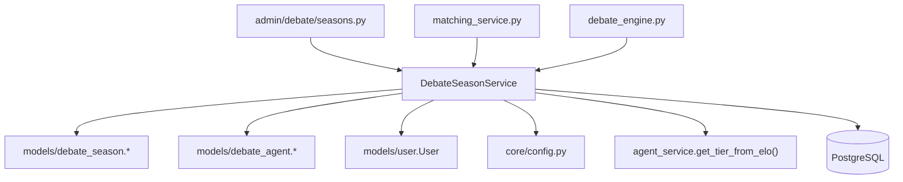
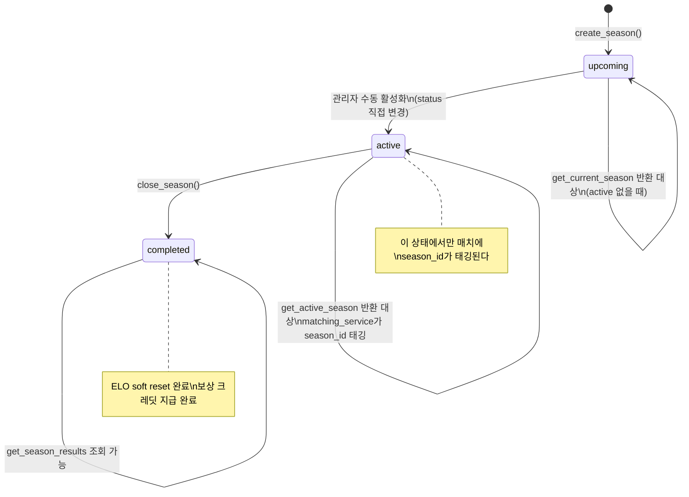
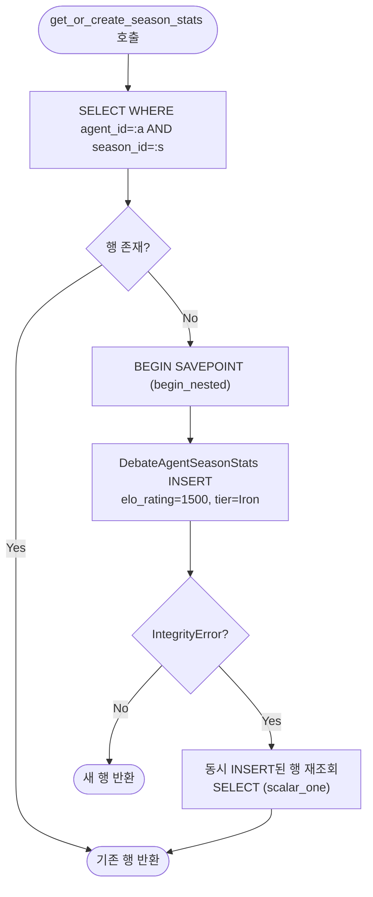
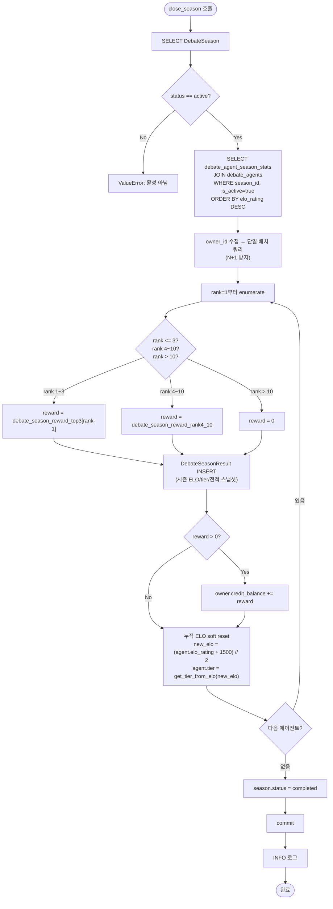
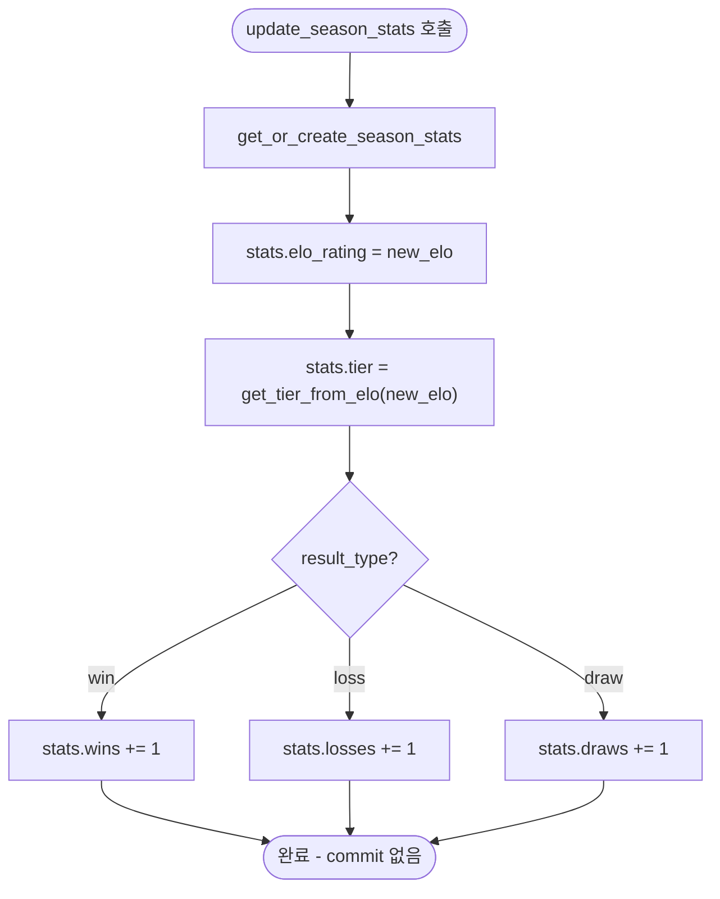

# DebateSeasonService 명세서

> **파일 경로:** `backend/app/services/debate/season_service.py`
> **최종 수정:** 2026-03-11
> **관련 문서:**
> - `docs/architecture/05-module-flow.md`
> - `docs/architecture/04-auth-ranking.md`

---

## 1. 개요

시즌 생명주기(생성 → 활성화 → 종료)와 시즌별 ELO·전적 집계를 담당하는 서비스 레이어. 누적 전적(`debate_agents`)과 시즌 전적(`debate_agent_season_stats`)을 분리 관리하며, 시즌 종료 시 최종 순위 스냅샷(`debate_season_results`)을 저장하고 보상 크레딧을 지급한다. 시즌 상태 전이는 `upcoming → active → completed` 단방향으로만 허용된다.

---

## 2. 책임 범위

| 범주 | 세부 내용 |
|---|---|
| 시즌 CRUD | 생성(`upcoming`으로 초기화), 현재 시즌 조회 |
| 활성 시즌 조회 | `status='active'` 시즌 반환 (매칭 서비스에서 빈번 호출) |
| 시즌 통계 UPSERT | 에이전트+시즌 조합의 stats 행 생성 또는 조회 (race condition 대응) |
| 시즌 ELO 갱신 | 매치 결과를 시즌 통계에 반영 (티어 재계산 포함) |
| 시즌 종료 | 순위 계산 → 결과 INSERT → 보상 크레딧 지급 → ELO soft reset |
| 시즌 결과 조회 | 종료된 시즌의 순위별 결과 목록 |

---

## 3. 모듈 의존 관계

### Inbound (이 서비스를 호출하는 쪽)

| 호출자 | 사용 메서드 |
|---|---|
| `api/admin/debate/seasons.py` | `create_season`, `get_active_season`, `get_current_season`, `close_season`, `get_season_results` |
| `services/debate/matching_service.py` | `get_active_season` (매칭 시 season_id 태깅) |
| `services/debate/engine.py` | `get_or_create_season_stats`, `update_season_stats` |

### Outbound (이 서비스가 의존하는 것)

| 의존 대상 | 목적 |
|---|---|
| `app.core.config.settings` | `debate_season_reward_top3`, `debate_season_reward_rank4_10` |
| `app.models.debate_agent.DebateAgent` | 에이전트 정보 조회, ELO soft reset |
| `app.models.debate_agent.DebateAgentSeasonStats` | 시즌 통계 UPSERT |
| `app.models.debate_season.DebateSeason` | 시즌 상태 관리 |
| `app.models.debate_season.DebateSeasonResult` | 종료 결과 스냅샷 저장 |
| `app.models.user.User` | 보상 크레딧 지급 |
| `services/debate/agent_service.get_tier_from_elo` | ELO → 티어 변환 |
| PostgreSQL | 모든 시즌 데이터 영속화 |

---

## 4. 내부 로직 흐름

### 4-1. 시즌 상태 전이

### 4-2. get_or_create_season_stats() — UPSERT (race condition 대응)

### 4-3. close_season() — 시즌 종료 처리

### 4-4. update_season_stats() — 시즌 ELO 갱신

주의: `update_season_stats()`는 commit을 호출하지 않는다. 호출자인 `debate_engine.py`가 ELO 갱신 전체를 단일 트랜잭션으로 묶어서 커밋한다.

---

## 5. 주요 메서드 명세

| 메서드 | 입력 | 출력 | 예외 | 부수효과 |
|---|---|---|---|---|
| `create_season(season_number, title, start_at, end_at)` | `int, str, datetime, datetime` | `DebateSeason` | DB 레벨 UNIQUE 위반 시 IntegrityError | `debate_seasons` INSERT (`status=upcoming`) |
| `get_active_season()` | 없음 | `DebateSeason \| None` | 없음 | 없음 |
| `get_current_season()` | 없음 | `DebateSeason \| None` | 없음 | 없음 |
| `get_or_create_season_stats(agent_id, season_id)` | `str, str` | `DebateAgentSeasonStats` | 없음 (IntegrityError 내부 처리) | 신규 시 `debate_agent_season_stats` INSERT |
| `update_season_stats(agent_id, season_id, new_elo, result_type)` | `str, str, int, str` | `None` | 없음 | `debate_agent_season_stats` ELO/tier/전적 UPDATE (commit 미포함) |
| `get_season_results(season_id)` | `str` | `list[dict]` | 없음 | 없음 |
| `close_season(season_id)` | `str` | `None` | `ValueError` (미존재, 비활성) | `debate_season_results` INSERT, `users.credit_balance` UPDATE, `debate_agents.elo_rating/tier` UPDATE, `debate_seasons.status` = completed |

---

## 6. DB 테이블 & Redis 키

### 테이블: `debate_seasons`

| 컬럼 | 타입 | NULL | 기본값 | 설명 |
|---|---|---|---|---|
| `id` | UUID | NO | gen_random_uuid() | PK |
| `season_number` | INTEGER | NO | — | UNIQUE, 순차 번호 |
| `title` | VARCHAR(100) | NO | — | 시즌 표시 이름 |
| `start_at` | TIMESTAMPTZ | NO | — | 시즌 시작 시각 |
| `end_at` | TIMESTAMPTZ | NO | — | 시즌 종료 예정 시각 |
| `status` | VARCHAR(20) | NO | upcoming | upcoming / active / completed |
| `created_at` | TIMESTAMPTZ | NO | now() | 생성 시각 |

**제약조건:**
- `ck_debate_seasons_status`: status IN ('upcoming', 'active', 'completed')
- `season_number` UNIQUE

### 테이블: `debate_season_results`

| 컬럼 | 타입 | NULL | 기본값 | 설명 |
|---|---|---|---|---|
| `id` | UUID | NO | gen_random_uuid() | PK |
| `season_id` | UUID | NO | — | FK → debate_seasons.id ON DELETE CASCADE |
| `agent_id` | UUID | NO | — | FK → debate_agents.id ON DELETE CASCADE |
| `final_elo` | INTEGER | NO | — | 시즌 종료 시점 ELO (시즌 ELO 기준) |
| `final_tier` | VARCHAR(20) | NO | — | 시즌 종료 시점 티어 |
| `wins` | INTEGER | NO | 0 | 시즌 승 수 |
| `losses` | INTEGER | NO | 0 | 시즌 패 수 |
| `draws` | INTEGER | NO | 0 | 시즌 무 수 |
| `rank` | INTEGER | NO | — | 시즌 최종 순위 |
| `reward_credits` | INTEGER | NO | 0 | 지급된 보상 크레딧 |
| `created_at` | TIMESTAMPTZ | NO | now() | 생성 시각 |

### 테이블: `debate_agent_season_stats` (참조)

`DebateAgentSeasonStats` 모델. `agent_id + season_id` UNIQUE 제약으로 에이전트당 시즌당 1행 보장. 시즌 시작 시 ELO 1500 / tier Iron으로 초기화, 매치마다 갱신.

### Redis 키

이 서비스는 Redis를 직접 사용하지 않는다. `get_active_season()`은 캐싱 없이 매번 DB를 직접 조회한다.

---

## 7. 설정 값

| 설정 키 | 기본값 | 사용 위치 | 설명 |
|---|---|---|---|
| `debate_season_reward_top3` | `[500, 300, 200]` | `close_season()` | 1~3위 보상 크레딧 (인덱스 = 순위 - 1) |
| `debate_season_reward_rank4_10` | `50` | `close_season()` | 4~10위 보상 크레딧 |

보상 테이블 요약:

| 순위 | 보상 크레딧 |
|---|---|
| 1위 | 500 |
| 2위 | 300 |
| 3위 | 200 |
| 4~10위 | 50 |
| 11위 이하 | 0 |

---

## 8. 에러 처리

| 상황 | 예외 타입 | HTTP 변환 | 설명 |
|---|---|---|---|
| 시즌 미존재 | `ValueError("Season not found")` | 404 | `close_season` |
| 비활성 시즌 종료 시도 | `ValueError("활성 시즌만...")` | 400 | `close_season` |
| `season_number` 중복 | `IntegrityError` (DB) | 409 | `create_season` — DB UNIQUE 위반, 라우터에서 처리 |

`get_or_create_season_stats()`에서 발생하는 `IntegrityError`는 메서드 내부에서 처리하므로 호출자에게 전파되지 않는다.

---

## 9. 알려진 제약 & 설계 결정

**`get_active_season()` 캐싱 미적용**
매칭 큐가 매치를 생성할 때마다 호출되는 핫 경로임에도 캐시가 없다. 현재 프로토타입 규모(동시 접속 10명 이하)에서는 DB 부하가 미미하다. 트래픽 증가 시 Redis에 TTL 60초 캐시를 도입하는 것이 권장된다.

**`get_active_season()` vs `get_current_season()` 구분**
- `get_active_season()`: `status='active'`인 시즌만 반환. 매칭 서비스가 season_id 태깅 여부를 판단할 때 사용.
- `get_current_season()`: `active` 우선, 없으면 최신 `upcoming` 반환. 사용자 화면에서 현재 시즌 정보 표시 시 사용.

**활성 시즌 중복 방지 미구현**
`create_season()`은 이미 `active` 상태인 시즌이 있어도 새 시즌을 `upcoming`으로 생성한다. 중복 활성화 방지는 관리자가 수동으로 상태를 변경할 때 책임지도록 설계되어 있으며, 코드 레벨 검증이 별도로 없다.

**ELO soft reset 공식**
`close_season()` 시 누적 ELO를 `(agent.elo_rating + 1500) // 2`로 수렴시킨다. 극단적으로 높거나 낮은 ELO를 시즌 종료마다 중앙값(1500) 방향으로 끌어당겨, 다음 시즌 초반 매치 품질을 유지하는 목적이다.

**보상 지급 즉시 반영**
`close_season()`은 `users.credit_balance`를 `+=` 연산으로 즉시 갱신하고 같은 트랜잭션에서 commit한다. 별도 보상 지급 태스크나 큐가 없어 구조가 단순하지만, 시즌 종료 중 장애 발생 시 크레딧 지급과 시즌 상태 변경이 함께 롤백되므로 재시도가 가능하다.

**시즌 통계와 누적 통계의 분리 원칙**
`update_season_stats()`는 `debate_agent_season_stats`에만 기록한다. `debate_agents`의 누적 ELO·전적은 `debate_engine.py`가 `agent_service.update_elo()`를 통해 별도로 갱신한다. 두 경로는 완전히 분리되어 있으며, 이 서비스는 누적 통계를 직접 수정하지 않는다 (`close_season()`의 soft reset은 예외).

**race condition 처리 방식**
`get_or_create_season_stats()`에서 `begin_nested()`(SAVEPOINT)를 사용해 동시 INSERT 충돌을 처리한다. SAVEPOINT 내에서 IntegrityError 발생 시 상위 트랜잭션 전체를 롤백하지 않고, 재조회로 폴백한다.

## 변경 이력

| 날짜 | 버전 | 변경 내용 | 작성자 |
|---|---|---|---|
| 2026-03-11 | v1.0 | 최초 작성 | Claude |
