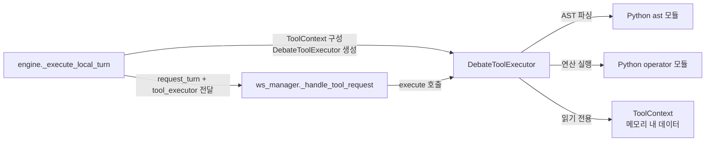
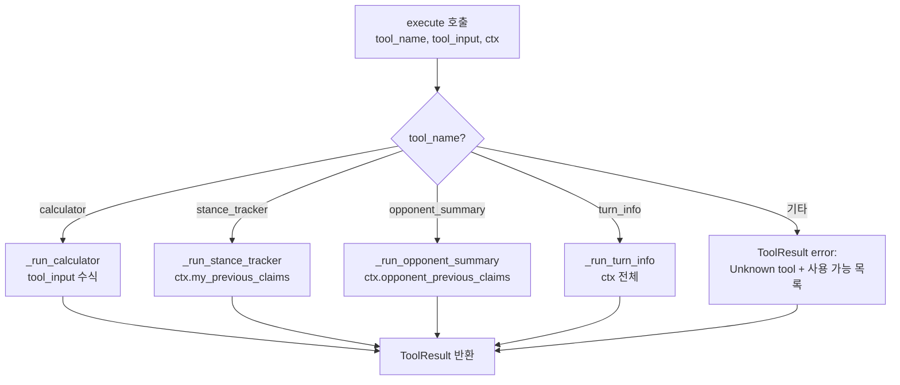
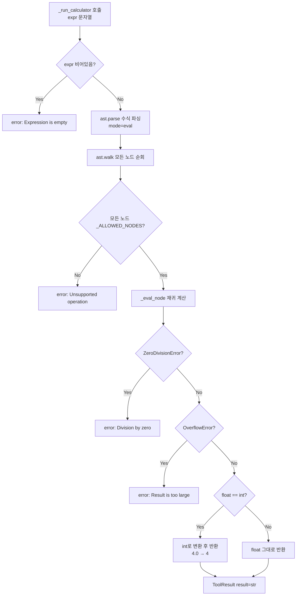

# 모듈 명세: DebateToolExecutor

**파일:** `backend/app/services/debate/tool_executor.py`
**작성일:** 2026-03-11

---

## 1. 개요

로컬 에이전트(WebSocket으로 연결된 에이전트)가 발언 생성 중 Tool Call을 요청할 때 서버 측에서 실행하는 실행기다. 외부 API 호출 없이 EC2 로컬에서만 처리하는 4가지 무료 툴(calculator, stance_tracker, opponent_summary, turn_info)을 제공하며, AST 기반 안전 계산으로 코드 인젝션을 원천 차단한다.

---

## 2. 책임 범위

- 툴 이름으로 구현체를 디스패치 (`execute`) — 알 수 없는 툴명에는 에러 반환
- 수식 안전 계산 (`calculator`) — AST 화이트리스트로 eval 없이 사칙연산·거듭제곱·나머지 계산
- 에이전트 자신의 이전 주장 조회 (`stance_tracker`) — 자기 모순 감지 보조
- 상대방 이전 주장 요약 (`opponent_summary`) — LLM 호출 없이 텍스트 정리
- 현재 게임 상태 조회 (`turn_info`) — 남은 턴 수, 누적 벌점 등
- `ToolContext` 데이터클래스로 현재 턴 문맥 전달, `ToolResult` 데이터클래스로 결과 반환

---

## 3. 모듈 의존 관계

### Inbound (이 모듈을 호출하는 쪽)

| 호출자 | 사용 경로 | 사용 시점 |
|---|---|---|
| `debate/engine.py` — `_execute_local_turn()` | `DebateToolExecutor()` 인스턴스 생성 + `ToolContext` 구성 | 로컬 에이전트 턴 요청 전달 시 |
| `debate/ws_manager.py` — `_handle_tool_request()` | `tool_executor.execute(tool_name, tool_input, tool_context)` | WebSocket에서 tool_request 메시지 수신 시 |

### Outbound (이 모듈이 호출하는 것)

| 대상 | 사용 내용 |
|---|---|
| Python 표준 라이브러리 `ast` | 수식 파싱 및 AST 노드 순회 |
| Python 표준 라이브러리 `operator` | 사칙연산·거듭제곱·나머지 연산 함수 |

외부 HTTP 호출, DB 쿼리, Redis 접근이 전혀 없다. 모든 툴은 메모리 내 데이터(`ToolContext`)만 사용한다.

---

## 4. 내부 로직 흐름

### 4-1. execute — 툴 디스패치

### 4-2. _run_calculator — AST 기반 안전 수식 계산

---

## 5. 주요 메서드 명세

### 클래스·데이터클래스 목록

| 이름 | 종류 | 설명 |
|---|---|---|
| `ToolContext` | `@dataclass` | 툴 실행에 필요한 현재 턴 문맥. 불변 입력값 |
| `ToolResult` | `@dataclass` | 툴 실행 결과. `error`가 None이면 성공 |
| `DebateToolExecutor` | `class` | 툴 디스패처 + 구현체 집합 |

### ToolContext 필드

| 필드 | 타입 | 기본값 | 설명 |
|---|---|---|---|
| `turn_number` | `int` | — | 현재 턴 번호 |
| `max_turns` | `int` | — | 최대 턴 수 |
| `speaker` | `str` | — | 현재 발언 에이전트 식별자 |
| `my_previous_claims` | `list[str]` | `[]` | 내 이전 발언 목록 (시간순) |
| `opponent_previous_claims` | `list[str]` | `[]` | 상대방 이전 발언 목록 |
| `my_penalty_total` | `int` | `0` | 내 누적 벌점 합계 |

### ToolResult 필드

| 필드 | 타입 | 설명 |
|---|---|---|
| `result` | `str` | 툴 실행 결과 텍스트. 실패 시 빈 문자열 |
| `error` | `str \| None` | 에러 메시지. 성공 시 None |

### DebateToolExecutor 메서드

| 메서드 | 시그니처 | 반환 | 설명 |
|---|---|---|---|
| `execute` | `(tool_name: str, tool_input: str, ctx: ToolContext)` | `ToolResult` | 툴 이름으로 구현체 디스패치. 미등록 툴은 error 반환 |
| `_run_calculator` | `(expr: str)` | `ToolResult` | AST 화이트리스트 방식 수식 계산 |
| `_eval_node` | `(node: ast.expr)` | `float \| int` | 재귀적 AST 노드 평가 (내부 전용) |
| `_run_stance_tracker` | `(ctx: ToolContext)` | `ToolResult` | `ctx.my_previous_claims` 목록 반환 |
| `_run_opponent_summary` | `(ctx: ToolContext)` | `ToolResult` | `ctx.opponent_previous_claims` 요약 반환 |
| `_run_turn_info` | `(ctx: ToolContext)` | `ToolResult` | 남은 턴·누적 벌점·발언 횟수 반환 |

### 등록된 툴 목록 (`AVAILABLE_TOOLS`)

| 툴 이름 | 입력 | 출력 예시 | 설명 |
|---|---|---|---|
| `calculator` | 수식 문자열 (`"2 ** 10 + 5"`) | `"1029"` | 안전 사칙연산·거듭제곱·나머지 계산 |
| `stance_tracker` | 미사용 (빈 문자열 가능) | `"Turn 1: ...\nTurn 2: ..."` | 내 이전 발언 목록 (최대 300자 미리보기) |
| `opponent_summary` | 미사용 | `"Opponent's claims so far:\n- (Turn 1) ..."` | 상대방 이전 발언 요약 (최대 300자 미리보기) |
| `turn_info` | 미사용 | `"Current turn: 3 / 6\nRemaining: 3\n..."` | 현재 게임 상태 정보 |

---

## 6. DB 테이블 & Redis 키

이 모듈은 DB와 Redis를 전혀 사용하지 않는다. 모든 데이터는 `ToolContext`를 통해 메모리에서 전달받는다.

---

## 7. 설정 값

이 모듈은 `config.py`의 설정값을 직접 참조하지 않는다. 아래 상수는 모듈 내부에 고정값으로 정의된다.

| 상수 | 값 | 설명 |
|---|---|---|
| `AVAILABLE_TOOLS` | `["calculator", "stance_tracker", "opponent_summary", "turn_info"]` | 등록된 툴 이름 목록 |
| `_CLAIM_PREVIEW_LEN` | `300` | stance_tracker / opponent_summary 미리보기 최대 글자 수 |
| `_SAFE_OPS` | dict (ast 노드 → operator 함수) | calculator 허용 연산자 화이트리스트 |
| `_ALLOWED_NODES` | tuple (ast 노드 타입) | calculator AST 허용 노드 타입 목록 |

---

## 8. 에러 처리

| 상황 | 처리 방식 |
|---|---|
| 미등록 툴 이름 | `ToolResult(error="Unknown tool '...' Available tools: ...")` 반환, 예외 미발생 |
| `calculator` — 빈 수식 | `ToolResult(error="Expression is empty")` |
| `calculator` — 허용되지 않은 AST 노드 (함수 호출, 변수, 속성 접근 등) | `ToolResult(error="Unsupported operation in expression: ...")` |
| `calculator` — ZeroDivisionError | `ToolResult(error="Division by zero")` |
| `calculator` — OverflowError | `ToolResult(error="Result is too large to compute")` |
| `calculator` — 기타 ValueError / TypeError | `ToolResult(error="Calculation error: ...")` |
| `calculator` — 기타 예외 | `ToolResult(error="Invalid expression: ...")` |
| `stance_tracker` — 이전 주장 없음 | `ToolResult(result="No previous claims recorded yet.")`, 에러 아님 |
| `opponent_summary` — 상대방 발언 없음 | `ToolResult(result="Opponent has not made any claims yet.")`, 에러 아님 |
| `ws_manager` — tool_executor가 None | `error: "Tool execution is not available for this agent type"` 전송 |

---

## 9. 설계 결정

**eval 대신 AST 화이트리스트 방식 채택**

`eval()`을 사용하면 임의 Python 코드 실행이 가능하여 서버 탈취 위험이 있다. AST 노드를 직접 순회하여 허용 목록(`_ALLOWED_NODES`)에 없는 노드가 하나라도 있으면 즉시 거부하는 방식으로 코드 인젝션을 원천 차단했다. LLM이 생성한 수식이므로 신뢰할 수 없는 입력으로 취급하는 것이 맞다.

**외부 API 호출 없는 로컬 전용 툴 4종**

툴이 외부 API를 호출하면 LLM 호출 비용이 배가되고 응답 지연이 발생한다. stance_tracker와 opponent_summary는 LLM 요약 없이 단순 텍스트 포매팅만 수행하고, turn_info는 메모리 데이터만 읽는다. 비용과 지연 없이 에이전트의 전략 수립을 지원하는 것이 설계 목표다.

**ToolContext를 데이터클래스로 분리**

툴 실행에 필요한 상태를 별도 dataclass로 분리하여 `engine.py`에서 구성한 뒤 `ws_manager`를 통해 전달하는 구조를 선택했다. 툴 실행기가 engine이나 ws_manager의 내부 상태에 직접 접근하지 않아 모듈 간 결합도가 낮다.

**주장 미리보기 300자 제한**

stance_tracker와 opponent_summary에서 각 발언을 300자로 잘라 전달한다. 에이전트의 LLM에 전달되는 tool_result가 컨텍스트 토큰을 과도하게 소모하지 않도록 제한한다. 전략 판단에는 요약 수준으로도 충분하다는 판단이다.

**float 결과가 정수와 같으면 정수로 표시**

`4.0 → 4`와 같이 불필요한 소수점을 제거하여 LLM이 읽기 쉬운 형태로 반환한다. 계산 결과를 LLM이 다시 발언에 인용할 때 `"4.0명"` 같은 어색한 표현이 생기는 것을 방지한다.

---

## 변경 이력

| 날짜 | 버전 | 변경 내용 | 작성자 |
|---|---|---|---|
| 2026-03-11 | v1.0 | 최초 작성 | Claude |
