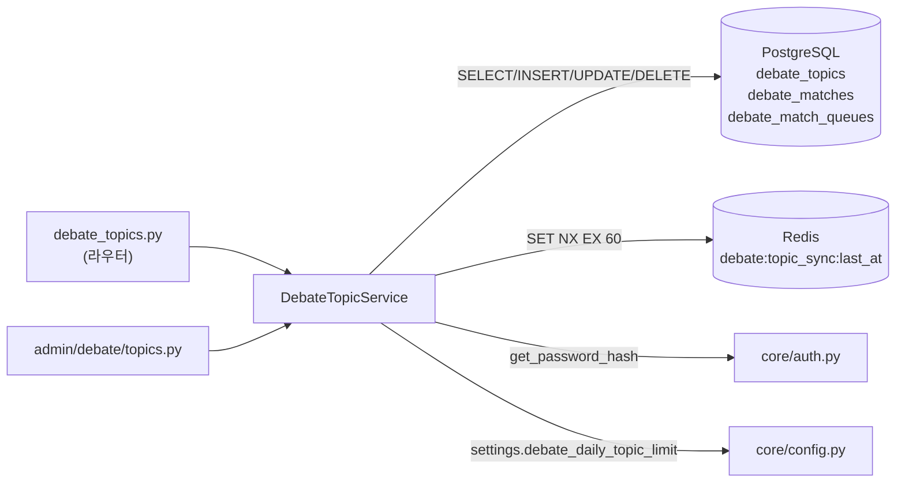
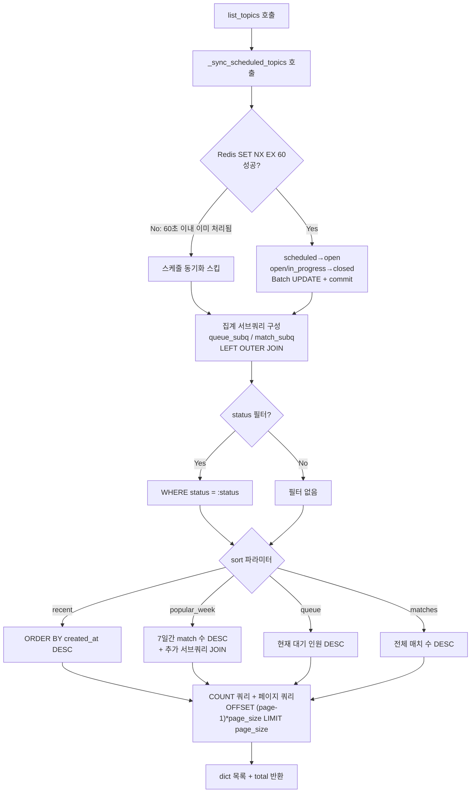

# debate/topic_service.md

> **파일 경로:** `backend/app/services/debate/topic_service.py`
> **최종 수정:** 2026-03-11

---

## 1. 개요

토론 주제(`DebateTopic`) CRUD와 스케줄 기반 상태 자동 갱신을 담당하는 서비스 클래스다. `list_topics()` 호출마다 `_sync_scheduled_topics()`가 실행되어 `scheduled_start_at`/`scheduled_end_at` 기준으로 상태를 자동 전이한다. Redis `SET NX EX` 패턴으로 60초 이내 재실행을 방지하여 멀티 워커 환경에서 중복 처리를 억제한다.

---

## 2. 책임 범위

- 토론 주제 생성 및 일일 등록 한도 검증 (`create_topic`)
- 주제 단건 조회 (`get_topic`)
- 주제 목록 조회 — 페이지네이션, 정렬(4가지), 상태 필터, N+1 방지 서브쿼리 (`list_topics`)
- 관리자 전용 주제 수정/삭제 (`update_topic`, `delete_topic`)
- 작성자 전용 주제 수정/삭제 — 소유권 검증 포함 (`update_topic_by_user`, `delete_topic_by_user`)
- 스케줄 상태 자동 갱신 — `scheduled→open`, `open/in_progress→closed` (`_sync_scheduled_topics`)
- 비밀번호 보호 토픽 생성 시 bcrypt 해시화 (`create_topic`)
- 큐·매치 건수 단건 조회 (`count_queue`, `count_matches`)

---

## 3. 모듈 의존 관계

### Inbound (이 모듈을 호출하는 것)

| 호출자 | 사용 메서드 |
|---|---|
| `api/debate_topics.py` (라우터) | 모든 퍼블릭 토픽 API |
| `api/admin/debate/topics.py` (라우터) | 관리자 토픽 조회/수정/삭제 |

### Outbound (이 모듈이 호출하는 것)

| 의존 대상 | 목적 |
|---|---|
| `app.core.redis.get_redis()` | 스케줄 동기화 분산 락 (`SET NX EX`) |
| `app.core.auth.get_password_hash()` | 비밀번호 보호 토픽 해시화 |
| `app.core.config.settings` | `debate_daily_topic_limit` |
| `models/debate_topic.DebateTopic` | 주제 ORM 모델 |
| `models/debate_match.DebateMatch` | 집계 서브쿼리 |
| `models/debate_match.DebateMatchQueue` | 큐 집계, 삭제 전 정리 |
| `models/user.User` | 목록 조회 시 `creator_nickname` JOIN |
| `schemas/debate_topic.TopicCreate` / `TopicUpdate` / `TopicUpdatePayload` | 입력 스키마 |



---

## 4. 내부 로직 흐름

### create_topic() — 주제 생성

```mermaid
flowchart TD
    A["create_topic 호출"] --> B{user.role ==\nadmin 또는 superadmin?}
    B -- No --> C["오늘 자정 이후 등록 수\nCOUNT(created_by=user.id AND created_at>=today)"]
    C --> D{count >=\ndebate_daily_topic_limit?}
    D -- Yes --> E["ValueError\n일일 한도 초과"]
    D -- No --> F
    B -- Yes --> F["scheduled_start_at 판단"]
    F --> G{scheduled_start_at\n> now(UTC)?}
    G -- Yes --> H["initial_status = 'scheduled'"]
    G -- No / None --> I["initial_status = 'open'"]
    H --> J{data.password 존재?}
    I --> J
    J -- Yes --> K["get_password_hash\nis_password_protected = True"]
    J -- No --> L["password_hash = None"]
    K --> M["DebateTopic INSERT\nis_admin_topic = is_admin"]
    L --> M
    M --> N["commit + refresh"]
    N --> O["DebateTopic 반환"]
```

### list_topics() — 목록 조회 (스케줄 동기화 포함)



---

## 5. 주요 메서드 명세

| 메서드 | 시그니처 | 반환값 | 예외 | 설명 |
|---|---|---|---|---|
| `create_topic` | `(data: TopicCreate, user: User) -> DebateTopic` | `DebateTopic` | `ValueError` (한도 초과) | 스케줄 판단, 비밀번호 해시화 포함 |
| `get_topic` | `(topic_id: str) -> DebateTopic \| None` | `DebateTopic \| None` | 없음 | 단건 조회. 미존재 시 `None` |
| `list_topics` | `(status, sort, page, page_size) -> tuple[list[dict], int]` | `(items, total)` | 없음 | 스케줄 동기화 부수효과 있음 |
| `update_topic` | `(topic_id: str, data: TopicUpdate) -> DebateTopic` | `DebateTopic` | `ValueError` (미존재) | 관리자 전용. `exclude_unset=True` 부분 갱신 |
| `update_topic_by_user` | `(topic_id: UUID, user_id: UUID, payload: TopicUpdatePayload) -> DebateTopic` | `DebateTopic` | `ValueError` (미존재), `PermissionError` (소유권 불일치) | 작성자 전용 |
| `delete_topic` | `(topic_id: str) -> None` | `None` | `ValueError` (미존재, 매치 존재) | 관리자 전용. 큐 먼저 삭제 |
| `delete_topic_by_user` | `(topic_id: UUID, user_id: UUID) -> None` | `None` | `ValueError` (미존재, in_progress 매치 존재), `PermissionError` | 작성자 전용. in_progress 매치만 검사 |
| `count_queue` | `(topic_id) -> int` | `int` | 없음 | 대기 큐 건수 |
| `count_matches` | `(topic_id) -> int` | `int` | 없음 | `is_test=False` 매치 건수 |
| `_sync_scheduled_topics` | `() -> None` | `None` | 없음 (Redis 장애 폴백) | 스케줄 상태 자동 전이. Redis 락으로 60초 throttle |

### list_topics 반환 dict 필드

`id`, `title`, `description`, `mode`, `status`, `max_turns`, `turn_token_limit`, `scheduled_start_at`, `scheduled_end_at`, `is_admin_topic`, `is_password_protected`, `tools_enabled`, `queue_count`, `match_count`, `created_at`, `updated_at`, `created_by`, `creator_nickname`

---

## 6. DB 테이블 & Redis 키

### 테이블: `debate_topics`

| 컬럼 | 타입 | NULL | 기본값 | 설명 |
|---|---|---|---|---|
| `id` | UUID | NO | `gen_random_uuid()` | PK |
| `title` | VARCHAR(200) | NO | — | 토론 주제 제목 |
| `description` | TEXT | YES | — | 상세 설명 |
| `mode` | VARCHAR(20) | NO | `'debate'` | `debate` / `persuasion` / `cross_exam` |
| `status` | VARCHAR(20) | NO | `'open'` | `scheduled` / `open` / `in_progress` / `closed` |
| `max_turns` | INTEGER | NO | `6` | 최대 턴 수 |
| `turn_token_limit` | INTEGER | NO | `1500` | 턴당 토큰 제한 |
| `scheduled_start_at` | TIMESTAMPTZ | YES | — | 자동 open 전환 시각 |
| `scheduled_end_at` | TIMESTAMPTZ | YES | — | 자동 closed 전환 시각 |
| `is_admin_topic` | BOOLEAN | NO | `false` | 관리자 등록 여부 |
| `tools_enabled` | BOOLEAN | NO | `true` | Tool Call 허용 여부 |
| `is_password_protected` | BOOLEAN | NO | `false` | 비밀번호 보호 여부 |
| `password_hash` | VARCHAR(255) | YES | — | bcrypt 해시 (API 응답 미포함) |
| `created_by` | UUID | YES | — | FK → `users.id` ON DELETE SET NULL |
| `created_at` | TIMESTAMPTZ | NO | `now()` | 생성 시각 |
| `updated_at` | TIMESTAMPTZ | NO | `now()` | 수정 시각 |

**CHECK 제약조건:**
- `ck_debate_topics_mode`: `mode IN ('debate', 'persuasion', 'cross_exam')`
- `ck_debate_topics_status`: `status IN ('scheduled', 'open', 'in_progress', 'closed')`

### 쓰기 대상 (부수 효과)

- `debate_match_queues` — `delete_topic` / `delete_topic_by_user` 호출 시 DELETE (토픽 삭제 전 큐 정리)

### Redis 키

| 키 | 타입 | TTL | 용도 |
|---|---|---|---|
| `debate:topic_sync:last_at` | String (`"1"`) | 60초 | 스케줄 동기화 분산 락 (SET NX EX) |

---

## 7. 설정 값

| 설정 키 | 기본값 | 설명 |
|---|---|---|
| `debate_daily_topic_limit` | `5` | 일반 사용자의 하루 토픽 등록 최대 건수. `admin` / `superadmin` 역할은 적용 제외 |

---

## 8. 에러 처리

| 상황 | 예외 | 라우터 HTTP 변환 |
|---|---|---|
| 일일 한도 초과 | `ValueError(f"일일 토론 주제 등록 한도({n}개)에 도달했습니다.")` | 400 |
| 토픽 미존재 | `ValueError("Topic not found")` | 404 |
| 소유권 불일치 | `PermissionError("Not the topic creator")` | 403 |
| 관리자 삭제 — 매치 존재 | `ValueError(f"진행된 매치가 {n}개 있어 삭제할 수 없습니다.")` | 409 |
| 사용자 삭제 — in_progress 매치 존재 | `ValueError(f"진행 중인 매치가 {n}개 있어 삭제할 수 없습니다.")` | 409 |
| Redis 장애 (`_sync_scheduled_topics`) | 예외 캐치 후 DEBUG 로그, 락 없이 계속 실행 | — |

---

## 9. 설계 결정

**목록 캐시 없음 — DB 직접 조회**

`list_topics()`는 Redis 목록 캐시를 사용하지 않는다. `_sync_scheduled_topics()`의 부수효과와 `queue_count`/`match_count`의 실시간성 요구로 인해 캐시 무효화 시점 관리가 복잡해진다. 프로토타입 규모(동시 접속 10명 이하)에서는 직접 조회로 충분하다.

**스케줄 동기화 — 요청 기반 트리거 (백그라운드 태스크 없음)**

`list_topics()` 호출 시마다 `_sync_scheduled_topics()`를 실행한다. Redis 락으로 60초 이내 중복 실행을 방지하므로 실제 DB 쿼리는 최대 분당 1회만 발생한다. 별도 백그라운드 태스크를 두는 것보다 구현이 단순하며, 정확한 시각 반영보다 단순성이 더 중요한 규모다.

**Redis 장애 시 폴백 — 중복 실행 허용**

`SET NX EX` 실패 시 락 없이 동기화를 계속 수행한다. `UPDATE ... WHERE status = 'scheduled' AND scheduled_start_at <= now` 형태의 멱등적 쿼리이므로 중복 실행 시 데이터 손상이 없다.

**삭제 정책 — 관리자 vs 사용자 차이**

관리자 `delete_topic()`은 `is_test=False` 매치가 1개라도 있으면 삭제를 거부한다. 사용자 `delete_topic_by_user()`는 `in_progress` 상태 매치만 확인한다. 완료된 매치 기록은 유지하면서 토픽은 삭제할 수 있도록 사용자에게 더 완화된 정책을 적용했다.

**비밀번호 보호 — API 응답 미포함**

`password_hash`는 API 응답에 포함하지 않는다. 큐 등록 시 비밀번호 검증은 `matching_service.py`에서 `verify_password()`로 처리한다.

---

## 변경 이력

| 날짜 | 버전 | 변경 내용 | 작성자 |
|---|---|---|---|
| 2026-03-11 | v1.0 | 최초 작성 | Claude |
| 2026-03-11 | v1.1 | 9섹션 템플릿으로 재정비 | Claude |
