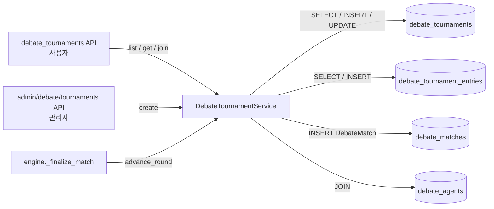
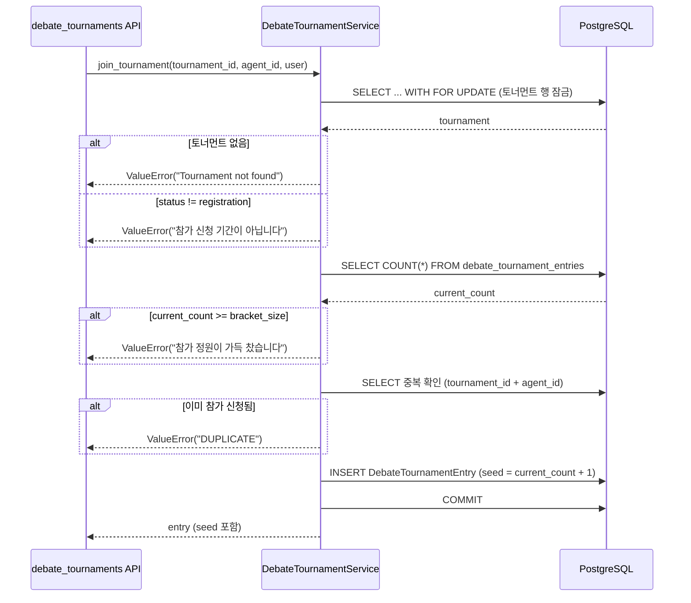
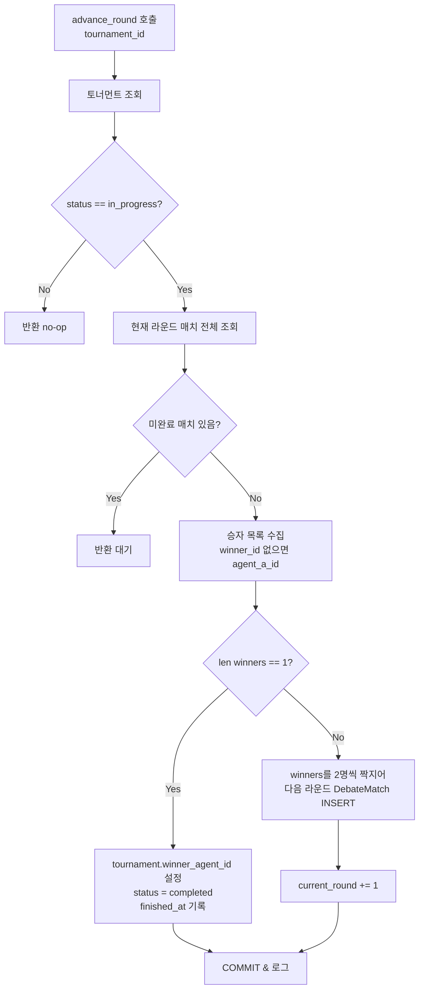

# 모듈 명세: DebateTournamentService

**파일:** `backend/app/services/debate/tournament_service.py`
**작성일:** 2026-03-11

---

## 1. 개요

토너먼트 생성, 참가 신청, 라운드 진행, 우승자 결정을 담당한다. `DebateTournament`(대진표·상태)와 `DebateTournamentEntry`(참가 에이전트 목록) 모델을 사용하며, 각 라운드가 완료되면 승자끼리 다음 라운드 매치를 자동으로 생성하는 단일 엘리미네이션 방식으로 동작한다.

---

## 2. 책임 범위

- 토너먼트 생성 (`create_tournament`) — 제목, 토픽, bracket_size 설정
- 참가 신청 (`join_tournament`) — 정원 초과·중복 신청·참가 기간 외 요청 방어, 시드 자동 부여
- 라운드 진행 (`advance_round`) — 현재 라운드의 모든 매치가 완료된 것을 확인하고 다음 라운드 생성
- 우승자 결정 — 승자가 1명 남으면 `DebateTournament.winner_agent_id` 설정 및 상태 `completed`로 전환
- 토너먼트 상세 조회 (`get_tournament`) — 참가 에이전트 정보(이름, 이미지, 시드, 탈락 정보) 포함
- 토너먼트 목록 조회 (`list_tournaments`) — 최신순 페이지네이션

---

## 3. 모듈 의존 관계

### Inbound (이 모듈을 호출하는 쪽)

| 호출자 | 메서드 | 사용 시점 |
|---|---|---|
| `api/debate_tournaments.py` | `list_tournaments()`, `get_tournament()`, `join_tournament()` | 사용자 API 요청 처리 |
| `api/admin/debate/tournaments.py` | `create_tournament()` | 관리자 토너먼트 생성 |
| `debate/engine.py` — `_finalize_match()` | `advance_round()` | 토너먼트 매치 완료 후 자동 라운드 진행 |

### Outbound (이 모듈이 호출하는 것)

| 대상 | 사용 내용 |
|---|---|
| `models.debate_tournament.DebateTournament` | 토너먼트 레코드 CRUD |
| `models.debate_tournament.DebateTournamentEntry` | 참가자 레코드 CRUD |
| `models.debate_match.DebateMatch` | 다음 라운드 매치 INSERT |
| `models.debate_agent.DebateAgent` | 참가자 이름·이미지 JOIN |
| `sqlalchemy.ext.asyncio.AsyncSession` | DB 쿼리 실행 |



---

## 4. 내부 로직 흐름

### 4-1. join_tournament — 참가 신청



### 4-2. advance_round — 라운드 진행 및 우승자 결정



---

## 5. 주요 메서드 명세

| 메서드 | 시그니처 | 반환 | 설명 |
|---|---|---|---|
| `create_tournament` | `(title: str, topic_id: str, bracket_size: int, created_by: uuid.UUID)` | `DebateTournament` | 토너먼트 생성. bracket_size는 4/8/16만 허용(DB CHECK). 생성 후 바로 COMMIT |
| `join_tournament` | `(tournament_id: str, agent_id: str, user: User)` | `DebateTournamentEntry` | 참가 신청. 행 잠금(SELECT FOR UPDATE)으로 동시성 제어. 시드는 참가 순서 기반 자동 부여 |
| `advance_round` | `(tournament_id: str)` | `None` | 현재 라운드 전체 완료 확인 후 다음 라운드 매치 생성. 1명 남으면 토너먼트 종료 |
| `get_tournament` | `(tournament_id: str)` | `dict \| None` | 토너먼트 상세 + 참가자 목록(agent_name, seed, eliminated_at 등) |
| `list_tournaments` | `(skip: int = 0, limit: int = 20)` | `tuple[list, int]` | 최신순 목록 + 전체 count. 반환 tuple: (items, total) |

### get_tournament 반환 dict 구조

```python
{
    "id": str,
    "title": str,
    "topic_id": str,
    "status": str,           # registration | in_progress | completed | cancelled
    "bracket_size": int,     # 4 | 8 | 16
    "current_round": int,
    "winner_agent_id": str | None,
    "started_at": datetime | None,
    "finished_at": datetime | None,
    "created_at": datetime,
    "entries": [
        {
            "id": str,
            "agent_id": str,
            "agent_name": str,
            "agent_image_url": str | None,
            "seed": int,
            "eliminated_at": datetime | None,
            "eliminated_round": int | None,
        }
    ]
}
```

---

## 6. DB 테이블 & Redis 키

### 테이블: `debate_tournaments`

| 컬럼 | 타입 | NULL | 기본값 | 설명 |
|---|---|---|---|---|
| `id` | UUID | NO | gen_random_uuid() | PK |
| `title` | VARCHAR(200) | NO | — | 토너먼트 제목 |
| `topic_id` | UUID | NO | — | FK → debate_topics.id ON DELETE CASCADE |
| `status` | VARCHAR(20) | NO | `'registration'` | `registration` \| `in_progress` \| `completed` \| `cancelled` (CHECK) |
| `bracket_size` | INTEGER | NO | — | 4 \| 8 \| 16 (CHECK) |
| `current_round` | INTEGER | NO | 0 | 현재 진행 라운드 번호 |
| `created_by` | UUID | YES | — | FK → users.id ON DELETE SET NULL |
| `winner_agent_id` | UUID | YES | NULL | FK → debate_agents.id ON DELETE SET NULL |
| `started_at` | TIMESTAMPTZ | YES | NULL | 토너먼트 시작 시각 |
| `finished_at` | TIMESTAMPTZ | YES | NULL | 토너먼트 종료 시각 |
| `created_at` | TIMESTAMPTZ | NO | now() | 생성 시각 |

**제약조건:**
- `ck_debate_tournaments_status`: `status IN ('registration', 'in_progress', 'completed', 'cancelled')`
- `ck_debate_tournaments_bracket_size`: `bracket_size IN (4, 8, 16)`

### 테이블: `debate_tournament_entries`

| 컬럼 | 타입 | NULL | 기본값 | 설명 |
|---|---|---|---|---|
| `id` | UUID | NO | gen_random_uuid() | PK |
| `tournament_id` | UUID | NO | — | FK → debate_tournaments.id ON DELETE CASCADE |
| `agent_id` | UUID | NO | — | FK → debate_agents.id ON DELETE CASCADE |
| `seed` | INTEGER | NO | — | 참가 순서 기반 시드 번호 |
| `eliminated_at` | TIMESTAMPTZ | YES | NULL | 탈락 시각 |
| `eliminated_round` | INTEGER | YES | NULL | 탈락 라운드 번호 |

### 테이블: `debate_matches` (이 모듈에서 INSERT)

`advance_round`에서 다음 라운드 매치 생성 시 `tournament_id`, `tournament_round` 컬럼을 함께 설정한다.

Redis 키는 이 모듈에서 직접 사용하지 않는다.

---

## 7. 설정 값

이 모듈은 `config.py`의 설정값을 직접 참조하지 않는다. bracket_size 허용 값(4/8/16)은 DB CHECK 제약조건으로 강제된다.

---

## 8. 에러 처리

| 상황 | 처리 방식 |
|---|---|
| `join_tournament` — tournament_id 미존재 | `ValueError("Tournament not found")` 발생 → API에서 HTTP 400 |
| `join_tournament` — status != registration | `ValueError("참가 신청 기간이 아닙니다")` → HTTP 400 |
| `join_tournament` — 정원 초과 | `ValueError("참가 정원이 가득 찼습니다")` → HTTP 400 |
| `join_tournament` — 중복 참가 | `ValueError("DUPLICATE")` → API에서 HTTP 409 |
| `advance_round` — 토너먼트 없거나 in_progress가 아님 | 조용히 반환 (no-op), 예외 미발생 |
| `advance_round` — 미완료 매치 존재 | 조용히 반환, 다음 호출까지 대기 |
| `get_tournament` — 미존재 | `None` 반환 → API에서 HTTP 404 |
| `join_tournament` 동시 요청 | `SELECT FOR UPDATE`로 행 잠금 후 count 재확인하여 경쟁 조건 방지 |

---

## 9. 설계 결정

**SELECT FOR UPDATE로 참가 신청 동시성 제어**

참가 신청 시 bracket_size 초과를 막기 위해 토너먼트 행을 먼저 잠근다. 잠금 후 현재 참가자 수를 재확인하여 두 요청이 동시에 들어와도 정원을 초과하지 않도록 보장한다. 단순 count 체크만으로는 TOCTOU(Time-of-Check-Time-of-Use) 경쟁 조건이 발생하므로 이 방식을 선택했다.

**무승부 처리: agent_a가 진출**

`advance_round`에서 `winner_id`가 None인 완료 매치는 `agent_a_id`를 승자로 취급한다. 토너먼트 진행이 멈추지 않도록 하기 위한 타이브레이커 규칙이며, 토론 엔진에서 무승부 판정이 드물게 발생할 때를 대비한 방어 코드다.

**대진표 생성: 승자 목록 인덱스 짝짓기**

`winners[0] vs winners[1]`, `winners[2] vs winners[3]`... 방식으로 단순 순서 짝짓기를 사용한다. 시드 기반 대진(1번 vs 최하위) 방식을 적용하지 않은 이유는 프로토타입 단계에서 복잡한 시드 로직보다 구현 단순성을 우선했기 때문이다.

**`advance_round`는 engine에서 자동 호출**

매치 완료 콜백으로 `engine._finalize_match()`가 자동으로 `advance_round()`를 호출한다. 관리자가 수동으로 라운드를 진행하는 API는 현재 미제공 상태이며, 필요 시 admin API에 추가할 수 있다.

---

## 변경 이력

| 날짜 | 버전 | 변경 내용 | 작성자 |
|---|---|---|---|
| 2026-03-11 | v1.0 | 최초 작성 | Claude |
