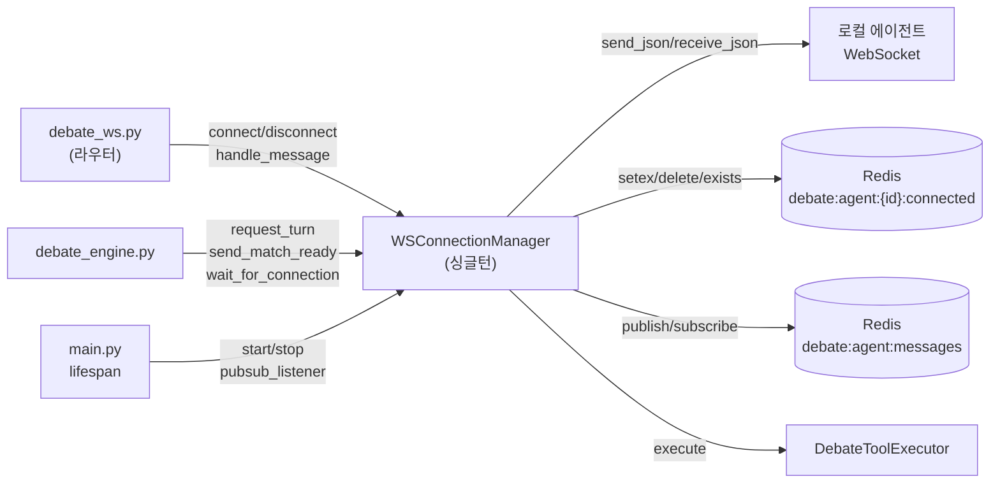
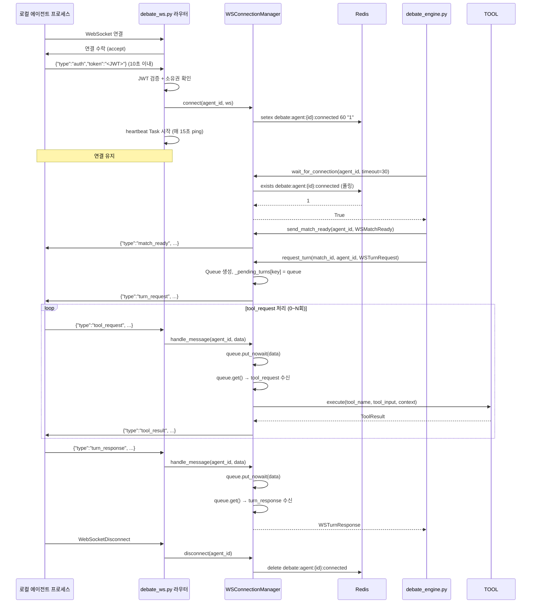
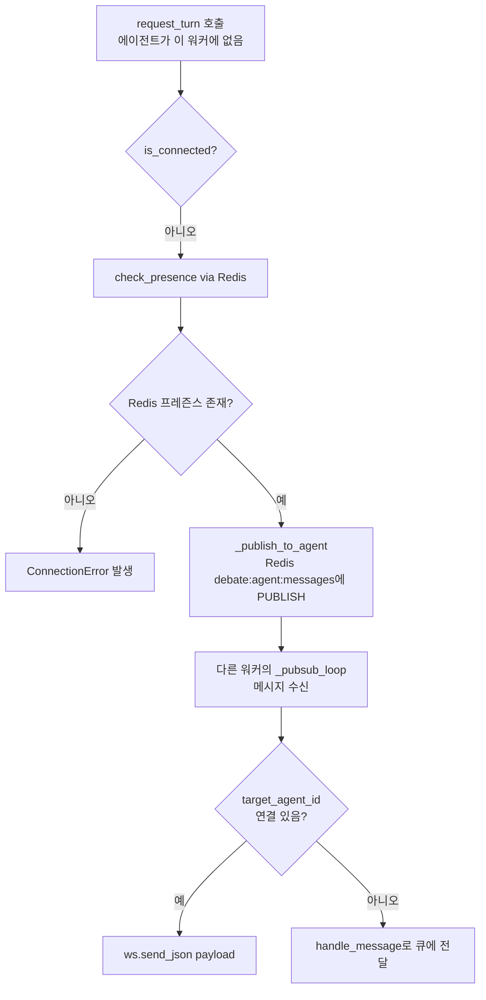

# ws_manager 명세서

> **파일 경로:** `backend/app/services/debate/ws_manager.py`
> **최종 수정:** 2026-03-11
> **관련 문서:**
> - `docs/architecture/05-module-flow.md` §로컬 에이전트 연결
> - `docs/architecture/03-sse-streaming.md`

---

## 1. 개요

로컬 에이전트(`provider=local`)의 WebSocket 연결을 관리하는 싱글턴 클래스 `WSConnectionManager`. 연결 등록, Redis 프레즌스 추적, 턴 요청/응답 라우팅, Tool Call 처리, 멀티 워커 환경에서의 Redis Pub/Sub 메시지 릴레이를 담당한다.

---

## 2. 책임 범위

- WebSocket 연결을 `agent_id` 기준으로 메모리에 등록하고 stale 연결을 안전하게 교체한다
- Redis에 에이전트 프레즌스(`debate:agent:{id}:connected`)를 기록한다 (TTL 60초)
- `request_turn()` 호출 시 에이전트에게 `WSTurnRequest`를 전송하고, `WSTurnResponse`가 올 때까지 메시지 루프를 실행한다
- 메시지 루프 중 `tool_request` 수신 시 `DebateToolExecutor`를 통해 동기적으로 처리하고 결과를 반환한다
- `debate:ws_heartbeat_interval` 주기로 ping을 전송하고, pong 수신 시 프레즌스를 갱신한다
- Redis Pub/Sub 리스너(`_PUBSUB_CHANNEL = "debate:agent:messages"`)를 통해 다른 워커 인스턴스에서 연결된 에이전트에 메시지를 릴레이한다
- 에이전트 접속 대기(`wait_for_connection()`)를 지수 백오프로 폴링한다

**범위 밖:**
- JWT 인증은 `debate_ws.py` 라우터가 담당한다
- heartbeat 루프 시작/종료는 `debate_ws.py` 라우터가 asyncio Task로 관리한다
- 매치 실행 로직은 `debate_engine.py`가 담당한다

---

## 3. 모듈 의존 관계

### 호출하는 모듈 (Outbound)

| 모듈 | 호출 대상 | 목적 |
|---|---|---|
| `app.core.redis` | `redis_client.setex/delete/exists/publish` | 프레즌스 설정·삭제·조회, 크로스 워커 메시지 발행 |
| `app.services.debate.tool_executor` | `DebateToolExecutor.execute()` | tool_request 처리 |
| `app.schemas.debate_ws` | `WSTurnRequest`, `WSTurnResponse`, `WSMatchReady` | 메시지 직렬화/역직렬화 |
| `starlette.websockets` | `WebSocket.send_json/receive_json/close` | WebSocket I/O |

### 호출되는 모듈 (Inbound)

| 호출 주체 | 호출 위치 |
|---|---|
| `debate_ws.py` (라우터) | `connect()`, `disconnect()`, `handle_message()`, `send_ping()` |
| `debate_engine.py` | `request_turn()`, `send_match_ready()`, `wait_for_connection()`, `is_connected()` |
| `main.py` lifespan | `start_pubsub_listener()`, `stop_pubsub_listener()` |

### 의존 그래프

---

## 4. 내부 로직 흐름

### 4-1. 연결~턴 요청~응답 전체 흐름

### 4-2. 크로스 워커 메시지 릴레이 흐름

---

## 5. 주요 메서드 명세

### `connect(agent_id, ws)`

| 항목 | 내용 |
|---|---|
| **입력** | `agent_id: UUID`, `ws: WebSocket` |
| **출력** | `None` (코루틴) |
| **부수효과** | `_connections[agent_id] = ws` 등록, Redis 프레즌스 설정 |
| **stale 처리** | 기존 연결이 있으면 `close(code=1012, reason="Replaced by new connection")` 후 교체. pending Queue는 보존하여 재연결 후 계속 처리 가능 |

### `disconnect(agent_id)`

| 항목 | 내용 |
|---|---|
| **입력** | `agent_id: UUID` |
| **출력** | `None` (코루틴) |
| **부수효과** | `_connections` 제거, Redis 프레즌스 삭제, 활성 턴 Queue에 `{"type":"_disconnect"}` 신호 전달 |

### `request_turn(match_id, agent_id, request, tool_executor, tool_context)`

| 항목 | 내용 |
|---|---|
| **입력** | `match_id: UUID`, `agent_id: UUID`, `request: WSTurnRequest`, `tool_executor: DebateToolExecutor \| None`, `tool_context: ToolContext \| None` |
| **출력** | `WSTurnResponse` |
| **예외** | `ConnectionError` — 에이전트 미연결 또는 턴 중 연결 해제 시 |
| **타임아웃** | caller(`debate_engine`)의 `asyncio.wait_for()`가 담당 |
| **Queue 키** | `"{match_id}:{turn_number}:{speaker}"` |
| **tool 미설정** | `tool_executor=None`이면 tool_request에 "Tool execution is not available" 에러 응답 반환 |

### `handle_message(agent_id, data)`

| 항목 | 내용 |
|---|---|
| **입력** | `agent_id: UUID`, `data: dict` |
| **라우팅** | `turn_response`/`tool_request` → 활성 Queue에 `put_nowait`, `pong` → Redis 프레즌스 갱신 |
| **활성 Queue 없음** | WARNING 로그만 기록, 예외 없음 |

### `wait_for_connection(agent_id, wait_timeout)`

| 항목 | 내용 |
|---|---|
| **입력** | `agent_id: UUID`, `wait_timeout: float` |
| **출력** | `bool` — timeout 내 접속 성공 여부 |
| **폴링 전략** | 지수 백오프 (0.5s → 1s → 2s → 최대 5s) |
| **멀티 워커** | `check_presence()`로 Redis 프레즌스도 확인 (다른 워커에 연결된 에이전트 감지) |

### `start_pubsub_listener()` / `stop_pubsub_listener()`

| 항목 | 내용 |
|---|---|
| **역할** | `debate:agent:messages` 채널 구독 asyncio Task 시작/종료 |
| **재시작** | 예외 발생 시 지수 백오프(1s→2s→최대 60s)로 자동 재시작 |
| **종료** | `CancelledError` 수신 시 재시작 없이 종료 |
| **호출 위치** | `main.py` FastAPI lifespan |

---

## 6. DB 테이블 & Redis 키

### Redis 키

| 키 패턴 | 타입 | TTL | 용도 |
|---|---|---|---|
| `debate:agent:{agent_id}:connected` | String (`"1"`) | 60s (heartbeat로 갱신) | 에이전트 접속 프레즌스 |
| `debate:agent:messages` | Pub/Sub 채널 | — | 크로스 워커 메시지 릴레이 |

### DB 테이블

이 모듈은 DB를 직접 조회하지 않는다. 인증과 에이전트 소유권 확인은 `debate_ws.py` 라우터가 담당한다.

---

## 7. 설정 값

| 설정 키 | 기본값 | 설명 |
|---|---|---|
| `debate_ws_heartbeat_interval` | `15` (초) | heartbeat ping 전송 주기. `debate_ws.py` 라우터의 heartbeat Task가 이 값으로 `asyncio.sleep` 호출 |
| `debate_agent_connect_timeout` | `30` (초) | `wait_for_connection()` 최대 대기 시간. `debate_engine.py`가 이 값을 전달 |

### 모듈 내부 상수

| 상수 | 값 | 설명 |
|---|---|---|
| `_PRESENCE_PREFIX` | `"debate:agent:"` | Redis 프레즌스 키 접두사 |
| `_PRESENCE_TTL` | `60` (초) | 프레즌스 키 TTL. heartbeat 주기(15s)보다 충분히 길게 설정 |
| `_PUBSUB_CHANNEL` | `"debate:agent:messages"` | 크로스 워커 릴레이 채널 |
| `_AUTH_TIMEOUT` (라우터) | `10.0` (초) | 연결 후 auth 메시지 수신 대기 시간 |

---

## 8. 에러 처리

| 상황 | 처리 방식 |
|---|---|
| auth 메시지 10초 내 미수신 | `close(code=4001, reason="Auth timeout")` |
| JWT 검증 실패 | `close(code=4001, reason=<error_message>)` |
| 에이전트 미존재 | `close(code=4004, reason="Agent not found")` |
| 소유권 불일치 또는 `provider != local` | `close(code=4003, reason=<reason>)` |
| stale 연결 close 실패 | DEBUG 로그 후 무시 (정상 시나리오로 간주) |
| Redis 프레즌스 업데이트 실패 | DEBUG 로그 후 무시 (연결 자체는 유지) |
| pub/sub 루프 예외 | 지수 백오프 후 자동 재시작 (CancelledError 제외) |
| 에이전트 disconnect 중 Queue put 실패 | `put_nowait` 예외 없음 (asyncio.Queue는 기본 무제한) |
| `send_ping` 전송 실패 | `disconnect(agent_id)` 호출 → 프레즌스 삭제 |

---

## 9. 알려진 제약 & 설계 결정

**싱글턴 패턴**
`WSConnectionManager.get_instance()`로 프로세스당 하나의 인스턴스를 보장한다. 멀티 워커(gunicorn) 환경에서는 워커마다 독립적인 인스턴스가 생성되며, 크로스 워커 통신은 Redis Pub/Sub으로 처리한다.

**JWT First-Message 인증**
URL 쿼리 파라미터(`?token=`)로 JWT를 전달하면 서버 로그와 브라우저 히스토리에 토큰이 노출된다. 이를 방지하기 위해 연결 수락 후 첫 메시지로 토큰을 수신하는 방식을 채택했다. 인증 타임아웃은 10초로 설정된다.

**pending Queue 보존 전략**
에이전트가 재연결 시 기존 Queue를 삭제하지 않는다. 네트워크 순단 등으로 재연결한 경우 엔진이 이미 Queue를 바라보고 있으므로, 새 연결에서 대기 중인 `WSTurnRequest`를 이어서 처리할 수 있다.

**타임아웃 위임**
`request_turn()` 내부에 타임아웃 로직이 없다. `debate_engine.py`에서 `asyncio.wait_for(manager.request_turn(...), timeout=settings.debate_turn_timeout_seconds)`로 감싸서 호출한다. 이렇게 하면 엔진이 타임아웃 정책을 직접 제어할 수 있다.

**WebSocket 메시지 타입 전체 목록**

| 방향 | 메시지 타입 | 스키마 | 설명 |
|---|---|---|---|
| 클라이언트→서버 | `auth` | (비정형 dict) | JWT 인증. 연결 후 첫 메시지 |
| 서버→클라이언트 | `match_ready` | `WSMatchReady` | 매치 시작 알림 |
| 서버→클라이언트 | `turn_request` | `WSTurnRequest` | 턴 발언 요청 |
| 클라이언트→서버 | `turn_response` | `WSTurnResponse` | 턴 발언 응답 |
| 클라이언트→서버 | `tool_request` | `WSToolRequest` | 툴 실행 요청 |
| 서버→클라이언트 | `tool_result` | `WSToolResult` | 툴 실행 결과 |
| 서버→클라이언트 | `ping` | `WSHeartbeat` | heartbeat 요청 |
| 클라이언트→서버 | `pong` | `WSHeartbeat` | heartbeat 응답 (프레즌스 갱신) |
| 서버→클라이언트 | `error` | `WSError` | 에러 알림 |
