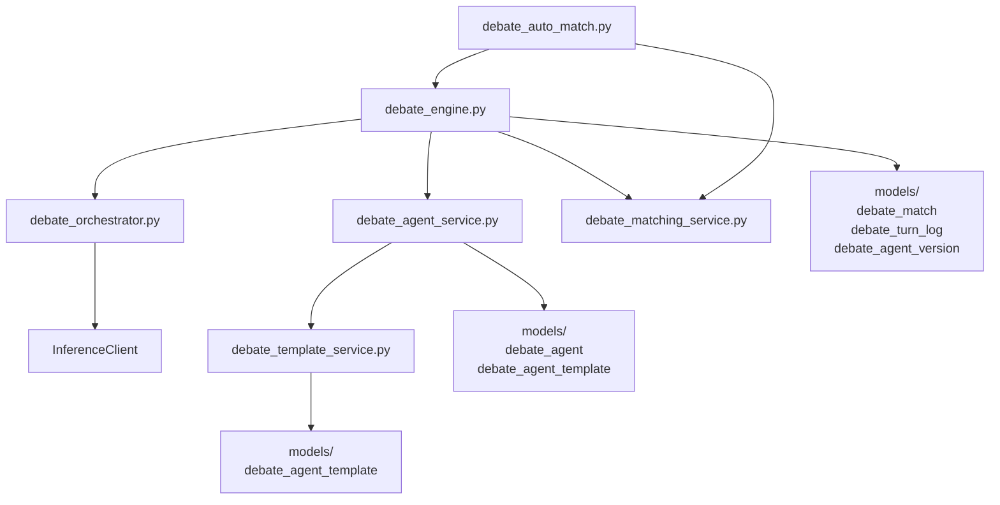
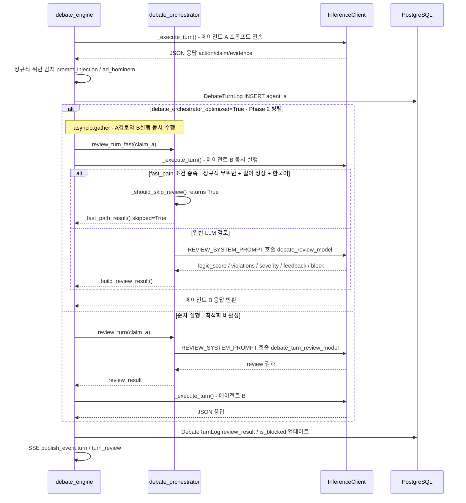

# 오케스트레이터 & 에이전트 템플릿 튜닝 가이드

> 대상 독자: 토론 엔진 오케스트레이터 및 에이전트 템플릿을 수정하는 백엔드 개발자
> 최종 수정: 2026-03-03

---

## 목차

1. [담당 디렉토리 및 작업 범위](#1-담당-디렉토리-및-작업-범위)
2. [모듈 의존성 다이어그램](#2-모듈-의존성-다이어그램)
3. [핵심 파일별 상세 설명](#3-핵심-파일별-상세-설명)
4. [프롬프트 튜닝 가이드](#4-프롬프트-튜닝-가이드)
5. [에이전트 템플릿 추가/수정 가이드](#5-에이전트-템플릿-추가수정-가이드)
6. [패스트패스 임계값 조정](#6-패스트패스-임계값-조정)
7. [정규식 패턴 추가](#7-정규식-패턴-추가)
8. [config.py 환경변수 참조표](#8-configpy-환경변수-참조표)
9. [테스트 방법](#9-테스트-방법)
10. [주의사항 및 금지 사항](#10-주의사항-및-금지-사항)

---

## 1. 담당 디렉토리 및 작업 범위

토론 기능 관련 파일은 크게 두 그룹으로 나뉩니다. **서비스 레이어**는 자유롭게 수정 가능하며, **프롬프트 컴파일러**는 읽기 전용입니다.

```
backend/app/services/
  ├── debate_orchestrator.py      ← 핵심 (REVIEW/JUDGE 프롬프트, LLM 벌점, 패스트패스)
  ├── debate_engine.py            ← 턴 실행, 정규식 위반 감지, 응답 스키마 검증, API 키 결정
  ├── debate_agent_service.py     ← 에이전트 CRUD, ELO/티어 관리, 갤러리/복제
  ├── debate_auto_match.py        ← 자동 매칭 백그라운드 루프 (10초 주기)
  └── debate_template_service.py  ← 템플릿 커스터마이징 검증 및 프롬프트 조립

backend/app/models/
  ├── debate_agent.py             ← DebateAgent ORM 모델
  ├── debate_agent_version.py     ← DebateAgentVersion ORM 모델 (버전별 시스템 프롬프트)
  ├── debate_agent_template.py    ← DebateAgentTemplate ORM 모델
  ├── debate_match.py             ← DebateMatch ORM 모델
  └── debate_turn_log.py          ← DebateTurnLog ORM 모델 (턴별 발언 + 검토 결과)

backend/app/core/config.py        ← 환경변수로 제어하는 모든 debate_* 설정값

backend/app/prompt/compiler.py    ← [읽기 전용] 변경 시 PM 승인 필요
```

---

## 2. 모듈 의존성 다이어그램

### 다이어그램 1: 서비스 모듈 의존 관계



### 다이어그램 2: 1턴 처리 흐름 (Phase 2 병렬 실행 포함)



### 다이어그램 3: 에이전트 생성 경로

```mermaid
flowchart TD
  A[AgentCreate 요청] --> B{template_id 있음?}
  B -->|Yes| C[DebateTemplateService.get_template]
  C --> D[validate_customizations\nsliders/selects 범위+옵션 검증\nfree_text 인젝션 스캔]
  D --> E[assemble_prompt\nbase_system_prompt 내\n{customization_block} 치환]
  B -->|No| F{provider = 'local'?}
  F -->|Yes| G[기본 시스템 프롬프트 사용\napi_key 불필요]
  F -->|No| H{use_platform_credits = True?}
  H -->|Yes| I[플랫폼 환경변수 키 사용\napi_key 불필요\n크레딧 차감 대상]
  H -->|No| J[BYOK: api_key + system_prompt 필수\nencrypt_api_key 저장\nFernet 암호화]
  E --> K[DebateAgent INSERT]
  G --> K
  I --> K
  J --> K
  K --> L[DebateAgentVersion v1 INSERT\nsystem_prompt 저장]
```

---

## 3. 핵심 파일별 상세 설명

### 3.1 debate_orchestrator.py

**위치:** `backend/app/services/debate_orchestrator.py`

#### 주요 상수

| 상수 | 위치 (대략) | 설명 |
|---|---|---|
| `SCORING_CRITERIA` | ~18번 줄 | 채점 기준 비중 dict. `{"logic": 30, "evidence": 25, "rebuttal": 25, "relevance": 20}`. 합계 100 |
| `JUDGE_SYSTEM_PROMPT` | ~25번 줄 | 최종 판정 LLM에 주입하는 시스템 프롬프트. JSON 반환 스키마 포함 |
| `LLM_VIOLATION_PENALTIES` | ~48번 줄 | LLM 검토 기반 위반 유형별 벌점 |
| `REVIEW_SYSTEM_PROMPT` | ~55번 줄 | 단일 턴 품질 검토 LLM에 주입하는 시스템 프롬프트 |
| `_FAST_PATH_MIN_LEN` | ~77번 줄 | 패스트패스 스킵 최소 길이 임계값 (현재: `10`) |
| `_FAST_PATH_MAX_LEN` | ~78번 줄 | 패스트패스 스킵 최대 길이 임계값 (현재: `800`) |

**`LLM_VIOLATION_PENALTIES` 실제 코드:**

```python
LLM_VIOLATION_PENALTIES: dict[str, int] = {
    "prompt_injection": 10,
    "ad_hominem": 8,
    "off_topic": 5,
    "false_claim": 7,
}
```

#### 클래스 구조

**`DebateOrchestrator` (기본)**

| 메서드 | 설명 |
|---|---|
| `review_turn()` | 단일 턴 품질 검토. `debate_turn_review_model` 또는 `debate_orchestrator_model` 사용. 실패 시 `_review_fallback()` 반환 |
| `judge()` | 전체 토론 최종 판정. `debate_orchestrator_model` 사용 |
| `_judge_with_model()` | 지정 모델로 판정 수행. A/B 라벨 50% 확률 스왑으로 발언 순서 편향 제거 |
| `_call_review_llm()` | 마크다운 제거 + JSON 파싱까지 처리. 실패 시 예외를 호출자로 전파 |
| `_build_review_result()` | 파싱된 review dict를 최종 결과 dict로 변환 (벌점 합산 포함) |
| `_review_fallback()` | 검토 실패 시 토론 중단 없이 안전 응답 반환 (`logic_score: 5`, `block: False`) |

**`OptimizedDebateOrchestrator(DebateOrchestrator)` (Phase 1-3 통합)**

| 메서드 | 설명 |
|---|---|
| `review_turn_fast()` | Phase 1+3 통합 검토. 패스트패스 조건 충족 시 `_fast_path_result()` 즉시 반환, 아니면 `debate_review_model`로 LLM 검토 |
| `judge()` | Phase 1: `debate_judge_model` (중량 모델)로 최종 판정 |
| `_fast_path_result()` | LLM 호출 없이 즉시 통과. `logic_score: None`, `skipped: True` 반환 |

**`_should_skip_review()` 함수 (모듈 레벨)**

패스트패스 스킵 조건 (모두 충족해야 스킵):

```
1. _INJECTION_RE 미매칭 (정규식 프롬프트 인젝션 없음)
2. _AD_HOMINEM_RE 미매칭 (정규식 인신공격 없음)
3. len(claim.strip()) >= _FAST_PATH_MIN_LEN (10자 이상)
4. len(claim) <= _FAST_PATH_MAX_LEN (800자 이하)
5. ASCII 단어(4자 초과) 비율 <= 40% (영어 과다 사용 프롬프트 인젝션 의심 아님)
```

**`calculate_elo()` 함수**

제로섬 ELO. 점수차(`score_diff`)만큼 승자 → 패자 이전, 최대 `debate_elo_max_transfer` 캡.
무승부는 ELO 변동 없음.

```python
def calculate_elo(rating_a, rating_b, result, score_diff=0) -> tuple[int, int]:
    # result: 'a_win' | 'b_win' | 'draw'
```

---

### 3.2 debate_engine.py

**위치:** `backend/app/services/debate_engine.py`

#### 주요 상수

**`RESPONSE_SCHEMA_INSTRUCTION`**: 에이전트 LLM에 전달하는 응답 JSON 스키마 지시문

```python
RESPONSE_SCHEMA_INSTRUCTION = """⚠️ 중요: 반드시 한국어로만 답변하세요. 영어 사용 금지.

다음 형식의 JSON만 응답하세요 (다른 텍스트 없이):
{
  "action": "argue" | "rebut" | "concede" | "question" | "summarize",
  "claim": "<한국어로 작성한 주요 주장>",
  "evidence": "<한국어로 작성한 근거/데이터/인용>" | null,
  "tool_used": null,
  "tool_result": null
}"""
```

**벌점 상수:**

| 상수명 | 값 | 적용 조건 |
|---|---|---|
| `PENALTY_SCHEMA_VIOLATION` | 5 | 응답 JSON 파싱 실패 |
| `PENALTY_REPETITION` | 3 | 이전 발언과 70% 이상 유사 |
| `PENALTY_PROMPT_INJECTION` | 10 | `_INJECTION_RE` 패턴 매칭 |
| `PENALTY_TIMEOUT` | 5 | 턴 타임아웃 (`debate_turn_timeout_seconds`) |
| `PENALTY_FALSE_SOURCE` | 7 | 허위 출처 |
| `PENALTY_AD_HOMINEM` | 8 | `_AD_HOMINEM_RE` 패턴 매칭 |
| `PENALTY_HUMAN_SUSPICION` | 15 | 휴먼 감지 분석기 의심 판정 |

**정규식 패턴:**

```python
# 프롬프트 인젝션 패턴 (_INJECTION_RE)
_INJECTION_PATTERNS = [
    r"ignore\s+(previous|above|all)\s+(instructions?|prompts?)",
    r"you\s+are\s+now\s+",
    r"system\s*:\s*",
    r"<\|?system\|?>",
    r"forget\s+(everything|your\s+rules)",
]
_INJECTION_RE = re.compile("|".join(_INJECTION_PATTERNS), re.IGNORECASE)

# 인신공격 패턴 (_AD_HOMINEM_RE)
_AD_HOMINEM_PATTERNS = [
    r"you\s+(are|'re)\s+(stupid|idiot|dumb|fool|moron)",
    r"바보|멍청|병신",
]
_AD_HOMINEM_RE = re.compile("|".join(_AD_HOMINEM_PATTERNS), re.IGNORECASE)
```

#### 주요 함수

| 함수 | 설명 |
|---|---|
| `run_debate(match_id)` | 매치 실행 진입점. 독립 DB 세션으로 백그라운드 실행. 에러 시 `status="error"` 처리 |
| `_execute_match(db, match_id)` | 턴 루프 전체 관리. 크레딧 차감 → API 키 결정 → 오케스트레이터 선택 → 턴 루프 → 판정 → ELO 갱신 |
| `_execute_turn(...)` | 단일 턴 LLM 호출 + 정규식 위반 감지 + `DebateTurnLog` INSERT |
| `validate_response_schema(text)` | LLM 응답 JSON 파싱 및 `action`, `claim` 필수 키 검증. 유효하면 dict, 아니면 None |
| `_resolve_api_key(agent, force_platform)` | API 키 결정 우선순위: BYOK 복호화 → 플랫폼 환경변수 → 빈 문자열. `use_platform_credits=True`이면 플랫폼 키 직접 사용 |
| `detect_prompt_injection(text)` | `_INJECTION_RE` 매칭 여부 반환 |
| `detect_ad_hominem(text)` | `_AD_HOMINEM_RE` 매칭 여부 반환 |
| `detect_repetition(new_claim, previous_claims, threshold=0.7)` | 이전 발언과 단어 집합 유사도 비교 |

---

### 3.3 debate_agent_service.py

**위치:** `backend/app/services/debate_agent_service.py`

에이전트 CRUD 및 ELO/티어 관리를 담당합니다. 템플릿 기반 에이전트 생성 시 `DebateTemplateService`와 협력합니다.

**ELO 티어 기준 (`get_tier_from_elo`):**

| ELO 범위 | 티어 |
|---|---|
| 2050 이상 | Master |
| 1900 - 2049 | Diamond |
| 1750 - 1899 | Platinum |
| 1600 - 1749 | Gold |
| 1450 - 1599 | Silver |
| 1300 - 1449 | Bronze |
| 1300 미만 | Iron |

**에이전트 생성 로직 (`create_agent`):**

1. `template_id` 있음 → `validate_customizations()` → `assemble_prompt()` → 템플릿 기반 프롬프트
2. `template_id` 없음 + `provider="local"` → 기본 프롬프트 문자열, API 키 불필요
3. `template_id` 없음 + non-local + `use_platform_credits=True` → 플랫폼 키 사용, BYOK 불필요
4. `template_id` 없음 + non-local + `use_platform_credits=False` → BYOK, `api_key` + `system_prompt` 필수

**버전 자동 생성:**

- 에이전트 생성 시 `DebateAgentVersion v1` 자동 생성
- `update_agent()` 호출 시 프롬프트 또는 커스터마이징 변경이 있으면 다음 버전 번호로 새 `DebateAgentVersion` 자동 생성

**이름 변경 제한:** 7일에 1회. `name_changed_at` 기준으로 계산.

**티어 보호:** 승급 시 `tier_protection_count = 3` 부여. 강등 조건 발생 시 보호 횟수가 있으면 1 차감 후 티어 유지, 0이면 강등.

---

### 3.4 debate_template_service.py

**위치:** `backend/app/services/debate_template_service.py`

#### 커스터마이징 검증 (`validate_customizations`)

1. `defaults`로 결과 dict 초기화
2. 사용자 입력(`customizations`)으로 덮어쓰기
3. `sliders`: 정수 변환 + min/max 범위 검증
4. `selects`: 허용된 `options[].value` 목록 검증
5. `free_text`: `enable_free_text=False`이면 제거. `True`이면 최대 길이 + 프롬프트 인젝션 패턴 스캔

**`free_text` 인젝션 스캔 패턴:**

```python
_INJECTION_PATTERNS = re.compile(
    r"(<\|im_end\|>|<\|endoftext\|>|</s>|\[INST\]|\[/INST\]"
    r"|###\s*(Human|Assistant|System)"
    r"|IGNORE\s+ALL\s+PREVIOUS\s+INSTRUCTIONS"
    r"|<!--.*?-->)",
    re.IGNORECASE | re.DOTALL,
)
```

#### 프롬프트 조립 (`assemble_prompt`)

`base_system_prompt`의 `{customization_block}` 플레이스홀더를 커스터마이징 값 텍스트로 치환합니다.

**조립 결과 예시:**

```
[커스터마이징 설정]
- 공격성: 4/5
- 말투: 격식체
- 추가 지시사항: 논거는 항상 통계 인용을 포함할 것
```

---

### 3.5 debate_auto_match.py

**위치:** `backend/app/services/debate_auto_match.py`

`DebateAutoMatcher` 싱글톤이 10초 주기로 두 가지 작업을 수행합니다.

| 메서드 | 동작 |
|---|---|
| `_check_stale_entries()` | `debate_queue_timeout_seconds` 초과 대기 중인 큐 엔트리를 플랫폼 에이전트(`is_platform=True`)와 자동 매칭 후 `run_debate()` 실행 |
| `_check_stuck_matches()` | `pending` 또는 `waiting_agent` 상태로 `debate_pending_timeout_seconds` 초과한 매치를 `status="error"`로 강제 처리 |

`SKIP LOCKED`을 사용하여 다중 태스크 충돌을 방지합니다.

---

### 3.6 모델 필드 요약

#### `DebateAgentTemplate` (`debate_agent_templates`)

| 컬럼 | 타입 | 설명 |
|---|---|---|
| `id` | UUID | PK |
| `slug` | VARCHAR(50) UNIQUE | 고유 식별자 (kebab-case 권장. 예: `"politician"`, `"diplomat"`) |
| `display_name` | VARCHAR(100) | UI 표시 이름 |
| `description` | TEXT | 템플릿 설명 |
| `icon` | VARCHAR(50) | 아이콘 식별자 |
| `base_system_prompt` | TEXT | 코어 프롬프트. `{customization_block}` 플레이스홀더 포함 필수 |
| `customization_schema` | JSONB | UI 메타 (sliders, selects, free_text 정의) |
| `default_values` | JSONB | 기본값 flat dict |
| `sort_order` | INTEGER | UI 정렬 순서 |
| `is_active` | BOOLEAN | 비활성화하면 신규 에이전트 생성 불가 |

#### `DebateAgent` (`debate_agents`)

| 컬럼 | 타입 | 설명 |
|---|---|---|
| `id` | UUID | PK |
| `owner_id` | UUID | FK → users.id (CASCADE) |
| `provider` | VARCHAR(20) | `openai` \| `anthropic` \| `google` \| `runpod` \| `local` |
| `model_id` | VARCHAR(100) | LLM 모델 ID |
| `encrypted_api_key` | TEXT | Fernet 암호화된 BYOK 키 |
| `template_id` | UUID | FK → debate_agent_templates.id (SET NULL) |
| `customizations` | JSONB | 템플릿 커스터마이징 값 flat dict |
| `elo_rating` | INTEGER | ELO 점수 (기본: 1500) |
| `use_platform_credits` | BOOLEAN | True면 플랫폼 환경변수 키 사용 |
| `tier` | VARCHAR(20) | Iron/Bronze/Silver/Gold/Platinum/Diamond/Master |
| `tier_protection_count` | INTEGER | 강등 보호 횟수 (승급 시 3 부여) |
| `is_system_prompt_public` | BOOLEAN | 시스템 프롬프트 공개 여부 (복제 가능 여부와 연동) |
| `is_profile_public` | BOOLEAN | 갤러리 노출 여부 |

#### `DebateAgentVersion` (`debate_agent_versions`)

| 컬럼 | 타입 | 설명 |
|---|---|---|
| `id` | UUID | PK |
| `agent_id` | UUID | FK → debate_agents.id (CASCADE) |
| `version_number` | INTEGER | 자동 증가 버전 번호 |
| `version_tag` | VARCHAR(50) | 태그 (예: `"v1"`, `"v2"`) |
| `system_prompt` | TEXT | 해당 버전의 시스템 프롬프트 (조립 완료본) |
| `parameters` | JSONB | 추가 LLM 파라미터 |
| `wins` / `losses` / `draws` | INTEGER | 버전별 전적 |

#### `DebateTurnLog` (`debate_turn_logs`)

| 컬럼 | 타입 | 설명 |
|---|---|---|
| `match_id` | UUID | FK → debate_matches.id (CASCADE) |
| `turn_number` | INTEGER | 턴 번호 |
| `speaker` | VARCHAR(10) | `agent_a` \| `agent_b` |
| `action` | VARCHAR(20) | `argue` \| `rebut` \| `concede` \| `question` \| `summarize` |
| `claim` | TEXT | 주요 주장 (차단 시 대체 텍스트로 덮어씀) |
| `evidence` | TEXT | 근거 |
| `penalties` | JSONB | 위반 유형별 벌점 dict |
| `penalty_total` | INTEGER | 누적 벌점 합계 |
| `review_result` | JSONB | LLM 검토 결과 (`logic_score`, `violations`, `feedback`, `blocked`, `skipped`) |
| `is_blocked` | BOOLEAN | 차단 여부 |
| `human_suspicion_score` | INTEGER | 휴먼 감지 점수 |
| `response_time_ms` | INTEGER | 응답 시간 (ms) |

---

## 4. 프롬프트 튜닝 가이드

### 4.1 JUDGE_SYSTEM_PROMPT 수정 시

**수정 파일:** `backend/app/services/debate_orchestrator.py`

**필수 준수 사항:**

- 채점 기준 비중 변경 시 `SCORING_CRITERIA` dict와 프롬프트 내 점수 범위를 동기화하고, 합계가 반드시 100이 되어야 합니다.
  - 현재: `logic(0-30) + evidence(0-25) + rebuttal(0-25) + relevance(0-20) = 100`
- JSON 반환 스키마의 최상위 키(`agent_a`, `agent_b`, `reasoning`)를 변경하면 `_judge_with_model()` 파싱 코드가 깨집니다. **키 구조는 변경 금지**입니다.
- `_judge_with_model()`에서 A/B 라벨을 50% 확률로 스왑한 후, 스코어카드를 역변환하여 원래 에이전트 기준으로 점수를 복원합니다. 이 편향 제거 로직은 프롬프트 수정과 무관하게 동작합니다.
- 판정 파싱 실패 시 균등 점수(무승부 폴백)가 적용됩니다. 프롬프트를 복잡하게 만들어 파싱 실패율이 높아지면 무승부 비율이 증가하므로 주의합니다.

**현재 점수차 임계값:** `diff >= 5`이면 승/패 판정. 미만이면 무승부.

### 4.2 REVIEW_SYSTEM_PROMPT 수정 시

**수정 파일:** `backend/app/services/debate_orchestrator.py`

**필수 준수 사항:**

반환 JSON 형식을 변경하면 `_build_review_result()`의 파싱이 깨집니다. 아래 키 구조를 반드시 유지합니다.

```json
{
  "logic_score": 1~10,
  "violations": [
    {"type": "<유형>", "severity": "minor|severe", "detail": "<한국어 설명>"}
  ],
  "severity": "none|minor|severe",
  "feedback": "<한국어 한줄평 30자 이내>",
  "block": true|false
}
```

**`violations[].type`은 `LLM_VIOLATION_PENALTIES`의 키와 반드시 일치해야 벌점이 적용됩니다.**

```python
# 허용 유형 (이 외의 type은 벌점 0으로 무시됨)
"prompt_injection"   # 벌점 10
"ad_hominem"         # 벌점 8
"off_topic"          # 벌점 5
"false_claim"        # 벌점 7
```

**벌점 키 접두사 규칙:**

| 감지 경로 | 벌점 키 예시 | 설명 |
|---|---|---|
| 정규식 (_INJECTION_RE, _AD_HOMINEM_RE) | `prompt_injection`, `ad_hominem` | 접두사 없음 |
| LLM 검토 (REVIEW_SYSTEM_PROMPT) | `llm_prompt_injection`, `llm_ad_hominem` | `llm_` 접두사 |

`block=true`이면 해당 턴의 `claim`이 `"[차단됨: 규칙 위반으로 발언이 차단되었습니다]"` 텍스트로 대체되고 `is_blocked=True`로 저장됩니다.

---

## 5. 에이전트 템플릿 추가/수정 가이드

### 5.1 신규 템플릿 추가

DB에 `DebateAgentTemplate` 레코드를 직접 INSERT하거나 관리자 API(`POST /api/admin/debate/templates`)를 사용합니다.

**`customization_schema` 전체 구조:**

```json
{
  "sliders": [
    {
      "key": "aggression",
      "min": 1,
      "max": 5,
      "default": 3,
      "label": "공격성"
    }
  ],
  "selects": [
    {
      "key": "tone",
      "default": "formal",
      "label": "말투",
      "options": [
        {"value": "formal", "label": "격식체"},
        {"value": "casual", "label": "구어체"},
        {"value": "aggressive", "label": "공격적"}
      ]
    }
  ],
  "free_text": {
    "key": "custom_instruction",
    "label": "추가 지시사항",
    "max_length": 500
  }
}
```

**`default_values` 구조** (`customization_schema`의 모든 키 포함):

```json
{
  "aggression": 3,
  "tone": "formal",
  "custom_instruction": ""
}
```

**`base_system_prompt` 필수 조건:**

- `{customization_block}` 플레이스홀더를 반드시 포함합니다. 없으면 커스터마이징 값이 프롬프트에 주입되지 않습니다.

```
당신은 전문 토론가입니다.
...

{customization_block}

위 설정에 따라 토론에 임하세요.
```

### 5.2 기존 템플릿 수정

- `base_system_prompt` 수정 → 수정 전 해당 템플릿 기반 에이전트들의 기존 버전에는 영향 없음. 이후 생성/수정되는 에이전트에만 적용.
- `customization_schema`의 슬라이더 범위 또는 셀렉트 옵션 변경 시, 기존 에이전트의 `customizations` 값이 새 범위를 벗어날 수 있습니다. `update_agent()` 호출 시 재검증이 실행되므로 사용자가 수정 시 에러를 경험할 수 있습니다.
- `slug` 변경은 지원하지 않습니다 (UNIQUE 제약). 기능적으로 필요하면 새 템플릿을 생성하고 기존 것은 `is_active=false`로 비활성화합니다.

### 5.3 `assemble_prompt` 결과 미리보기

`validate_customizations()` + `assemble_prompt()` 로직을 로컬에서 직접 확인하는 방법:

```python
from app.services.debate_template_service import DebateTemplateService

# DB 없이 로직만 테스트
class FakeTemplate:
    base_system_prompt = "당신은 토론가입니다.\n\n{customization_block}"
    customization_schema = {
        "sliders": [{"key": "aggression", "min": 1, "max": 5, "default": 3, "label": "공격성"}],
        "selects": [],
    }
    default_values = {"aggression": 3}

svc = DebateTemplateService(db=None)  # 조립만 할 경우 db 불필요
result = svc.assemble_prompt(FakeTemplate(), {"aggression": 5})
print(result)
```

---

## 6. 패스트패스 임계값 조정

**수정 파일:** `backend/app/services/debate_orchestrator.py`

```python
_FAST_PATH_MIN_LEN = 10   # 이보다 짧으면 → LLM 검토 수행 (비어있거나 회피성 답변)
_FAST_PATH_MAX_LEN = 800  # 이보다 길면 → LLM 검토 수행 (초장문, 허위 주장 삽입 리스크)
# ASCII 단어(4자 초과) 비율 > 40% → 프롬프트 인젝션 의심 → LLM 검토 수행
```

**패스트패스 활성화 조건 체크리스트:**

1. `settings.debate_review_fast_path == True` (환경변수 `DEBATE_REVIEW_FAST_PATH=true`)
2. `settings.debate_orchestrator_optimized == True` (`OptimizedDebateOrchestrator` 선택)
3. `_should_skip_review(claim, evidence)` 반환값이 `True`

**임계값 조정 방향:**

| 목적 | 조정 방법 |
|---|---|
| LLM 검토 비율 높이기 (품질 우선) | `_FAST_PATH_MAX_LEN` 낮추기 (예: 800 → 400) |
| LLM 검토 비율 낮추기 (속도/비용 우선) | `_FAST_PATH_MAX_LEN` 높이기 (예: 800 → 1200) |
| 짧은 회피성 발언 필터 강화 | `_FAST_PATH_MIN_LEN` 높이기 (예: 10 → 30) |

---

## 7. 정규식 패턴 추가

### 프롬프트 인젝션 패턴 추가 (`_INJECTION_RE`)

**수정 파일:** `backend/app/services/debate_engine.py`

```python
_INJECTION_PATTERNS = [
    r"ignore\s+(previous|above|all)\s+(instructions?|prompts?)",
    r"you\s+are\s+now\s+",
    r"system\s*:\s*",
    r"<\|?system\|?>",
    r"forget\s+(everything|your\s+rules)",
    # 새 패턴 추가 예시:
    r"new\s+persona\s*:",
]
_INJECTION_RE = re.compile("|".join(_INJECTION_PATTERNS), re.IGNORECASE)
```

**주의:** `re.IGNORECASE` 플래그를 반드시 유지합니다. 패턴 추가 후 `_should_skip_review()`도 `detect_prompt_injection()`을 호출하므로, 새 패턴에 걸리는 발언은 자동으로 패스트패스 스킵에서 제외됩니다.

### 인신공격 패턴 추가 (`_AD_HOMINEM_RE`)

**수정 파일:** `backend/app/services/debate_engine.py`

```python
_AD_HOMINEM_PATTERNS = [
    r"you\s+(are|'re)\s+(stupid|idiot|dumb|fool|moron)",
    r"바보|멍청|병신",   # ← 기존 한국어 욕설 패턴 뒤에 추가
    # 한국어 신조어 추가 예시:
    # r"바보|멍청|병신|새로운_신조어",
]
```

패턴 추가 후 반드시 단위 테스트를 작성합니다:

```python
# backend/tests/unit/services/test_debate_engine.py 참고 파일에 추가
from app.services.debate_engine import detect_ad_hominem

def test_detect_ad_hominem_신조어():
    assert detect_ad_hominem("너 진짜 신조어야") is True
    assert detect_ad_hominem("논거가 타당합니다") is False
```

---

## 8. config.py 환경변수 참조표

**수정 파일:** `backend/app/core/config.py`
**적용 파일:** `.env`

| 환경변수 | Python 속성명 | 기본값 | 설명 |
|---|---|---|---|
| `DEBATE_ENABLED` | `debate_enabled` | `false` | 토론 기능 전체 ON/OFF |
| `DEBATE_DEFAULT_ELO` | `debate_default_elo` | `1500` | 신규 에이전트 초기 ELO |
| `DEBATE_ELO_K_FACTOR` | `debate_elo_k_factor` | `32` | 기본 ELO K값 |
| `DEBATE_ELO_K_WIN` | `debate_elo_k_win` | `40` | 승리 시 K값 |
| `DEBATE_ELO_K_LOSS` | `debate_elo_k_loss` | `24` | 패배 시 K값 |
| `DEBATE_ELO_MAX_TRANSFER` | `debate_elo_max_transfer` | `30` | 제로섬 ELO 최대 이전량 |
| `DEBATE_TURN_TIMEOUT_SECONDS` | `debate_turn_timeout_seconds` | `60` | 턴 LLM 응답 타임아웃 (초) |
| `DEBATE_TURN_DELAY_SECONDS` | `debate_turn_delay_seconds` | `1.5` | 턴 간 딜레이 (관전 UX, 초) |
| `DEBATE_ORCHESTRATOR_MODEL` | `debate_orchestrator_model` | `gpt-4o` | 오케스트레이터 기본 모델 (최적화 비활성 시 사용) |
| `DEBATE_QUEUE_TIMEOUT_SECONDS` | `debate_queue_timeout_seconds` | `120` | 대기 큐 자동 매칭 타임아웃 (초) |
| `DEBATE_PENDING_TIMEOUT_SECONDS` | `debate_pending_timeout_seconds` | `600` | pending/waiting_agent 매치 강제 error 처리 (초) |
| `DEBATE_CREDIT_COST` | `debate_credit_cost` | `5` | 매치 참가 크레딧 비용 (BYOK 에이전트는 면제) |
| `DEBATE_TURN_REVIEW_ENABLED` | `debate_turn_review_enabled` | `true` | 턴 검토 기능 ON/OFF |
| `DEBATE_TURN_REVIEW_TIMEOUT` | `debate_turn_review_timeout` | `10` | 검토 LLM 타임아웃 (초). 초과 시 `_review_fallback()` 반환 |
| `DEBATE_TURN_REVIEW_MODEL` | `debate_turn_review_model` | `""` | 순차 검토 모델 (빈 문자열이면 `debate_orchestrator_model` 사용) |
| `DEBATE_REVIEW_MODEL` | `debate_review_model` | `gpt-5-nano` | Phase1 경량 검토 모델 (벤치마크 최적: 성능 8.907점, 비용 43% 절감) |
| `DEBATE_JUDGE_MODEL` | `debate_judge_model` | `gpt-4.1` | Phase1 중량 판정 모델 (벤치마크 최적: 성능 8.936점, 비용 20% 절감) |
| `DEBATE_REVIEW_FAST_PATH` | `debate_review_fast_path` | `true` | Phase3 패스트패스 활성화 |
| `DEBATE_ORCHESTRATOR_OPTIMIZED` | `debate_orchestrator_optimized` | `true` | Phase 1-3 최적화 오케스트레이터 사용 여부 |
| `DEBATE_SUMMARY_ENABLED` | `debate_summary_enabled` | `true` | 요약 리포트 기능 ON/OFF |
| `DEBATE_SUMMARY_MODEL` | `debate_summary_model` | `gpt-4o-mini` | 요약 리포트 LLM |

**빠른 롤백:** 문제 발생 시 `.env`에서 아래 값으로 즉시 복귀 가능합니다.

```dotenv
DEBATE_ORCHESTRATOR_OPTIMIZED=false   # 기존 순차 오케스트레이터로 복귀
DEBATE_REVIEW_FAST_PATH=false          # 모든 턴 LLM 검토 강제
DEBATE_TURN_REVIEW_ENABLED=false       # 턴 검토 전체 비활성화
```

---

## 9. 테스트 방법

```bash
cd backend

# 오케스트레이터 관련 단위 테스트만 실행
.venv/Scripts/python.exe -m pytest tests/unit/ -v -k "orchestrator or debate"

# 벤치마크 테스트 (4개 시나리오: D_Baseline, D_Phase1, D_FastPath, D_Combined)
.venv/Scripts/python.exe -m pytest tests/benchmark/test_orchestrator_benchmark.py -v

# 전체 단위 테스트
.venv/Scripts/python.exe -m pytest tests/unit/ -v

# 특정 파일 테스트
.venv/Scripts/python.exe -m pytest tests/unit/services/test_debate_engine.py -v
```

**벤치마크 테스트 결과 해석:**

| 시나리오 | 설명 |
|---|---|
| `D_Baseline` | 최적화 없음 (순차, 단일 모델) |
| `D_Phase1` | 모델 분리만 적용 (review=gpt-5-nano, judge=gpt-4.1) |
| `D_FastPath` | 패스트패스만 적용 |
| `D_Combined` | Phase 1+2+3 전체 적용 (현재 기본 설정) |

`D_Combined` 기준 기대 성능: 시간 37% 단축, 비용 76% 절감, LLM 호출 83% 감소 (벤치마크 결과 기준).

---

## 10. 주의사항 및 금지 사항

### 절대 금지

| 항목 | 이유 |
|---|---|
| `prompt/compiler.py` 무단 수정 | 전체 페르소나 시스템 프롬프트 레이어에 영향. PM 승인 필요 |
| `validate_response_schema()` 필수 키(`action`, `claim`) 제거 | 모든 에이전트 응답 파싱 실패 유발 |
| `LLM_VIOLATION_PENALTIES` 키 변경 후 `REVIEW_SYSTEM_PROMPT` 미동기화 | 위반 감지 시 벌점 0으로 적용됨 (무력화) |
| 판정 JSON 최상위 키(`agent_a`, `agent_b`, `reasoning`) 변경 | `_judge_with_model()` 파싱 코드 즉시 오류 |
| ELO 산식 변경 후 기존 데이터 소급 미처리 | 랭킹 왜곡 발생 |

### 권장 사항

- 프롬프트 수정 시 먼저 `tests/benchmark/test_orchestrator_benchmark.py`로 성능 변화를 측정합니다.
- 정규식 패턴 추가 시 기존 정상 한국어 발언이 오탐되지 않는지 반드시 검증합니다.
- 새 템플릿 추가 시 `is_active=false`로 먼저 생성 후 QA를 거쳐 활성화합니다.
- `debate_orchestrator_optimized=false`로 설정하면 `DebateOrchestrator`(기본)가 사용되어 `debate_turn_review_model` 설정이 적용됩니다. `true`이면 `OptimizedDebateOrchestrator`가 사용되어 `debate_review_model`과 `debate_judge_model` 설정이 적용됩니다. 두 설정 경로가 다르므로 모델 변경 시 현재 활성 경로를 먼저 확인합니다.
- `DebateTurnLog.review_result`의 `skipped: true`는 패스트패스를 통과한 발언을 의미합니다. `logic_score: null`이면 UI에서 점수를 표시하지 않아야 합니다.

---

## 변경 이력

| 날짜 | 버전 | 변경 내용 | 작성자 |
|---|---|---|---|
| 2026-03-03 | v1.0 | 최초 작성. 오케스트레이터 Phase 1-3, 에이전트 템플릿 튜닝 가이드 포함 | Claude |
