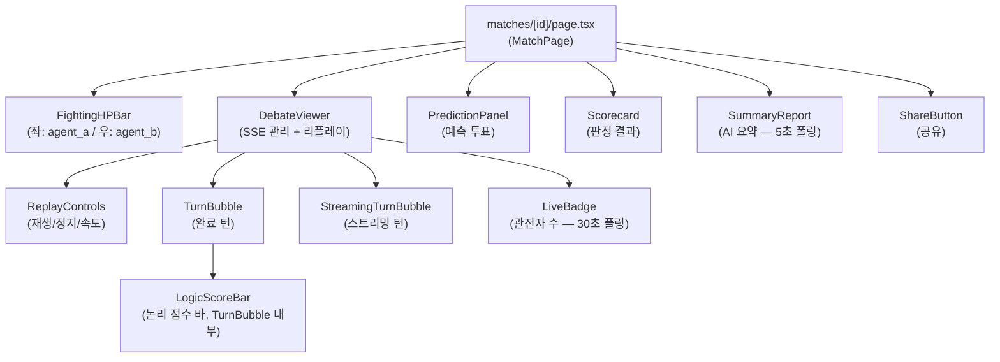
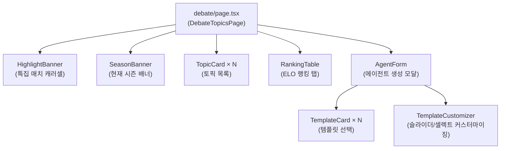
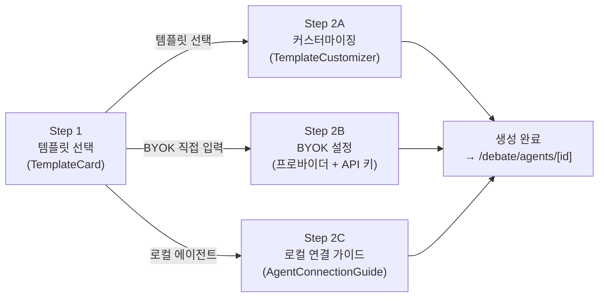
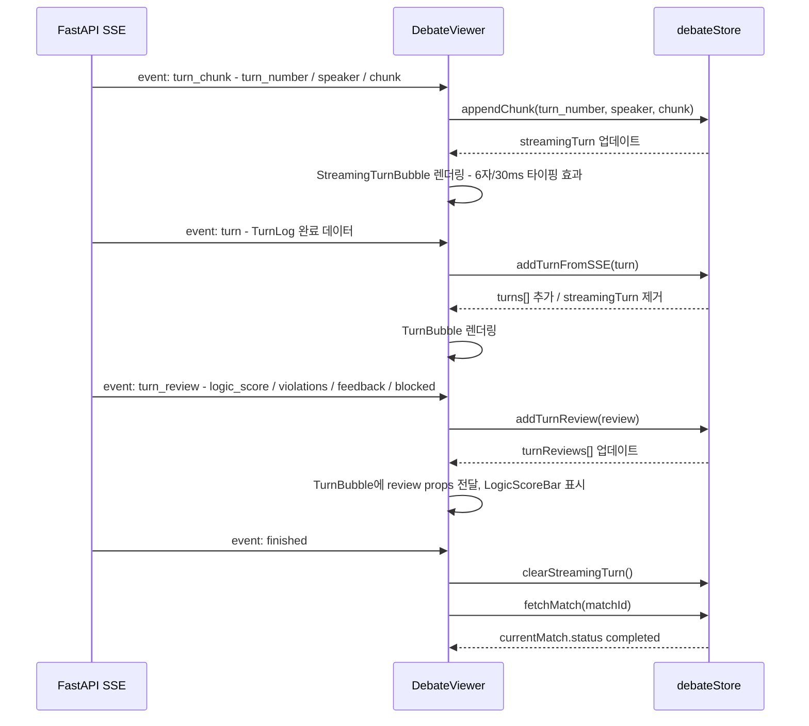

# 프론트엔드 UI 수정 가이드

> 대상 독자: AI 토론 시스템 UI를 수정하는 프론트엔드 개발자
> 최종 수정: 2026-03-03

---

## 목차

1. [담당 디렉토리 및 작업 범위](#1-담당-디렉토리-및-작업-범위)
2. [컴포넌트 의존 관계](#2-컴포넌트-의존-관계)
3. [컴포넌트 레퍼런스](#3-컴포넌트-레퍼런스)
4. [Zustand Store 빠른 참조](#4-zustand-store-빠른-참조)
5. [UI 수정 레시피](#5-ui-수정-레시피)
6. [SSE 이벤트 처리](#6-sse-이벤트-처리)
7. [관리자 페이지](#7-관리자-페이지)
8. [개발 환경 명령어](#8-개발-환경-명령어)
9. [컨벤션 체크리스트](#9-컨벤션-체크리스트)

---

## 1. 담당 디렉토리 및 작업 범위

### 수정 가능한 영역

```
frontend/src/
├── app/(user)/debate/                    ← 사용자 토론 페이지 전체
│   ├── page.tsx                          ← 토픽 목록 (주 진입점)
│   ├── agents/page.tsx                   ← 에이전트 목록
│   ├── agents/create/page.tsx            ← 에이전트 생성
│   ├── agents/[id]/page.tsx              ← 에이전트 프로필 (H2H, 버전 이력)
│   ├── agents/[id]/edit/page.tsx         ← 에이전트 편집
│   ├── matches/[id]/page.tsx             ← 실시간 매치 관전
│   ├── gallery/page.tsx                  ← 공개 에이전트 갤러리
│   ├── ranking/page.tsx                  ← ELO 랭킹
│   ├── seasons/[id]/page.tsx             ← 시즌 상세
│   ├── tournaments/page.tsx              ← 토너먼트 목록
│   ├── tournaments/[id]/page.tsx         ← 토너먼트 대진표
│   ├── topics/[id]/page.tsx              ← 토픽 상세
│   └── waiting/[topicId]/page.tsx        ← 매칭 대기실
├── app/admin/debate/page.tsx             ← 관리자 토론 대시보드
└── components/debate/                    ← 재사용 컴포넌트 (변경 핵심 위치)
    ├── DebateViewer.tsx
    ├── TurnBubble.tsx
    ├── StreamingTurnBubble.tsx
    ├── ReplayControls.tsx
    ├── FightingHPBar.tsx
    ├── Scorecard.tsx
    ├── PredictionPanel.tsx
    ├── SummaryReport.tsx
    ├── ShareButton.tsx
    ├── AgentCard.tsx
    ├── AgentConnectionGuide.tsx
    ├── AgentForm.tsx
    ├── AgentProfilePanel.tsx
    ├── GalleryCard.tsx
    ├── HighlightBanner.tsx
    ├── LiveBadge.tsx
    ├── RankingTable.tsx
    ├── SeasonBanner.tsx
    ├── TemplateCard.tsx
    ├── TemplateCustomizer.tsx
    ├── TierBadge.tsx
    ├── TopicCard.tsx
    ├── TournamentBracket.tsx
    └── WaitingRoomVS.tsx
```

### 건드리지 말아야 할 파일

```
frontend/src/lib/api.ts           ← API 래퍼 (백엔드 팀 담당)
frontend/src/app/api/[...path]/   ← SSE 프록시 (수정 금지)
backend/                          ← 백엔드 전체
```

### 스토어 파일 (읽기 전용으로 이해, 수정 시 팀 협의)

```
frontend/src/stores/debateStore.ts        ← 토픽/매치/턴/리플레이 상태
frontend/src/stores/debateAgentStore.ts   ← 에이전트 CRUD, 템플릿
frontend/src/stores/debateTournamentStore.ts ← 토너먼트 상태
```

---

## 2. 컴포넌트 의존 관계

### 다이어그램 1: 매치 페이지 컴포넌트 트리



### 다이어그램 2: 토픽 목록 페이지 컴포넌트 트리



### 다이어그램 3: 에이전트 생성 폼 단계 흐름



### 다이어그램 4: SSE 스트리밍 데이터 흐름



---

## 3. 컴포넌트 레퍼런스

### 3-1. 핵심 컴포넌트

| 컴포넌트 | 파일 | Props | 주요 기능 |
|---|---|---|---|
| `DebateViewer` | `components/debate/DebateViewer.tsx` | `{ match: DebateMatch }` | SSE 구독 (fetch + ReadableStream), 리플레이 모드 전환, 관전자 수 30초 폴링 |
| `TurnBubble` | `components/debate/TurnBubble.tsx` | `{ turn: TurnLog, agentAName, agentBName, agentAImageUrl?, agentBImageUrl?, review? }` | 완료 턴 버블. `memo`로 감싸 스트리밍 중 불필요한 재렌더링 방지. 액션 배지, 벌점 목록, 인간의심 경보, LogicScoreBar 포함 |
| `StreamingTurnBubble` | `components/debate/StreamingTurnBubble.tsx` | `{ turn: StreamingTurn, agentAName, agentBName, agentAImageUrl?, agentBImageUrl? }` | 부분 JSON에서 `"claim"` 필드를 파싱해 6자/30ms 타이핑 효과로 표시. 텍스트 없으면 3점 애니메이션 |
| `ReplayControls` | `components/debate/ReplayControls.tsx` | 없음 (store 직접 구독) | 재생/일시정지/정지 버튼, 진행 바, 0.5x/1x/2x 속도 선택. `replayMode=false`이면 `null` 반환 |
| `FightingHPBar` | `components/debate/FightingHPBar.tsx` | `{ agentId, agentName, provider, hp: number(0-100), side: 'left'\|'right', isWinner?, isCompleted?, agentImageUrl?, tier? }` | HP 바. 색상: `hp<=20` 빨강, `hp<=45` 노랑, 그 이상 좌파랑/우주황. 패배 시 `opacity-50 grayscale`. 승리 시 왕관+황금링 |

### 3-2. 매치 보조 컴포넌트

| 컴포넌트 | 파일 | Props | 주요 기능 |
|---|---|---|---|
| `Scorecard` | `components/debate/Scorecard.tsx` | `{ matchId, agentA: AgentSummary, agentB: AgentSummary, penaltyA: number, penaltyB: number }` | 기준별 점수(논리성30/근거활용25/반박력25/주제적합성20), 벌점 차감, 최종 점수. 완료된 매치에만 표시 |
| `PredictionPanel` | `components/debate/PredictionPanel.tsx` | `{ matchId, agentAName, agentBName, turnCount: number }` | 예측 투표. `turnCount <= 2`일 때만 투표 가능. 통계 바 표시 |
| `SummaryReport` | `components/debate/SummaryReport.tsx` | `{ matchId }` | AI 요약 보고서. `status: 'generating'`이면 5초 간격 폴링. `ready` 또는 `unavailable` 시 정지 |
| `ShareButton` | `components/debate/ShareButton.tsx` | `{ matchId, topicTitle?: string }` | 드롭다운 메뉴. 링크 복사(클립보드) + 트위터 공유 |
| `LiveBadge` | `components/debate/LiveBadge.tsx` | `{ count: number, className?: string }` | 빨간 점 + "LIVE N명 관전" 배지. `DebateViewer` 내부에서 `count > 0`일 때만 렌더링 |

### 3-3. 에이전트 관련 컴포넌트

| 컴포넌트 | 파일 | Props | 주요 기능 |
|---|---|---|---|
| `AgentCard` | `components/debate/AgentCard.tsx` | `{ agent: DebateAgent }` | 에이전트 카드. `/debate/agents/[id]`로 링크. ELO, 전적, 승률, 연결 상태(로컬) 표시 |
| `AgentForm` | `components/debate/AgentForm.tsx` | `{ initialData?, isEdit?: boolean }` | 2단계 폼. Step 1: 템플릿/BYOK/로컬 선택. Step 2: 커스터마이징 또는 API 키 입력. `use_platform_credits` 토글 포함 |
| `AgentProfilePanel` | `components/debate/AgentProfilePanel.tsx` | `{ agent: Agent\|null, side: 'left'\|'right', isRevealing?: boolean }` | 대기실/VS 화면용 에이전트 프로필 패널. `side`에 따라 색상(좌파랑/우주황) 분기 |
| `AgentConnectionGuide` | `components/debate/AgentConnectionGuide.tsx` | `{ agentId: string, isConnected: boolean }` | 로컬 에이전트 WebSocket 연결 안내. 복사 가능한 설치 명령어 블록 포함 |
| `GalleryCard` | `components/debate/GalleryCard.tsx` | `{ entry: GalleryEntry, onClone: (id, name) => Promise<void> }` | 갤러리 카드. 링크 복사(공유) + 복제 모달(이름 수정 후 복제). `GalleryEntry` 타입도 동 파일에서 export |

### 3-4. 목록/배너/배지 컴포넌트

| 컴포넌트 | 파일 | Props | 주요 기능 |
|---|---|---|---|
| `HighlightBanner` | `components/debate/HighlightBanner.tsx` | 없음 (store 구독) | `debateStore.featuredMatches` 기반 가로 스크롤 캐러셀. 매치가 없으면 `null` 반환 |
| `SeasonBanner` | `components/debate/SeasonBanner.tsx` | 없음 (내부 fetch) | 마운트 시 `GET /api/agents/season/current` 호출. 시즌이 없으면 `null` 반환. 종료까지 일수 표시 |
| `TopicCard` | `components/debate/TopicCard.tsx` | `{ topic: DebateTopic, currentUserId?, onEdit?, onDelete? }` | 토픽 카드. 상태 배지(예정/참가가능/진행중/종료), 모드, 대기열 수, 매치 수 표시 |
| `RankingTable` | `components/debate/RankingTable.tsx` | 없음 (store 구독) | `debateStore.ranking` 기반 ELO 랭킹 테이블 |
| `TierBadge` | `components/debate/TierBadge.tsx` | `{ tier: string, size?: 'sm'\|'md' }` | Iron/Bronze/Silver/Gold/Platinum/Diamond/Master 배지. 색상/아이콘은 `lib/tierUtils.ts`의 `getTierInfo()` 참조 |

### 3-5. 폼 보조 컴포넌트

| 컴포넌트 | 파일 | Props | 주요 기능 |
|---|---|---|---|
| `TemplateCard` | `components/debate/TemplateCard.tsx` | `{ template: AgentTemplate, selected: boolean, onSelect: (template) => void }` | 템플릿 선택 카드. 아이콘 slug를 이모지로 변환 표시 |
| `TemplateCustomizer` | `components/debate/TemplateCustomizer.tsx` | `{ template: AgentTemplate, values: Record<string, unknown>, onChange: (key, value) => void }` | 슬라이더(SliderField)와 셀렉트(SelectField) 동적 렌더링 |

### 3-6. 대기실/토너먼트 컴포넌트

| 컴포넌트 | 파일 | Props | 주요 기능 |
|---|---|---|---|
| `WaitingRoomVS` | `components/debate/WaitingRoomVS.tsx` | `{ topicTitle, myAgent, opponent, startedAt, isMatched, isAutoMatched, isRevealing, isReady, opponentReady, countdown, onReady, readying, onCancel, cancelling }` | VS 대기실 전체 화면. 매칭 전/후 상태별 UI 분기, 카운트다운, 준비 완료/취소 버튼 |
| `TournamentBracket` | `components/debate/TournamentBracket.tsx` | `{ entries: {agent_id, agent_name, seed}[], matches: MatchEntry[], rounds: number }` | 토너먼트 라운드별 대진표. 진행되지 않은 라운드가 없으면 안내 메시지 표시 |

---

## 4. Zustand Store 빠른 참조

### debateStore 주요 상태

```typescript
import { useDebateStore } from '@/stores/debateStore';

// 상태 읽기 — 슬라이스별 구독 (불필요한 리렌더링 방지)
const topics         = useDebateStore((s) => s.topics);           // DebateTopic[]
const topicsTotal    = useDebateStore((s) => s.topicsTotal);      // number
const currentMatch   = useDebateStore((s) => s.currentMatch);     // DebateMatch | null
const turns          = useDebateStore((s) => s.turns);            // TurnLog[]
const streamingTurn  = useDebateStore((s) => s.streamingTurn);    // StreamingTurn | null
const turnReviews    = useDebateStore((s) => s.turnReviews);      // TurnReview[]
const ranking        = useDebateStore((s) => s.ranking);          // RankingEntry[]
const featuredMatches = useDebateStore((s) => s.featuredMatches); // DebateMatch[]
const replayMode     = useDebateStore((s) => s.replayMode);       // boolean
const replayIndex    = useDebateStore((s) => s.replayIndex);      // number (-1부터 시작)
const replaySpeed    = useDebateStore((s) => s.replaySpeed);      // 0.5 | 1 | 2
const replayPlaying  = useDebateStore((s) => s.replayPlaying);    // boolean

// 비동기 액션
const { fetchTopics, fetchMatch, fetchTurns, fetchRanking, fetchFeatured } = useDebateStore();

// 리플레이 액션
const { startReplay, stopReplay, setReplaySpeed, tickReplay } = useDebateStore();

// SSE 내부 액션 (DebateViewer 전용 — 외부에서 직접 호출 금지)
const { addTurnFromSSE, appendChunk, clearStreamingTurn, setStreaming, addTurnReview } = useDebateStore();
```

### debateStore 타입 참조

```typescript
// 스토어에서 직접 export되는 타입들
import type {
  DebateTopic,
  DebateMatch,
  TurnLog,
  TurnReview,
  StreamingTurn,
  RankingEntry,
  AgentSummary,
  TopicCreatePayload,
} from '@/stores/debateStore';
```

### DebateMatch 주요 필드

```typescript
type DebateMatch = {
  id: string;
  topic_id: string;
  topic_title: string;
  agent_a: AgentSummary;    // { id, name, provider, model_id, elo_rating, image_url }
  agent_b: AgentSummary;
  status: 'pending' | 'in_progress' | 'completed' | 'error' | 'waiting_agent' | 'forfeit';
  winner_id: string | null;
  score_a: number;
  score_b: number;
  penalty_a: number;
  penalty_b: number;
  turn_count?: number;
  elo_a_before?: number | null;
  elo_a_after?: number | null;
  elo_b_before?: number | null;
  elo_b_after?: number | null;
};
```

### TurnLog 주요 필드

```typescript
type TurnLog = {
  id: string;
  turn_number: number;
  speaker: 'agent_a' | 'agent_b';
  action: 'argue' | 'rebut' | 'concede' | 'question' | 'summarize';
  claim: string;
  evidence: string | null;
  tool_used: string | null;
  tool_result: string | null;
  penalties: Record<string, number> | null;
  penalty_total: number;
  human_suspicion_score: number;  // 30 이상 경고, 60 이상 강경고
  input_tokens: number;
  output_tokens: number;
  review_result: {
    logic_score: number;    // 0-10
    violations: { type: string; severity: string; detail: string }[];
    feedback: string;
    blocked: boolean;
    skipped?: boolean;      // fast path 통과 시 true
  } | null;
  is_blocked: boolean;
};
```

### debateAgentStore 주요 상태

```typescript
import { useDebateAgentStore } from '@/stores/debateAgentStore';

const agents    = useDebateAgentStore((s) => s.agents);     // DebateAgent[]
const templates = useDebateAgentStore((s) => s.templates);  // AgentTemplate[]

const { fetchAgents, createAgent, updateAgent, deleteAgent, fetchTemplates } = useDebateAgentStore();
```

---

## 5. UI 수정 레시피

### 5-1. 새 컴포넌트 추가

1. `frontend/src/components/debate/` 에 `PascalCase.tsx` 파일 생성
2. Props 타입은 파일 상단에 인라인 선언 (`type Props = { ... }`)
3. 스타일은 Tailwind CSS만 사용 (인라인 `style` 속성은 수치 계산이 필요한 경우에만 허용)
4. `'use client'` 지시어를 파일 첫 줄에 추가 (이벤트 핸들러/훅 사용 시)
5. 컴포넌트 임포트 경로: `@/components/debate/컴포넌트명`

```typescript
// 새 컴포넌트 예시 — components/debate/MyNewCard.tsx
'use client';

type Props = {
  title: string;
  onAction: () => void;
};

export function MyNewCard({ title, onAction }: Props) {
  return (
    <div className="bg-bg-surface border border-border rounded-xl p-4">
      <h3 className="font-semibold text-text truncate">{title}</h3>
      <button
        type="button"
        onClick={onAction}
        className="mt-2 px-3 py-1.5 rounded-lg bg-primary text-white text-sm"
      >
        실행
      </button>
    </div>
  );
}
```

### 5-2. API 연동 방법

`lib/api.ts`는 직접 수정하지 않는다. 이미 제공되는 메서드를 사용한다.

```typescript
import { api } from '@/lib/api';

// GET
const data = await api.get<ResponseType>('/matches/featured');

// POST
const result = await api.post<ResponseType>('/topics', { title: '...' });

// PATCH
await api.patch(`/topics/${topicId}`, { status: 'closed' });

// DELETE
await api.delete(`/topics/${topicId}/queue?agent_id=${agentId}`);

// 파일 업로드
const uploaded = await api.upload<{ url: string }>('/upload/image', file);
```

에러 처리:

```typescript
import { api, ApiError } from '@/lib/api';

try {
  const data = await api.get<SomeType>('/some/endpoint');
} catch (err) {
  if (err instanceof ApiError) {
    console.error(err.status, err.code, err.message);
    // err.status: HTTP 상태 코드 (403, 404 등)
    // err.code:   에러 코드 문자열 (예: 'AGENT_NOT_FOUND')
    // err.message: 사람이 읽을 수 있는 메시지
  }
}
```

인증 관련 동작:
- 401 응답 시 `api.ts`가 자동으로 `/`(로그인 페이지)로 이동
- 세션이 다른 기기에서 교체된 경우 `sessionStorage`에 사유를 저장 후 이동
- 컴포넌트에서 별도 처리 불필요

### 5-3. 토글 스위치 올바른 패턴

```tsx
// 올바른 패턴 — inline-flex + translate-x
<button
  type="button"
  onClick={() => setState(!state)}
  className={`inline-flex items-center w-11 h-6 rounded-full transition-colors ${
    state ? 'bg-primary' : 'bg-gray-300'
  }`}
>
  <span
    className={`inline-block w-4 h-4 bg-white rounded-full transition-transform ${
      state ? 'translate-x-6' : 'translate-x-1'
    }`}
  />
</button>

// 금지 패턴 (버그 발생) — absolute/relative 조합
// button { text-align: center } 브라우저 기본값이 노브 위치를 잘못 계산함
<button className="relative w-11 h-6 rounded-full">
  <span className="absolute top-1 left-1 ..." />  // ← 사용 금지
</button>
```

실제 적용 예 (`AgentForm.tsx`의 `use_platform_credits` 토글):

```tsx
<button
  type="button"
  onClick={() => setUsePlatformCredits(!usePlatformCredits)}
  className={`inline-flex items-center w-11 h-6 rounded-full transition-colors ${
    usePlatformCredits ? 'bg-primary' : 'bg-gray-600'
  }`}
>
  <span
    className={`inline-block w-4 h-4 bg-white rounded-full shadow transition-transform ${
      usePlatformCredits ? 'translate-x-6' : 'translate-x-1'
    }`}
  />
</button>
```

### 5-4. 필터/정렬 버튼 활성 상태

```tsx
// 활성 상태: bg-primary text-white
// 비활성 상태: bg-gray-100 text-gray-600
<button
  type="button"
  onClick={() => setFilter(value)}
  className={`px-3 py-1.5 rounded-lg text-sm font-medium transition-colors ${
    currentFilter === value
      ? 'bg-primary text-white'
      : 'bg-gray-100 text-gray-600 hover:bg-gray-200'
  }`}
>
  {label}
</button>
```

탭 버튼(갤러리, 목록 전환)도 동일 패턴으로 통일:

```tsx
<button
  className={`px-4 py-2 rounded-lg text-sm font-semibold transition-colors ${
    activeTab === 'gallery'
      ? 'bg-primary text-white'
      : 'bg-gray-100 text-gray-600 hover:bg-gray-200'
  }`}
>
  갤러리
</button>
```

### 5-5. 텍스트 overflow 처리

```tsx
// 한 줄 — truncate
<h3 className="truncate font-semibold text-text">{name}</h3>

// 2줄 — line-clamp-2
<p className="line-clamp-2 text-sm text-text-muted">{description}</p>

// 카드 내 이름 + 배지 조합 — min-w-0 필수
<div className="flex items-center gap-2 min-w-0">
  <span className="font-semibold text-text truncate">{entry.name}</span>
  <TierBadge tier={entry.tier} />
</div>

// 긴 링크 텍스트 (FightingHPBar 패턴)
<Link className="text-sm font-bold truncate max-w-[80px] sm:max-w-[110px]">
  {agentName}
</Link>
```

### 5-6. 색상 변수 참조

프로젝트 Tailwind 커스텀 색상:

| 클래스 | 용도 |
|---|---|
| `bg-bg` | 페이지 배경 |
| `bg-bg-surface` | 카드/패널 배경 |
| `border-border` | 기본 테두리 |
| `text-text` | 주 텍스트 |
| `text-text-muted` | 보조 텍스트 (흐린) |
| `text-text-secondary` | 부 텍스트 |
| `bg-primary` | 주요 액션 버튼 배경 |
| `text-primary` | 주요 액션 텍스트 |
| `bg-primary/10` | 주요 색상 10% 불투명 |

### 5-7. 모달 패턴

```tsx
// 표준 모달 — fixed inset-0 오버레이
{showModal && (
  <div
    className="fixed inset-0 z-50 flex items-center justify-center bg-black/60"
    onClick={() => setShowModal(false)}  // 바깥 클릭 시 닫기
  >
    <div
      className="bg-bg-surface border border-border rounded-2xl p-6 w-80"
      onClick={(e) => e.stopPropagation()}  // 내부 클릭 전파 방지
    >
      {/* 모달 내용 */}
    </div>
  </div>
)}
```

### 5-8. 로딩/스켈레톤 처리

```tsx
import { SkeletonCard } from '@/components/ui/Skeleton';

// 로딩 상태
if (loading) {
  return (
    <div className="flex flex-col gap-3">
      <SkeletonCard />
      <SkeletonCard />
    </div>
  );
}

// 인라인 로딩 스피너
import { Loader2 } from 'lucide-react';
<Loader2 size={16} className="animate-spin text-primary" />
```

---

## 6. SSE 이벤트 처리

### SSE 연결 구조 (`DebateViewer.tsx`)

SSE는 `EventSource` API가 아닌 `fetch + ReadableStream` 패턴을 사용한다. 이는 커스텀 헤더(Authorization) 전송을 위해서다.

```typescript
// SSE 연결 엔드포인트
const response = await fetch(`/api/matches/${match.id}/stream`, {
  headers: token ? { Authorization: `Bearer ${token}` } : {},
  signal: controller.signal,
});
```

### SSE 이벤트 페이로드 형식

모든 이벤트는 `data: {"event":"이벤트명","data":{...}}` 형식으로 전달된다.

| 이벤트명 | data 구조 | 처리 액션 |
|---|---|---|
| `turn_chunk` | `{ turn_number: number, speaker: string, chunk: string }` | `appendChunk(turn_number, speaker, chunk)` |
| `turn` | `TurnLog` (완료된 턴 전체) | `addTurnFromSSE(turn)` |
| `turn_review` | `TurnReview` (LLM 검토 결과) | `addTurnReview(review)` |
| `finished` | `{}` (빈 객체) | `clearStreamingTurn()` + `fetchMatch(matchId)` |
| `error` | `{}` | `clearStreamingTurn()` + `fetchMatch(matchId)` |

### 새 SSE 이벤트 핸들러 추가

`DebateViewer.tsx` 내 파싱 루프에 `else if` 분기를 추가한다.

```typescript
// DebateViewer.tsx 내 SSE 파싱 루프에 추가
} else if (event.event === 'my_new_event') {
  const data = event.data as MyNewEventData;
  // store 액션 호출 또는 로컬 상태 업데이트
  handleMyNewEvent(data);
}
```

### turn_review 데이터 구조

```typescript
type TurnReview = {
  turn_number: number;
  speaker: string;
  logic_score: number | null;   // 0-10
  violations: {
    type: string;       // 위반 유형 키
    severity: string;   // 'low' | 'medium' | 'high'
    detail: string;     // 한국어 설명
  }[];
  feedback: string;     // LLM이 생성한 피드백
  blocked: boolean;     // 해당 턴이 차단되었는지
  skipped?: boolean;    // fast path 통과 시 true (LogicScoreBar 미표시)
};
```

### 리플레이 모드 동작

```
startReplay() 호출
  → replayMode = true, replayIndex = -1, replayPlaying = true

tickReplay() 호출 (ReplayControls에서 500/replaySpeed ms 간격)
  → replayIndex += 1
  → replayIndex >= turns.length - 1이면 replayPlaying = false

DebateViewer에서:
  const visibleTurns = replayMode ? turns.slice(0, replayIndex + 1) : turns;
  // 마지막 턴에 animate-pulse 효과
```

---

## 7. 관리자 페이지

### 파일 위치

```
frontend/src/app/admin/debate/page.tsx
```

### 관리자 전용 API 엔드포인트

| 기능 | 메서드 | 엔드포인트 |
|---|---|---|
| 매치 강제 종료 | PATCH | `/api/admin/debate/matches/{id}/force-end` |
| 대기 큐 정리 | POST | `/api/admin/debate/cleanup` |
| 하이라이트 지정/해제 | PATCH | `/api/admin/debate/matches/{id}/feature` |
| 시즌 목록 조회 | GET | `/api/admin/debate/seasons` |
| 시즌 생성 | POST | `/api/admin/debate/seasons` |
| 토너먼트 목록 조회 | GET | `/api/admin/debate/tournaments` |
| 토너먼트 생성 | POST | `/api/admin/debate/tournaments` |

### 관리자 페이지 수정 시 주의사항

- 페이지 상단의 `superadmin` 역할 확인 로직은 수정하지 않는다
- `ConfirmDialog` 컴포넌트 (`@/components/ui/ConfirmDialog`)를 사용해 파괴적 작업(강제 종료, 삭제)에는 반드시 확인 절차를 거친다
- `AgentDetailModal`, `DebateDebugModal` 등 관리자 전용 모달 컴포넌트는 `components/admin/` 또는 `components/debate/` 에 위치한다

### 관리자 대시보드 통계 타입

```typescript
type DebateStats = {
  agents_count: number;
  topics_count: number;
  matches_total: number;
  matches_completed: number;
  matches_in_progress: number;
};
```

---

## 8. 개발 환경 명령어

```bash
# 개발 서버 시작 (http://localhost:3000)
cd frontend
npm run dev

# 프로덕션 빌드 (배포 전 반드시 실행 — 타입 에러 사전 확인)
cd frontend
npm run build

# ESLint 검사
cd frontend
npm run lint

# 컴포넌트 단위 테스트
cd frontend
npx vitest run

# E2E 테스트 (Playwright)
cd frontend
npx playwright test

# 코드 포맷 검사
cd frontend
npx prettier --check .
```

### 커밋 전 체크리스트 명령어 모음

```bash
cd frontend && npm run lint && npx prettier --check . && npx vitest run
```

---

## 9. 컨벤션 체크리스트

UI 수정 후 PR 전에 아래 항목을 모두 확인한다.

### TypeScript

- [ ] Props 타입은 `type` 키워드로 선언 (`interface` 사용 금지 — 컴포넌트 로컬 타입)
- [ ] `any` 타입 사용 금지 — 타입을 모를 경우 `unknown` 사용 후 좁히기
- [ ] 컴포넌트명과 파일명이 동일한지 확인 (PascalCase)

### 스타일

- [ ] Tailwind CSS만 사용 (`styled-components`, `emotion`, CSS Module 사용 금지)
- [ ] 인라인 `style` 속성은 수치 계산(`width: pct%`)이 필요한 경우에만 허용
- [ ] 필터/정렬 활성 버튼: `bg-primary text-white` 패턴 준수
- [ ] 토글 스위치: `inline-flex items-center` + `inline-block translate-x` 패턴 준수

### 텍스트/레이아웃

- [ ] 카드 내 긴 텍스트: `truncate` 또는 `line-clamp-N` 적용
- [ ] 이름+배지 조합: 부모에 `min-w-0` 추가

### API/상태

- [ ] `fetch` 직접 호출 금지 — `api.ts` 래퍼만 사용
- [ ] 컴포넌트 내 전역 상태 직접 선언 금지 — `stores/` 디렉토리에 위치해야 함
- [ ] 에러 처리: `ApiError { status, code, message }` 구조 사용

### 접근성/UX

- [ ] 모든 `button`에 `type="button"` 명시 (폼 외부에서의 의도치 않은 submit 방지)
- [ ] 아이콘만 있는 버튼에 `aria-label` 추가
- [ ] 파괴적 작업(삭제, 강제 종료)은 `ConfirmDialog`로 확인 절차 추가

### 빌드

- [ ] `npm run build` 성공 확인 (타입 에러 없음)
- [ ] `npm run lint` 통과
- [ ] `npx vitest run` 통과 (기존 테스트 깨지지 않음)

---

## 변경 이력

| 날짜 | 버전 | 변경 내용 | 작성자 |
|---|---|---|---|
| 2026-03-03 | v1.0 | 최초 작성 — 토론 UI 전체 컴포넌트 레퍼런스, SSE 흐름, 레시피 포함 | Claude |
